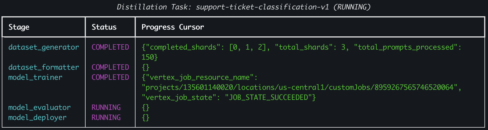

# `distillfw`: Gemini-to-Gemma LLM Distillation Framework on GCP

`distillfw` is an end-to-end Python framework for distilling task-specific capabilities from frontier **Gemini** teacher models into compact, open-weights **Gemma** student models on Google Cloud Platform (GCP).

It is designed for teams currently using Gemini for a well-defined task who want to **reduce inference cost**, **guarantee low latency (TTFT / TPOT)**, and **serve models on controlled infrastructure** (Vertex AI Endpoints / vLLM).



---

## Key Features

- **5-Stage Modular Pipeline**:
  1. `dataset_generator`: Queries Gemini teacher models (`gemini-3.5-pro`, `gemini-3.5-flash`, `gemini-3.5-flash-lite`, `gemini-2.0-flash`, etc.) with your task prompts to collect high-quality completions, `<thought>` reasoning traces, and top-$k$ token `response_logprobs`.
  2. `dataset_formatter`: Formats datasets into Gemma prompt templates (`pretrain`, `instruction`, `chat`, `reasoning`) and training representations (`text`, `tokens` with `-100` prompt masking, `sparse_logprobs`, `preference`).
  3. `model_trainer`: Distills into Gemma 2 / Gemma 3 student models (`1B`–`27B`) on a **single multi-GPU node** (local GPU VM or managed Vertex AI Custom Job) using SOTA off-policy and on-policy algorithms.
  4. `model_evaluator`: Benchmarks Teacher vs. Base Student vs. Distilled Student across lexical metrics (BLEU, ROUGE, Exact Match), LLM-as-a-Judge rubric & win rates, and latency/cost savings.
  5. `model_deployer`: Merges LoRA adapters, registers the model in Vertex AI Model Registry (vLLM), and deploys to **Vertex AI Endpoints**.
- **Isolated Multi-Task Tracking on GCS**: Each distillation task lives in its own isolated GCS prefix (`gs://<bucket>/tasks/<task_id>/`).
- **Zero-Local-State Resumability**: A task's GCS URI is the single source of truth (`config.yaml` + `task_state.json`). Any machine, VM, or Vertex AI worker can inspect status or resume an interrupted pipeline given **only** `gs://<bucket>/tasks/<task_id>`.

---

## 1. Installation & Prerequisites

### 1.1 Environment Setup

```bash
conda create --name distillfw python=3.13
conda activate distillfw
pip install -e ".[dev]"
```

### 1.2 GCP Authentication & Required APIs

Ensure your environment is authenticated with Google Cloud and the required APIs are enabled:

```bash
gcloud config set billing/quota_project <YOUR_GCP_PROJECT_ID>
gcloud config set project <YOUR_GCP_PROJECT_ID>
gcloud auth application-default login

# check GCP config
gcloud config list

gcloud services enable \
  aiplatform.googleapis.com \
  storage.googleapis.com
```

### 1.3 Create a Regional GCS Bucket

Vertex AI Custom Training Jobs and Model Registry require your GCS bucket (`gcp.bucket_name`) to be a **single-region** bucket in the exact same region as `gcp.location` (e.g., `us-central1`). Multi-region buckets (such as default `us`) are rejected by Vertex AI Custom Jobs (`400 FailedPrecondition`).

```bash
gcloud storage buckets create gs://<YOUR_BUCKET_NAME> \
  --project=<YOUR_GCP_PROJECT_ID> \
  --location=us-central1 \
  --uniform-bucket-level-access
```

> **Tip (Local Storage Mode):**
> By default, all storage, training, and deployment run on GCP (`gcp:` section in `config.yaml`).
> To store task workspaces on a local filesystem instead of GCS, replace the `gcp:` section in `config.yaml` with a `local:` section specifying `storage_root` (either `gcp` or `local` must be present in `config.yaml`, but not both):
> ```yaml
> local:
>   storage_root: /path/to/local_tasks_root
> ```

---

## 2. Preparing Your Task Prompts

Provide a prompt dataset in `.jsonl`, `.parquet`, or `.csv` format containing a `prompt` column (and optional `metadata`):

```jsonl
{"prompt": "Classify customer support ticket: My credit card was charged twice for order #8821."}
{"prompt": "Classify customer support ticket: Unable to connect to VPN after upgrading macOS."}
{"prompt": "Classify customer support ticket: How do I export my monthly analytics report to CSV?"}
```

---

## 3. Configuration (`config.yaml`)

Create a declarative `config.yaml` describing your teacher model, student model, prompt format, distillation algorithm, evaluation metrics, and serving infrastructure. Either `gcp` (default production mode) or `local` must be specified, but not both:

```yaml
task_id: support-ticket-triage-v1
description: Distill Gemini 3.5 Flash into Gemma 3 4B for support ticket triage

gcp:
  project_id: my-gcp-project
  location: us-central1
  bucket_name: my-distillfw-bucket
  tasks_prefix: tasks

# Alternatively, to store task workspaces on the local filesystem instead of GCS,
# omit `gcp:` and specify `local:` (either `gcp` or `local` must be present, not both):
# local:
#   storage_root: /tmp/distillfw_tasks

teacher:
  model_id: gemini-3.5-flash          # gemini-3.5-pro | gemini-3.5-flash | gemini-3.5-flash-lite | gemini-2.0-flash
  location: global                    # Optional override (e.g., global endpoint for Gemini 3.5); defaults to gcp.location
  temperature: 0.2
  top_p: 0.95
  max_output_tokens: 1024
  candidate_count: 1
  response_logprobs: true             # Enable top-k token logprobs for gray-box logit distillation
  logprobs_top_k: 20
  thinking_budget: null               # Set integer budget (e.g., 1024) to capture Gemini 3.5 reasoning traces
  system_instruction: "You are an expert support triage assistant."
  shard_size: 250                     # Checkpoint progress to GCS every 250 prompts

student:
  model_id: google/gemma-3-4b-it      # Gemma 3 (1b/4b/12b/27b) or Gemma 2 (2b/9b/27b)
  source: huggingface                 # huggingface | model_garden
  peft_method: lora                   # none | lora | qlora_4bit | qlora_8bit
  lora_r: 16
  lora_alpha: 32
  lora_dropout: 0.05
  max_seq_length: 2048
  dtype: bfloat16

formatting:
  prompt_format: chat                 # pretrain | instruction | chat | reasoning
  dataset_representation: text        # text | tokens | sparse_logprobs | preference
  train_split_ratio: 0.85
  val_split_ratio: 0.10
  test_split_ratio: 0.05
  seed: 42

training:
  paradigm: off_policy                # off_policy | on_policy | hybrid
  algorithm: skew_kl                  # sft_seqkd | forward_kl | reverse_kl | jsd | skew_kl | distillm2 | dpo | gkd | grpo
  execution_mode: vertex_custom_job   # vertex_custom_job (default on GCP) | local (single-node multi-GPU)
  num_epochs: 3
  per_device_batch_size: 4
  gradient_accumulation_steps: 4
  learning_rate: 0.0002
  temperature: 1.0
  skew_alpha: 0.1                     # Skew KLD interpolation parameter (DistiLLM)
  gkd_lambda: 0.5                     # On-policy student rollout fraction for GKD
  vertex_machine_type: g2-standard-48
  vertex_accelerator_type: NVIDIA_L4
  vertex_accelerator_count: 4         # Single node with 1-8 GPUs

evaluation:
  metrics:
    - rouge
    - bleu
    - exact_match
    - llm_judge
    - latency
  judge_model_id: gemini-3.5-flash
  judge_model_location: global
  max_eval_samples: 200

deployment:
  merge_lora: true
  machine_type: g2-standard-12
  accelerator_type: NVIDIA_L4
  accelerator_count: 1
  min_replica_count: 1
  max_replica_count: 3
```

---

## 4. Usage via CLI

### 4.1 Initialize a New Task Workspace on GCS

Copies `config.yaml` and your input prompt dataset into an isolated GCS workspace (`gs://<bucket>/tasks/<task_id>/`) and initializes `task_state.json`. If existing contents are found in the target GCS path, `distillfw init` prints a warning and exits without modifying anything unless `--force-reset` is specified:

```bash
distillfw init --config config.yaml --prompts prompts.jsonl

# Wipe existing contents in the target GCS workspace and re-initialize from scratch
distillfw init --config config.yaml --prompts prompts.jsonl --force-reset
```

### 4.2 Run or Resume the Pipeline from Its GCS URI

Because all state is stored in GCS, you can start or resume execution from **any machine** using only the task's GCS URI:

```bash
# Run all remaining stages end-to-end
distillfw resume gs://my-distillfw-bucket/tasks/support-ticket-triage-v1

# Or run up to a specific stage and pause
distillfw resume gs://my-distillfw-bucket/tasks/support-ticket-triage-v1 --stop-after dataset_formatter
```

### 4.3 Run a Single Stage Explicitly

```bash
distillfw run-stage gs://my-distillfw-bucket/tasks/support-ticket-triage-v1 --stage dataset_generator
distillfw run-stage gs://my-distillfw-bucket/tasks/support-ticket-triage-v1 --stage dataset_formatter
distillfw run-stage gs://my-distillfw-bucket/tasks/support-ticket-triage-v1 --stage model_trainer --local-exec
distillfw run-stage gs://my-distillfw-bucket/tasks/support-ticket-triage-v1 --stage model_evaluator
distillfw run-stage gs://my-distillfw-bucket/tasks/support-ticket-triage-v1 --stage model_deployer
```

### 4.4 Inspect Task Status, Reset Stages, & List All Tracked Tasks

```bash
# View detailed per-stage status, attempt counts, and shard/checkpoint cursors
distillfw status gs://my-distillfw-bucket/tasks/support-ticket-triage-v1

# Reset the model_trainer or model_evaluator stage status back to PENDING
distillfw reset-training gs://my-distillfw-bucket/tasks/support-ticket-triage-v1
distillfw reset-eval gs://my-distillfw-bucket/tasks/support-ticket-triage-v1

# List all tracked distillation tasks in your bucket
distillfw list gs://my-distillfw-bucket/tasks
```

### 4.5 Launch the Interactive Web UI (`distillfw ui`)

```bash
# Start the local Web UI pointing to your GCS tasks root
distillfw ui --root-uri gs://my-distillfw-bucket/tasks --host 127.0.0.1 --port 8080
```

In your browser (`http://127.0.0.1:8080`), you can:
- Enter any GCS tasks root path (`gs://<bucket>/tasks`) and select a task from the dropdown.
- View overall task status, per-stage progress cursors, and direct **GCP Resource references & Google Cloud Console links** (GCS workspace, trainer checkpoints, exported student model weights, Vertex AI Custom Training Job + Cloud Logs, Vertex AI Model Registry resource, and Vertex AI Serving Endpoint).
- Click **`config.yaml`**, any **log file** (`logs/*.log`), or any **dataset** (`00_inputs/`, `01_raw_dataset/`, `02_formatted_dataset/`, `04_evaluation/`) to inspect them in an emerging panel (with structured table rendering for datasets).
- Inspect structured **Evaluation Metrics** (`Before Training` vs. `After Training` vs. `Improvement`) and open the **Side-by-Side Inferences** emerging panel to compare `Student Model Before Training`, `Student Model After Training`, and `Teacher Model` outputs side by side.

---


## 5. Usage via Python API

```python
from distillfw import (
    DistillationConfig,
    DistillationPipeline,
    StageName,
)

# 1. Load config and initialize a new task on GCS
config = DistillationConfig.from_yaml("config.yaml")
pipeline = DistillationPipeline.init_task(
    config=config,
    prompts_path="prompts.jsonl",
)

# 2. Run Stages 1 & 2 (Dataset Generation + Formatting)
pipeline.resume(stop_after=StageName.DATASET_FORMATTER)

# 3. Later (or on a separate GPU node), re-attach using ONLY the GCS URI
gpu_pipeline = DistillationPipeline.from_task_uri(
    "gs://my-distillfw-bucket/tasks/support-ticket-triage-v1"
)
final_state = gpu_pipeline.resume()
print("Final Task Status:", final_state.status)
```

---

## 6. Choosing the Right Distillation Algorithm

| Algorithm Key | Paradigm | Teacher Signal Required | Best For |
| :--- | :--- | :--- | :--- |
| `sft_seqkd` | Off-Policy | Text completions (+ optional `<thought>`) | Fast baseline sequence-level distillation (Kim & Rush, 2016). |
| `forward_kl` | Off-Policy | Logits or Top-$K$ `response_logprobs` | Broad mode-covering imitation (Hinton et al., 2015). |
| `reverse_kl` | Off-Policy | Logits or Top-$K$ `response_logprobs` | Mode-seeking precision; reduces student hallucinations (*MiniLLM*). |
| `jsd` | Off-Policy | Logits or Top-$K$ `response_logprobs` | Balanced symmetric divergence (*GKD*). |
| `skew_kl` | Off-Policy | Logits or Top-$K$ `response_logprobs` | High stability & bounded gradients (*DistiLLM*, ICML 2024). |
| `distillm2` | Off-Policy | Teacher + offline student trajectories | Asymmetric contrastive pull-up / push-down (*DistiLLM-2*, ICML 2025). |
| `dpo` | Off-Policy | Multi-candidate ranked pairs (`chosen`/`rejected`) | Aligning style, formatting, and preference boundaries. |
| `gkd` | On-Policy / Hybrid | Student rollouts + teacher scoring ($\lambda \in [0,1]$) | Eliminating exposure bias on multi-step generation tasks. |

---

## 7. GCS Task Workspace Layout

Every task produces a standardized, self-contained directory tree on GCS:

```text
gs://<bucket>/tasks/<task_id>/
├── config.yaml                 # Frozen DistillationConfig snapshot
├── task_state.json             # Single-source-of-truth stage status, attempts & cursors
├── 00_inputs/                  # Immutable copy of input prompts
├── 01_raw_dataset/             # Sharded Gemini responses, thoughts & top-k logprobs
├── 02_formatted_dataset/       # Templated & tokenized train/val/test Parquet splits
├── 03_checkpoints/             # Resumable single-node training checkpoints & metrics
├── 04_evaluation/              # scorecard.json, report.md, and predictions.jsonl
├── 05_exported_model/          # Final merged HuggingFace / vLLM model weights
└── 06_deployment/              # Deployed Vertex AI Model & Endpoint manifest
```

---

## 8. Sample Notebooks

Interactive walkthrough notebooks are located in [`src/notebooks/`](src/notebooks/):

1. [`01_quickstart_end_to_end.ipynb`](src/notebooks/01_quickstart_end_to_end.ipynb) — Full 5-stage pipeline quickstart.
2. [`02_staged_pipeline_and_resumption.ipynb`](src/notebooks/02_staged_pipeline_and_resumption.ipynb) — Multi-task GCS tracking, interruption recovery, and stateless resumption from `gs://...` URIs.
3. [`03_off_policy_vs_on_policy_algorithms.ipynb`](src/notebooks/03_off_policy_vs_on_policy_algorithms.ipynb) — Hands-on comparison of Forward KL, Reverse KL, Skew KL (*DistiLLM*), *DistiLLM-2*, and Sparse Top-$K$ Logprob losses.
4. [`04_evaluation_and_vertex_deployment.ipynb`](src/notebooks/04_evaluation_and_vertex_deployment.ipynb) — Evaluation scorecards, LLM-as-a-Judge grading, and Vertex AI Endpoint deployment.
5. [`05_inference_side_by_side_teacher_with_deployed_student.ipynb`](src/notebooks/05_inference_side_by_side_teacher_with_deployed_student.ipynb) — Side-by-side quality, latency, and cost comparison between the live Gemini teacher and the deployed Gemma student endpoint.

---

## 9. Running Tests

```bash
pytest -v
```
