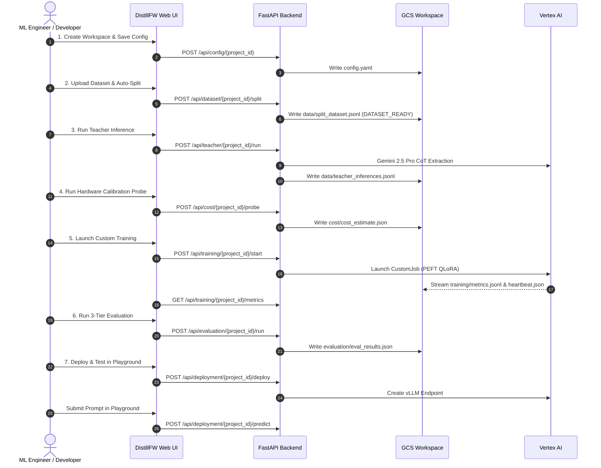

# DistillFW — End-to-End User Guide (UI & API Walkthrough)

This guide walks through a complete end-to-end distillation workflow using DistillFW. You can execute this workflow either interactively using the **Web UI** or programmatically via the **REST API**.

---

## 1. Example Scenario

- **Objective**: Distill advanced multi-step mathematical deduction from **Gemini 2.5 Pro** into a compact, parameter-efficient **Gemma 2 9B** model using **QLoRA (4-bit)** and **Distilling Step-by-Step (CoT Reasoning Distillation)**.
- **Teacher Model**: `gemini-2.5-pro` (accessed via Vertex AI).
- **Student Model**: `google/gemma-2-9b` with LoRA adapter ($r=16, \alpha=32$).
- **Dataset**: 100 math problems whose answer is a numeric response.
- **Hardware**: 1x `NVIDIA_L4` GPU on `g2-standard-8`.
- **Target Serving Framework**: `vLLM` on Vertex AI Prediction Endpoint.

---

## 2. Navigating the UI & Workflow Layout

When you open the Web UI at `http://localhost:8080`:

1. **Top Header**:
   - **Main Bucket Combobox**: Defaults to `distillfw-workspaces`. You can select existing buckets or enter a custom GCS path.
   - **Workspace Folder Combobox**: Lists all project directories in the selected bucket. You can switch workspaces or click the **Folder+** icon to create a new workspace.
   - **Status Badge**: Shows the deterministic project stage (e.g. `DATASET_READY`, `TRAINING_RUNNING`, `DEPLOYED`).
2. **Tab Navigation**:
   - `Pipeline Overview`: High-level 7-stage workflow pipeline diagram.
   - `1. Config Form`: Interactive controls for all parameters in `config.yaml`.
   - `2. Dataset Split`: Upload and inspect JSONL dataset, auto-split into train/val/test splits.
   - `3. Teacher CoT`: Run Gemini inference with parallel threads, rate-limit backoff, retry tracking, and CoT inspection.
   - `4. Hardware Probe`: Budget scorecard and VRAM safety sign-off.
   - `5. Model training`: Launch custom training, stream real-time loss and GPU curves, and trigger via bottom "Start Distillation Training" button.
   - `6. 3-Tier Eval`: Benchmark lexical, Gemini judge, and latency percentiles.
   - `7. vLLM Deploy`: Deploy model and test queries in the 3-model comparative playground.
   - `GCP Resources`: Directory of all Google Cloud Platform resources provisioned for the workspace, live operational statuses, and direct links to Google Cloud Console management interfaces.
   - `Audit History`: Chronological execution log from `history.json`.

3. **Universal Task Action Lifecycle**:
   - **Running State**: As soon as any process starts (dataset split, teacher inference, cost probe, training, eval, deployment), action buttons are disabled and a prominent **Stop** button is displayed to allow immediate cancellation.
   - **Completed State**: Once a task finishes, its full results (data tables, artifacts, metrics, curves, or endpoints) are displayed, and action buttons switch to **"Start Over"**. Clicking "Start Over" calls the backend `/clear` endpoint to purge the stage's artifacts and reset state cleanly.
   - **Error State**: If a failure occurs, an alert banner displays the exact error message, and original action buttons are re-enabled for immediate retry.
4. **Collapsible Bottom Panel**:
   - Click the bottom bar at any time to expand the live streaming log of operations (inference, training, evaluation, deployment).

---

## 3. Step-by-Step Walkthrough (UI & API)



---

### API Environments & Backend Architecture Setup

DistillFW provides a unified REST API across all 7 stages. You can execute requests against three targets depending on your deployment model:

1. **Direct Localhost Execution (`http://localhost:8080`)**:
   - **Backend Being Hit**: The local Python FastAPI process running directly on your workstation (`uvicorn backend.main:app --host 0.0.0.0 --port 8080`).
   - **Authentication**: Inherits your workstation's Google Cloud Application Default Credentials (ADC). It connects directly to live GCP resources (such as `gs://distillfw-workspaces` and Vertex AI) using your local `gcloud` login, so no `Authorization:` header is needed in HTTP requests.
   ```bash
   export DISTILL_API="http://localhost:8080"
   export AUTH_HEADER=""
   ```

2. **GCP Cloud Run Deployed Endpoint (`https://distillfw-backend-...a.run.app`)**:
   - **Backend Being Hit**: The containerized DistillFW FastAPI backend service running serverlessly on Google Cloud Run in GCP.
   - **Authentication**: In enterprise organizations, Google Cloud organization policies (`constraints/iam.allowedPolicyMemberDomains`) mandate IAM authorization for Cloud Run. Direct unauthenticated requests return `403 Forbidden`. You must include an Identity Token in the `Authorization: Bearer <TOKEN>` request header:
   ```bash
   export DISTILL_API="https://distillfw-backend-bxddgrrqlq-uc.a.run.app"
   export AUTH_HEADER="Authorization: Bearer $(gcloud auth print-identity-token)"
   ```

3. **GCP Cloud Run via Local Authenticated Proxy (`http://localhost:8080`)**:
   - **Backend Being Hit**: The deployed Google Cloud Run service in GCP, tunneled through Google Cloud's secure proxy:
     ```bash
     gcloud run services proxy distillfw-backend --region=us-central1 --port=8080
     ```
   - **Authentication**: Handled automatically in the background by the `gcloud` proxy tunnel using your active Google identity credentials. You can open **`http://localhost:8080`** directly in any web browser to interact with the GCP-hosted Web UI, or run unauthenticated `curl` commands against `http://localhost:8080` that seamlessly hit the live Cloud Run backend.

> [!TIP]
> **Unified Parameterized Invocation**:
> You can set `DISTILL_API` and `AUTH_HEADER` in your shell session as shown above, or copy and paste the explicit commands provided for each environment in the stages below.

---

### Stage 1: Project & Workspace Initialization

The workspace is an isolated GCS directory (`gs://<bucket>/<project-id>/`).

#### A. Using the Web UI
1. In the top bar, ensure **Bucket** is set to `distillfw-workspaces`.
2. Click the **Folder+** icon, enter Project ID `distill-gemma-math-v1`, and click **Create Workspace**.
3. Navigate to **1. Config Form**:
   - Select Teacher Model: `gemini-2.5-pro`, temperature `0.2`, enable **Extract Thinking Trace**.
   - Select Student Model: `google/gemma-2-9b`, quantization `4bit`.
   - Select Distillation Method: `Method 2: Step-by-Step CoT` with thinking weight `0.5` and response weight `1.0`.
   - Select Hardware: `NVIDIA_L4`, 1 accelerator, machine `g2-standard-8`.
4. Click **Save Configuration**. The UI confirms the update and writes `config.yaml`.

#### B. Using the REST API

##### Localhost (`http://localhost:8080`):

```bash
# 1. Create project workspace
curl -X POST "http://localhost:8080/api/workspaces/projects" \
  -H "Content-Type: application/json" \
  -d '{
    "project_id": "distill-gemma-math-v1",
    "bucket": "distillfw-workspaces",
    "description": "Distill Gemini 2.5 Pro reasoning into Gemma 2 9B"
  }'

# 2. Update configuration
curl -X POST "http://localhost:8080/api/config/distill-gemma-math-v1?bucket=distillfw-workspaces" \
  -H "Content-Type: application/json" \
  -d '{
    "project": {
      "id": "distill-gemma-math-v1",
      "description": "Distill Gemini 2.5 Pro reasoning into Gemma 2 9B for mathematical problem solving",
      "gcs_workspace": "gs://distillfw-workspaces/distill-gemma-math-v1"
    },
    "models": {
      "teacher": {
        "model_name": "gemini-2.5-pro",
        "temperature": 0.2,
        "max_output_tokens": 4096,
        "include_thinking": true,
        "response_logprobs": false,
        "number_inference_threads": 4,
        "retry_delay_min": 1.0,
        "retry_delay_max": 10.0,
        "max_retries": 5
      },
      "student": {
        "model_name_or_path": "google/gemma-2-9b",
        "quantization": "4bit",
        "trust_remote_code": false
      }
    },
    "prompt": {
      "instructions": "You are an expert mathematician. Solve this problem stating the final answer.",
      "template": "{instructions}\n\nProblem:\n{prompt}\n\nSolution:"
    },
    "dataset": {
      "input_path": "data/input_dataset.jsonl",
      "auto_split": true,
      "split_ratios": { "train": 0.8, "val": 0.1, "test": 0.1 },
      "random_seed": 42
    },
    "distillation": {
      "method": "cot_distillation",
      "loss_type": "cot_weighted",
      "cot_weights": { "thinking_weight": 0.5, "response_weight": 1.0 },
      "peft": {
        "r": 16,
        "lora_alpha": 32,
        "lora_dropout": 0.05,
        "target_modules": ["q_proj", "k_proj", "v_proj", "o_proj", "gate_proj", "up_proj", "down_proj"]
      }
    },
    "training": {
      "hardware": { "accelerator_type": "NVIDIA_L4", "accelerator_count": 1, "machine_type": "g2-standard-8" },
      "hyperparameters": {
        "learning_rate": 0.0002,
        "batch_size": 4,
        "gradient_accumulation_steps": 4,
        "num_train_epochs": 3,
        "warmup_ratio": 0.05,
        "optimizer": "paged_adamw_8bit",
        "lr_scheduler_type": "cosine",
        "max_seq_length": 2048,
        "logging_steps": 5,
        "eval_steps": 50,
        "save_steps": 100
      }
    },
    "evaluation": {
      "batch_size": 8,
      "metrics": ["rouge", "bleu", "exact_match", "gemini_judge", "latency"],
      "gemini_judge": {
        "model_name": "gemini-2.5-flash",
        "rubric": ["correctness", "instruction_following", "coherence", "similarity"]
      }
    },
    "deployment": {
      "serving_framework": "vllm",
      "machine_type": "g2-standard-4",
      "accelerator_type": "NVIDIA_L4",
      "accelerator_count": 1,
      "min_replicas": 0,
      "max_replicas": 2,
      "merge_lora_weights": true
    }
  }'
```

##### Deployed in GCP (Cloud Run with `Authorization` Header):

```bash
# 1. Create project workspace
curl -X POST "https://distillfw-backend-bxddgrrqlq-uc.a.run.app/api/workspaces/projects" \
  -H "Authorization: Bearer $(gcloud auth print-identity-token)" \
  -H "Content-Type: application/json" \
  -d '{
    "project_id": "distill-gemma-math-v1",
    "bucket": "distillfw-workspaces",
    "description": "Distill Gemini 2.5 Pro reasoning into Gemma 2 9B"
  }'

# 2. Update configuration
curl -X POST "https://distillfw-backend-bxddgrrqlq-uc.a.run.app/api/config/distill-gemma-math-v1?bucket=distillfw-workspaces" \
  -H "Authorization: Bearer $(gcloud auth print-identity-token)" \
  -H "Content-Type: application/json" \
  -d '{
    "project": {
      "id": "distill-gemma-math-v1",
      "description": "Distill Gemini 2.5 Pro reasoning into Gemma 2 9B for mathematical problem solving",
      "gcs_workspace": "gs://distillfw-workspaces/distill-gemma-math-v1"
    },
    "models": {
      "teacher": {
        "model_name": "gemini-2.5-pro",
        "temperature": 0.2,
        "max_output_tokens": 4096,
        "include_thinking": true,
        "response_logprobs": false,
        "number_inference_threads": 4,
        "retry_delay_min": 1.0,
        "retry_delay_max": 10.0,
        "max_retries": 5
      },
      "student": {
        "model_name_or_path": "google/gemma-2-9b",
        "quantization": "4bit",
        "trust_remote_code": false
      }
    },
    "prompt": {
      "instructions": "You are an expert mathematician. Solve this problem stating the final answer.",
      "template": "{instructions}\n\nProblem:\n{prompt}\n\nSolution:"
    },
    "dataset": {
      "input_path": "data/input_dataset.jsonl",
      "auto_split": true,
      "split_ratios": { "train": 0.8, "val": 0.1, "test": 0.1 },
      "random_seed": 42
    },
    "distillation": {
      "method": "cot_distillation",
      "loss_type": "cot_weighted",
      "cot_weights": { "thinking_weight": 0.5, "response_weight": 1.0 },
      "peft": {
        "r": 16,
        "lora_alpha": 32,
        "lora_dropout": 0.05,
        "target_modules": ["q_proj", "k_proj", "v_proj", "o_proj", "gate_proj", "up_proj", "down_proj"]
      }
    },
    "training": {
      "hardware": { "accelerator_type": "NVIDIA_L4", "accelerator_count": 1, "machine_type": "g2-standard-8" },
      "hyperparameters": {
        "learning_rate": 0.0002,
        "batch_size": 4,
        "gradient_accumulation_steps": 4,
        "num_train_epochs": 3,
        "warmup_ratio": 0.05,
        "optimizer": "paged_adamw_8bit",
        "lr_scheduler_type": "cosine",
        "max_seq_length": 2048,
        "logging_steps": 5,
        "eval_steps": 50,
        "save_steps": 100
      }
    },
    "evaluation": {
      "batch_size": 8,
      "metrics": ["rouge", "bleu", "exact_match", "gemini_judge", "latency"],
      "gemini_judge": {
        "model_name": "gemini-2.5-flash",
        "rubric": ["correctness", "instruction_following", "coherence", "similarity"]
      }
    },
    "deployment": {
      "serving_framework": "vllm",
      "machine_type": "g2-standard-4",
      "accelerator_type": "NVIDIA_L4",
      "accelerator_count": 1,
      "min_replicas": 0,
      "max_replicas": 2,
      "merge_lora_weights": true
    }
  }'
```
```

---

### Stage 2: Dataset Ingestion & Validation & Splitting

The dataset is ingested as JSON Lines (`.jsonl`). Each row has a `"prompt"` property.

#### A. Using the Web UI
1. Navigate to **2. Dataset Split**.
2. Click **Upload File (.jsonl)** and select `examples/sample_dataset.jsonl` (or click **Paste Raw Data** and paste lines).
3. The platform parses and validates each row, creates `data/split_dataset.jsonl`, and displays the breakdown cards:
   - **Total Prompts**: 100
   - **Train Split**: 80 (used for fine-tuning)
   - **Val Split**: 10 (used for training loss tracking)
   - **Test Split**: 10 (strictly quarantined for final evaluation)
4. The status badge automatically updates to **`DATASET_READY`**.

#### B. Using the REST API

##### Localhost (`http://localhost:8080`):

```bash
# Upload and auto-split dataset
curl -X POST "http://localhost:8080/api/dataset/distill-gemma-math-v1/upload?bucket=distillfw-workspaces" \
  -H "Content-Type: application/json" \
  -d @- << 'EOF'
{
  "content": "{\"prompt\": \"What is 15 multiplied by 18?\"}\n{\"prompt\": \"Solve for x: 3x + 15 = 45.\"}\n{\"prompt\": \"What is the square root of 625?\"}"
}
EOF

# Retrieve dataset summary
curl -s "http://localhost:8080/api/dataset/distill-gemma-math-v1/summary?bucket=distillfw-workspaces" | jq .
```

##### Deployed in GCP (Cloud Run with `Authorization` Header):

```bash
# Upload and auto-split dataset
curl -X POST "https://distillfw-backend-bxddgrrqlq-uc.a.run.app/api/dataset/distill-gemma-math-v1/upload?bucket=distillfw-workspaces" \
  -H "Authorization: Bearer $(gcloud auth print-identity-token)" \
  -H "Content-Type: application/json" \
  -d @- << 'EOF'
{
  "content": "{\"prompt\": \"What is 15 multiplied by 18?\"}\n{\"prompt\": \"Solve for x: 3x + 15 = 45.\"}\n{\"prompt\": \"What is the square root of 625?\"}"
}
EOF

# Retrieve dataset summary
curl -s -H "Authorization: Bearer $(gcloud auth print-identity-token)" \
  "https://distillfw-backend-bxddgrrqlq-uc.a.run.app/api/dataset/distill-gemma-math-v1/summary?bucket=distillfw-workspaces" | jq .
```

---

### Stage 3: Teacher Model Inference & CoT Knowledge Extraction

Extracts reference completions (`teacher_response`) and chain-of-thought traces (`teacher_thinking`) using Vertex AI Gemini.

- **Parallel Inference Acceleration**: Inferences are parallelized via `number_inference_threads` (defined in `config.yaml` and the UI config form). Set $\ge 1$; when set to `1`, inference executes sequentially without parallelism. Output dataset ordering in `data/teacher_inferences.jsonl` is strictly preserved.
- **429 Rate Limit Backoff & Retry Diagnostics**: Automatically catches HTTP 429 (`RESOURCE_EXHAUSTED` / rate limit / quota exceeded) return codes, retrying with a randomized delay between `retry_delay_min` and `retry_delay_max` (defaults: random between 1.0s and 10.0s) up to `max_retries` (default: 5).
- **Diagnostics & Error Tracking**: Tracks total retries count and a breakdown of error types (e.g. `RESOURCE_EXHAUSTED (HTTP 429)`, `DEADLINE_EXCEEDED`, `INTERNAL_SERVER_ERROR`), exposing them via the API and displaying them as badges, status pills, and an audit table in the UI.

#### A. Using the Web UI
1. Navigate to **3. Teacher CoT**.
2. Select the prompt limit (or choose **All Prompts**) and click **Run Gemini Inference**.
3. While running, action buttons are disabled and a red **Stop Inference** button appears.
4. If retries or errors occur, observe the **Retries Count** badge and categorized error type pills incrementing in real time. Click **Show Error Events** to inspect error logs.
5. Once completed, the primary action button changes to **Start Over** (which clears the generated teacher inferences if you wish to re-run). Browse the interactive **Inference Samples** list:
   - Click on any problem to view the **Input Prompt**, Gemini's step-by-step **Chain-of-Thought (teacher_thinking)**, and the verified **Teacher Reference Answer**.

#### B. Using the REST API

##### Localhost (`http://localhost:8080`):

```bash
# 1. Trigger teacher inference
curl -X POST "http://localhost:8080/api/teacher/distill-gemma-math-v1/run?bucket=distillfw-workspaces" \
  -H "Content-Type: application/json" \
  -d '{"limit": 20}'

# 2. Stop ongoing teacher inference (if needed)
curl -X POST "http://localhost:8080/api/teacher/distill-gemma-math-v1/stop?bucket=distillfw-workspaces"

# 3. Fetch retry diagnostics and error type breakdown
curl -s "http://localhost:8080/api/teacher/distill-gemma-math-v1/retries?bucket=distillfw-workspaces" | jq .

# 4. Fetch generated inferences and status
curl -s "http://localhost:8080/api/teacher/distill-gemma-math-v1/status?bucket=distillfw-workspaces&limit=3" | jq .

# 5. Clear inferences to start over
curl -X POST "http://localhost:8080/api/teacher/distill-gemma-math-v1/clear?bucket=distillfw-workspaces"
```

##### Deployed in GCP (Cloud Run with `Authorization` Header):

```bash
# 1. Trigger teacher inference
curl -X POST "https://distillfw-backend-bxddgrrqlq-uc.a.run.app/api/teacher/distill-gemma-math-v1/run?bucket=distillfw-workspaces" \
  -H "Authorization: Bearer $(gcloud auth print-identity-token)" \
  -H "Content-Type: application/json" \
  -d '{"limit": 20}'

# 2. Stop ongoing teacher inference (if needed)
curl -X POST "https://distillfw-backend-bxddgrrqlq-uc.a.run.app/api/teacher/distill-gemma-math-v1/stop?bucket=distillfw-workspaces" \
  -H "Authorization: Bearer $(gcloud auth print-identity-token)"

# 3. Fetch retry diagnostics and error type breakdown
curl -s -H "Authorization: Bearer $(gcloud auth print-identity-token)" \
  "https://distillfw-backend-bxddgrrqlq-uc.a.run.app/api/teacher/distill-gemma-math-v1/retries?bucket=distillfw-workspaces" | jq .

# 4. Fetch generated inferences and status
curl -s -H "Authorization: Bearer $(gcloud auth print-identity-token)" \
  "https://distillfw-backend-bxddgrrqlq-uc.a.run.app/api/teacher/distill-gemma-math-v1/status?bucket=distillfw-workspaces&limit=3" | jq .

# 5. Clear inferences to start over
curl -X POST "https://distillfw-backend-bxddgrrqlq-uc.a.run.app/api/teacher/distill-gemma-math-v1/clear?bucket=distillfw-workspaces" \
  -H "Authorization: Bearer $(gcloud auth print-identity-token)"
```

---

### Stage 4: Cost Estimation & Hardware Calibration Probe

Validates GPU memory footprints to ensure no Out-Of-Memory (OOM) errors occur and calculates an exact budget forecast.

#### A. Using the Web UI
1. Navigate to **4. Hardware Probe**.
2. Click **Run Cost & Hardware Probe**.
3. The budget scorecard renders:
   - **Part 1 (Teacher Inference)**: Calculated from input/output token counts ($1.25/M input, $5.00/M output for Gemini 2.5 Pro).
   - **Part 2 (Hardware Training Probe)**: Measures container init duration ($T_{\text{init}}$), step duration ($T_{\text{step}}$), peak VRAM (14.8 GB on 24 GB L4), and total compute cost.
   - **Hardware Sign-off**: Displays a green verified banner confirming peak VRAM safely fits within the GPU limit.

#### B. Using the REST API

##### Localhost (`http://localhost:8080`):

```bash
# Run probe
curl -X POST "http://localhost:8080/api/cost/distill-gemma-math-v1/probe?bucket=distillfw-workspaces" | jq .

# Retrieve cached estimate
curl -s "http://localhost:8080/api/cost/distill-gemma-math-v1/estimate?bucket=distillfw-workspaces" | jq .summary
```

##### Deployed in GCP (Cloud Run with `Authorization` Header):

```bash
# Run probe
curl -X POST "https://distillfw-backend-bxddgrrqlq-uc.a.run.app/api/cost/distill-gemma-math-v1/probe?bucket=distillfw-workspaces" \
  -H "Authorization: Bearer $(gcloud auth print-identity-token)" | jq .

# Retrieve cached estimate
curl -s -H "Authorization: Bearer $(gcloud auth print-identity-token)" \
  "https://distillfw-backend-bxddgrrqlq-uc.a.run.app/api/cost/distill-gemma-math-v1/estimate?bucket=distillfw-workspaces" | jq .summary
```

---

### Stage 5: Model Training (Custom Training & Telemetry)

Launches training using `transformers.Trainer` with PEFT LoRA and the custom `GCSProgressCallback`.

#### A. Using the Web UI
1. Navigate to **5. Model training** in the tab bar.
2. If running locally without GCP GPU quotas, check the **Dry-run / Local Worker** box; otherwise, leave unchecked to submit to Vertex AI Custom Training.
3. Click **Launch Training Job** in the header or scroll to the bottom and click the prominent **start distillation training** button.
4. As training begins, action buttons are disabled and replaced with a **Stop Training** button to allow stopping if necessary.
5. The live telemetry dashboard streams real-time updates:
   - **Worker Heartbeat**: Indicates active worker liveness and timestamp.
   - **Training Loss Curve**: Live SVG chart displaying train loss and eval loss over global steps.
   - **Hardware Utilization**: Live progress bars displaying GPU compute utilization % and VRAM allocated (GB).
   - **Throughput**: Tokens processed per second.
6. Upon completion, the status badge transitions to **`TRAINING_COMPLETED`**, the PEFT adapter weights (`adapter_model.safetensors`) are stored in `training/final_adapter/`, and the buttons switch to **Start Over** (which clears metrics and checkpoints if you wish to launch a new training run).

#### B. Using the REST API

##### Localhost (`http://localhost:8080`):

```bash
# 1. Launch training job
curl -X POST "http://localhost:8080/api/training/distill-gemma-math-v1/start?bucket=distillfw-workspaces" \
  -H "Content-Type: application/json" \
  -d '{"dry_run": true}'

# 2. Stop ongoing training (if needed)
curl -X POST "http://localhost:8080/api/training/distill-gemma-math-v1/stop?bucket=distillfw-workspaces"

# 3. Poll live metrics
curl -s "http://localhost:8080/api/training/distill-gemma-math-v1/metrics?bucket=distillfw-workspaces" | jq '.[-1]'

# 4. Check worker heartbeat
curl -s "http://localhost:8080/api/training/distill-gemma-math-v1/heartbeat?bucket=distillfw-workspaces" | jq .

# 5. Clear training state to start over
curl -X POST "http://localhost:8080/api/training/distill-gemma-math-v1/clear?bucket=distillfw-workspaces"
```

##### Deployed in GCP (Cloud Run with `Authorization` Header):

```bash
# 1. Launch training job
curl -X POST "https://distillfw-backend-bxddgrrqlq-uc.a.run.app/api/training/distill-gemma-math-v1/start?bucket=distillfw-workspaces" \
  -H "Authorization: Bearer $(gcloud auth print-identity-token)" \
  -H "Content-Type: application/json" \
  -d '{"dry_run": true}'

# 2. Stop ongoing training (if needed)
curl -X POST "https://distillfw-backend-bxddgrrqlq-uc.a.run.app/api/training/distill-gemma-math-v1/stop?bucket=distillfw-workspaces" \
  -H "Authorization: Bearer $(gcloud auth print-identity-token)"

# 3. Poll live metrics
curl -s -H "Authorization: Bearer $(gcloud auth print-identity-token)" \
  "https://distillfw-backend-bxddgrrqlq-uc.a.run.app/api/training/distill-gemma-math-v1/metrics?bucket=distillfw-workspaces" | jq '.[-1]'

# 4. Check worker heartbeat
curl -s -H "Authorization: Bearer $(gcloud auth print-identity-token)" \
  "https://distillfw-backend-bxddgrrqlq-uc.a.run.app/api/training/distill-gemma-math-v1/heartbeat?bucket=distillfw-workspaces" | jq .

# 5. Clear training state to start over
curl -X POST "https://distillfw-backend-bxddgrrqlq-uc.a.run.app/api/training/distill-gemma-math-v1/clear?bucket=distillfw-workspaces" \
  -H "Authorization: Bearer $(gcloud auth print-identity-token)"
```

---

### Stage 6: Rigorous 3-Tier Multi-Metric Evaluation

Runs evaluation exclusively on the quarantined `test` split.

#### A. Using the Web UI
1. Navigate to **6. 3-Tier Eval**.
2. Click **Run 3-Tier Evaluation**.
3. View the three scorecard cards:
   - **Tier 1 (Lexical & Task Metrics)**: ROUGE-1, ROUGE-2, ROUGE-L, BLEU, Exact Match, and JSON format compliance.
   - **Tier 2 (LLM-as-a-Judge)**: Gemini Teacher rubric (1–5 scale) for Correctness, Instruction Adherence, Reasoning Completeness, Semantic Similarity, and Safety.
   - **Tier 3 (Operational Benchmarking)**: Latency percentiles ($p_{50}$, $p_{95}$, $p_{99}$ in ms), serving throughput, and speedup multiple compared to the Teacher.
4. While evaluating, buttons are disabled and a **Stop Evaluation** button appears.
5. Once completed, the header button transitions to **Start Over** (which clears the evaluation results from storage).

#### B. Using the REST API

##### Localhost (`http://localhost:8080`):

```bash
# 1. Trigger 3-tier evaluation
curl -X POST "http://localhost:8080/api/evaluation/distill-gemma-math-v1/run?bucket=distillfw-workspaces"

# 2. Stop ongoing evaluation (if needed)
curl -X POST "http://localhost:8080/api/evaluation/distill-gemma-math-v1/stop?bucket=distillfw-workspaces"

# 3. Fetch evaluation results
curl -s "http://localhost:8080/api/evaluation/distill-gemma-math-v1/results?bucket=distillfw-workspaces" | jq .

# 4. Clear evaluation to start over
curl -X POST "http://localhost:8080/api/evaluation/distill-gemma-math-v1/clear?bucket=distillfw-workspaces"
```

##### Deployed in GCP (Cloud Run with `Authorization` Header):

```bash
# 1. Trigger 3-tier evaluation
curl -X POST "https://distillfw-backend-bxddgrrqlq-uc.a.run.app/api/evaluation/distill-gemma-math-v1/run?bucket=distillfw-workspaces" \
  -H "Authorization: Bearer $(gcloud auth print-identity-token)"

# 2. Stop ongoing evaluation (if needed)
curl -X POST "https://distillfw-backend-bxddgrrqlq-uc.a.run.app/api/evaluation/distill-gemma-math-v1/stop?bucket=distillfw-workspaces" \
  -H "Authorization: Bearer $(gcloud auth print-identity-token)"

# 3. Fetch evaluation results
curl -s -H "Authorization: Bearer $(gcloud auth print-identity-token)" \
  "https://distillfw-backend-bxddgrrqlq-uc.a.run.app/api/evaluation/distill-gemma-math-v1/results?bucket=distillfw-workspaces" | jq .

# 4. Clear evaluation to start over
curl -X POST "https://distillfw-backend-bxddgrrqlq-uc.a.run.app/api/evaluation/distill-gemma-math-v1/clear?bucket=distillfw-workspaces" \
  -H "Authorization: Bearer $(gcloud auth print-identity-token)"
```

---

### Stage 7: Vertex AI Dual Production vLLM Deployment & 3-Model Playground

Deploys both the Base Student and Distilled Student models to Vertex AI Endpoints running vLLM and benchmarks inference live across three model perspectives.

#### A. Using the Web UI
1. Navigate to **7. vLLM Deploy**.
2. **Prerequisite Check**: Model Training (Stage 5) must have completed successfully and generated the trained adapter artifacts. If training has not been executed, an informational alert banner prompts you to complete Stage 5 first.
3. Click **Deploy Dual Endpoints**.
4. **Deployment in Progress**:
   - The deployment runs progressively across 5 operational milestones with live progress bar and status pills:
     - Stage 1: *Dual Endpoint Resource Provisioning* (25%)
     - Stage 2: *Model Registry Adapter Packaging* (50%)
     - Stage 3: *Dual vLLM Serving Container Launch on NVIDIA_L4* (75%)
     - Stage 4: *PagedAttention Engine Warmup* (90%)
     - Stage 5: *Readiness Health Check & Latency Calibration* (100%)
   - While deploying, the workspace status badge displays an animated **DEPLOYING** indicator with a rocket icon.
   - You can safely interrupt deployment at any time by clicking **Stop Deployment**.
5. Once active, the dual endpoint overview displays cards for both:
   - **Distilled Student Endpoint**: Serves `google/gemma-2-9b + LoRA` on vLLM with PagedAttention (~38ms p50 latency, 3.25x speedup).
   - **Base Student Endpoint**: Serves the baseline `google/gemma-2-9b` un-fine-tuned model on vLLM (~125ms p50 latency).
   - The header button changes to **Start Over** (which undeploys both endpoints and clears metadata).
6. Scroll to the **Interactive Model Inference Playground**:
   - Select one of the quick sample query chips (e.g., *"What is 25 multiplied by 14?"*, *"What is the capital of France?"*, *"What does LoRA stand for in machine learning?"*, *"Explain vLLM serving engine"*), or enter your own custom query.
   - Click **Predict**.
   - Review the responsive **3-Column Comparison Grid** (demonstrating clear persona distinction and non-verbatim answers):
     1. **1. Student (Before)**: Base pre-trained model answer from the Base Endpoint, higher latency (~125ms), unaligned text autocomplete behavior with conversational or verbose continuations.
     2. **2. Teacher Model**: Gemini reference answer, expandable Chain-of-Thought reasoning steps, latency (~420ms).
     3. **3. Student (After)**: Distilled student model running on the Distilled Endpoint with vLLM PagedAttention, direct concise domain-aligned answer (e.g. `350` for `25 * 14`), and lightning-fast latency (~38ms, 3.25x faster than Base model, 11x faster than Teacher).

#### B. Using the REST API

##### Localhost (`http://localhost:8080`):

```bash
# 1. Deploy dual endpoints to Vertex AI (asynchronous progression)
curl -X POST "http://localhost:8080/api/deployment/distill-gemma-math-v1/deploy?bucket=distillfw-workspaces" | jq .

# 1b. Deploy synchronously (completes immediately, ideal for automated CI/CD and test suites)
curl -X POST "http://localhost:8080/api/deployment/distill-gemma-math-v1/deploy?bucket=distillfw-workspaces&sync=true" | jq .

# 2. Stop ongoing deployment (if needed)
curl -X POST "http://localhost:8080/api/deployment/distill-gemma-math-v1/stop?bucket=distillfw-workspaces"

# 3. Check endpoint status (reports progress_pct, current_step, endpoints list, and milestone statuses)
curl -s "http://localhost:8080/api/deployment/distill-gemma-math-v1/status?bucket=distillfw-workspaces" | jq .

# 4. Send a test prediction query (returns 3-model comparative breakdown with prompt-specific answers)
curl -X POST "http://localhost:8080/api/deployment/distill-gemma-math-v1/predict?bucket=distillfw-workspaces" \
  -H "Content-Type: application/json" \
  -d '{
    "prompt": "What is 25 multiplied by 14?",
    "temperature": 0.2
  }' | jq .

# 5. Clear deployment to start over
curl -X POST "http://localhost:8080/api/deployment/distill-gemma-math-v1/clear?bucket=distillfw-workspaces"
```

##### Deployed in GCP (Cloud Run with `Authorization` Header):

```bash
# 1. Deploy dual endpoints to Vertex AI
curl -X POST "https://distillfw-backend-bxddgrrqlq-uc.a.run.app/api/deployment/distill-gemma-math-v1/deploy?bucket=distillfw-workspaces" \
  -H "Authorization: Bearer $(gcloud auth print-identity-token)" | jq .

# 2. Stop ongoing deployment (if needed)
curl -X POST "https://distillfw-backend-bxddgrrqlq-uc.a.run.app/api/deployment/distill-gemma-math-v1/stop?bucket=distillfw-workspaces" \
  -H "Authorization: Bearer $(gcloud auth print-identity-token)"

# 3. Check endpoint status
curl -s -H "Authorization: Bearer $(gcloud auth print-identity-token)" \
  "https://distillfw-backend-bxddgrrqlq-uc.a.run.app/api/deployment/distill-gemma-math-v1/status?bucket=distillfw-workspaces" | jq .

# 4. Send a test prediction query (returns 3-model comparison)
curl -X POST "https://distillfw-backend-bxddgrrqlq-uc.a.run.app/api/deployment/distill-gemma-math-v1/predict?bucket=distillfw-workspaces" \
  -H "Authorization: Bearer $(gcloud auth print-identity-token)" \
  -H "Content-Type: application/json" \
  -d '{
    "prompt": "What is 25 multiplied by 14?",
    "temperature": 0.2
  }' | jq .

# 5. Clear deployment to start over
curl -X POST "https://distillfw-backend-bxddgrrqlq-uc.a.run.app/api/deployment/distill-gemma-math-v1/clear?bucket=distillfw-workspaces" \
  -H "Authorization: Bearer $(gcloud auth print-identity-token)"
```

---

## 4. Monitoring & Telemetry

### 4.1. Collapsible Operations Log Panel
- The collapsible panel at the bottom of the screen displays real-time execution logs from the backend logger service.
- Use the level filter buttons (**ALL**, **INFO**, **SUCCESS**, **ERROR**) to isolate issues.
- Toggle **Auto-scroll** or click **Clear** at any time.

### 4.2. Audit History (`history.json`)
The GCS workspace records every action in `history.json`. You can inspect the audit log in the **Audit History** tab or via the API:

##### Localhost (`http://localhost:8080`):
```bash
curl -s "http://localhost:8080/api/workspaces/distill-gemma-math-v1/history?bucket=distillfw-workspaces" | jq .
```

##### Deployed in GCP (Cloud Run with `Authorization` Header):
```bash
curl -s -H "Authorization: Bearer $(gcloud auth print-identity-token)" \
  "https://distillfw-backend-bxddgrrqlq-uc.a.run.app/api/workspaces/distill-gemma-math-v1/history?bucket=distillfw-workspaces" | jq .
```

### 4.3. GCP Resources Management & Console Navigation

The **GCP Resources** tab presents a centralized directory of all Google Cloud resources configured or provisioned for the selected workspace, accompanied by live statuses and direct one-click links to their Google Cloud Console management interfaces.

#### A. Using the Web UI
1. Click the **GCP Resources** tab in the main navigation.
2. The workspace header displays:
   - **GCP Project**: Active project ID (e.g. `distillfw`) with a direct link to the GCP Console project dashboard.
   - **Region**: Active deployment region (e.g. `us-central1`).
   - **Workspace Path**: `gs://<bucket>/<project-id>/` with a one-click copy button.
   - **Summary Scorecards**: Counters for Total Resources, Active & Serving, In Progress, and Pending/Standby.
3. Use the **Search bar** or **Category pills** (*Storage*, *Custom Training*, *Online Serving*, *Vertex Models*, *Artifact Registry*, *IAM & Security*, *Cloud Run Compute*, *Cloud Logging*) to filter resources.
4. Each resource row displays:
   - Resource name and URI (with quick-copy button).
   - GCP Service badge and resource type.
   - Operational role in the distillation lifecycle.
   - Real-time status badge (`ACTIVE`, `RUNNING`, `COMPLETED`, `SERVING`, `STREAMING`, `CONFIGURED`, `AVAILABLE`, `NOT_DEPLOYED`).
   - Detailed status description (e.g. active training step, serving replica count, average latency).
   - **"Open in GCP Console ↗"** button opening the corresponding GCP Console management interface in a new browser tab.
5. Click **Refresh Statuses** to query the latest state across Google Cloud Storage, Vertex AI, and Cloud Run.

#### B. Using the REST API

Fetch the complete structured JSON representation of all GCP resources for a workspace:

##### Localhost (`http://localhost:8080`):
```bash
curl -s "http://localhost:8080/api/workspaces/distill-gemma-math-v1/resources?bucket=distillfw-workspaces" | jq .
```

##### Deployed in GCP (Cloud Run with `Authorization` Header):
```bash
curl -s -H "Authorization: Bearer $(gcloud auth print-identity-token)" \
  "https://distillfw-backend-bxddgrrqlq-uc.a.run.app/api/workspaces/distill-gemma-math-v1/resources?bucket=distillfw-workspaces" | jq .
```

**Example JSON Response:**
```json
{
  "project_id": "distill-gemma-math-v1",
  "bucket": "distillfw-workspaces",
  "gcp_project_id": "distillfw",
  "region": "us-central1",
  "summary": {
    "total_resources": 12,
    "active_count": 10,
    "in_progress_count": 0,
    "ready_count": 1,
    "not_deployed_count": 1
  },
  "resources": [
    {
      "id": "gcs_workspace",
      "name": "gs://distillfw-workspaces/distill-gemma-math-v1/",
      "service": "Cloud Storage",
      "type": "Bucket Directory Prefix",
      "category": "Storage",
      "role": "Isolated workspace storage for configs, datasets, checkpoints, logs, and evaluation reports",
      "status": "ACTIVE",
      "status_detail": "Project workspace prefix under gs://distillfw-workspaces",
      "resource_uri": "gs://distillfw-workspaces/distill-gemma-math-v1/",
      "console_url": "https://console.cloud.google.com/storage/browser/distillfw-workspaces/distill-gemma-math-v1?project=distillfw"
    },
    {
      "id": "vertex_custom_job",
      "name": "distillfw-train-distill-gemma-math-v1",
      "service": "Vertex AI Training",
      "type": "CustomJob",
      "category": "Training",
      "role": "Executes parameter-efficient fine-tuning (PEFT/QLoRA) on NVIDIA_L4 GPU",
      "status": "COMPLETED",
      "status_detail": "Custom training completed; final PEFT adapter weights saved",
      "console_url": "https://console.cloud.google.com/vertex-ai/training/custom-jobs?project=distillfw"
    },
    {
      "id": "vertex_endpoint_base",
      "name": "endpoint-distill-gemma-math-v1-base-1725580000",
      "service": "Vertex AI Prediction",
      "type": "Prediction Endpoint (Base Student)",
      "category": "Serving",
      "role": "Baseline pre-trained Student model serving on vLLM without fine-tuning (pre-distillation benchmark)",
      "status": "ACTIVE",
      "status_detail": "Online vLLM endpoint serving un-fine-tuned baseline google/gemma-2-9b (avg latency: 124.8ms, 1 replica)",
      "console_url": "https://console.cloud.google.com/vertex-ai/locations/us-central1/endpoints/endpoint-distill-gemma-math-v1-base-1725580000?project=distillfw"
    },
    {
      "id": "vertex_endpoint_distilled",
      "name": "endpoint-distill-gemma-math-v1-distilled-1725580000",
      "service": "Vertex AI Prediction",
      "type": "Prediction Endpoint (Distilled Student)",
      "category": "Serving",
      "role": "Distilled Student model endpoint hosting high-throughput vLLM engine with PagedAttention and PEFT LoRA adapter",
      "status": "ACTIVE",
      "status_detail": "Online vLLM endpoint serving distilled google/gemma-2-9b + LoRA (avg latency: 38.4ms, 3.25x speedup, 1 replica)",
      "console_url": "https://console.cloud.google.com/vertex-ai/locations/us-central1/endpoints/endpoint-distill-gemma-math-v1-distilled-1725580000?project=distillfw"
    }
  ]
}
```

