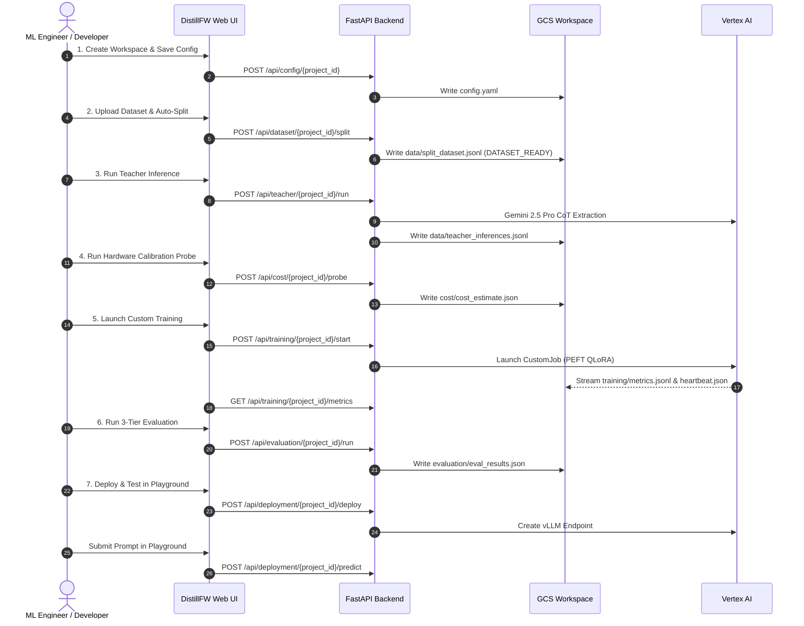

# DistillFW — End-to-End User Guide (UI & API Walkthrough)

This guide walks through a complete end-to-end distillation workflow using DistillFW. You can execute this workflow either interactively using the **Web UI** or programmatically via the **REST API**.

---

## 1. Example Scenario

- **Objective**: Distill advanced multi-step mathematical deduction from **Gemini 2.5 Pro** into a compact, parameter-efficient **Gemma 2 9B** model using **QLoRA (4-bit)** and **Distilling Step-by-Step (CoT Reasoning Distillation)**.
- **Teacher Model**: `gemini-2.5-pro` (accessed via Vertex AI).
- **Student Model**: `google/gemma-2-9b` with LoRA adapter ($r=16, \alpha=32$).
- **Dataset**: 100 math problems whose answer is a numeric response.
- **Hardware**: 1x `NVIDIA_L4` GPU on `g2-standard-8`.
- **Target Serving Framework**: `vLLM` on Vertex AI Prediction Endpoint.

---

## 2. Navigating the UI & Workflow Layout

When you open the Web UI at `http://localhost:8080`:

1. **Top Header**:
   - **Main Bucket Combobox**: Defaults to `distillfw-workspaces`. You can select existing buckets or enter a custom GCS path.
   - **Workspace Folder Combobox**: Lists all project directories in the selected bucket. You can switch workspaces or click the **Folder+** icon to create a new workspace.
   - **Status Badge**: Shows the deterministic project stage (e.g. `DATASET_READY`, `TRAINING_RUNNING`, `DEPLOYED`).
2. **Tab Navigation**:
   - `Pipeline Overview`: High-level 7-stage workflow pipeline diagram.
   - `1. Config Form`: Interactive controls for all parameters in `config.yaml`.
   - `2. Dataset Split`: Upload and inspect JSONL dataset, auto-split into train/val/test.
   - `3. Teacher CoT`: Run Gemini inference and inspect thinking traces and completions.
   - `4. Hardware Probe`: Budget scorecard and VRAM safety sign-off.
   - `5. Training Telemetry`: Launch custom training and view real-time loss and GPU curves.
   - `6. 3-Tier Eval`: Benchmark lexical, Gemini judge, and latency percentiles.
   - `7. vLLM Deploy`: Deploy model and test queries interactively in the playground.
   - `Audit History`: Chronological execution log from `history.json`.
3. **Collapsible Bottom Panel**:
   - Click the bottom bar at any time to expand the live streaming log of operations (inference, training, evaluation, deployment).

---

## 3. Step-by-Step Walkthrough (UI & API)



---

### API Environments & Backend Architecture Setup

DistillFW provides a unified REST API across all 7 stages. You can execute requests against three targets depending on your deployment model:

1. **Direct Localhost Execution (`http://localhost:8080`)**:
   - **Backend Being Hit**: The local Python FastAPI process running directly on your workstation (`uvicorn backend.main:app --host 0.0.0.0 --port 8080`).
   - **Authentication**: Inherits your workstation's Google Cloud Application Default Credentials (ADC). It connects directly to live GCP resources (such as `gs://distillfw-workspaces` and Vertex AI) using your local `gcloud` login, so no `Authorization:` header is needed in HTTP requests.
   ```bash
   export DISTILL_API="http://localhost:8080"
   export AUTH_HEADER=""
   ```

2. **GCP Cloud Run Deployed Endpoint (`https://distillfw-backend-...a.run.app`)**:
   - **Backend Being Hit**: The containerized DistillFW FastAPI backend service running serverlessly on Google Cloud Run in GCP.
   - **Authentication**: In enterprise organizations, Google Cloud organization policies (`constraints/iam.allowedPolicyMemberDomains`) mandate IAM authorization for Cloud Run. Direct unauthenticated requests return `403 Forbidden`. You must include an Identity Token in the `Authorization: Bearer <TOKEN>` request header:
   ```bash
   export DISTILL_API="https://distillfw-backend-bxddgrrqlq-uc.a.run.app"
   export AUTH_HEADER="Authorization: Bearer $(gcloud auth print-identity-token)"
   ```

3. **GCP Cloud Run via Local Authenticated Proxy (`http://localhost:8080`)**:
   - **Backend Being Hit**: The deployed Google Cloud Run service in GCP, tunneled through Google Cloud's secure proxy:
     ```bash
     gcloud run services proxy distillfw-backend --region=us-central1 --port=8080
     ```
   - **Authentication**: Handled automatically in the background by the `gcloud` proxy tunnel using your active Google identity credentials. You can open **`http://localhost:8080`** directly in any web browser to interact with the GCP-hosted Web UI, or run unauthenticated `curl` commands against `http://localhost:8080` that seamlessly hit the live Cloud Run backend.

> [!TIP]
> **Unified Parameterized Invocation**:
> You can set `DISTILL_API` and `AUTH_HEADER` in your shell session as shown above, or copy and paste the explicit commands provided for each environment in the stages below.

---

### Stage 1: Project & Workspace Initialization

The workspace is an isolated GCS directory (`gs://<bucket>/<project-id>/`).

#### A. Using the Web UI
1. In the top bar, ensure **Bucket** is set to `distillfw-workspaces`.
2. Click the **Folder+** icon, enter Project ID `distill-gemma-math-v1`, and click **Create Workspace**.
3. Navigate to **1. Config Form**:
   - Select Teacher Model: `gemini-2.5-pro`, temperature `0.2`, enable **Extract Thinking Trace**.
   - Select Student Model: `google/gemma-2-9b`, quantization `4bit`.
   - Select Distillation Method: `Method 2: Step-by-Step CoT` with thinking weight `0.5` and response weight `1.0`.
   - Select Hardware: `NVIDIA_L4`, 1 accelerator, machine `g2-standard-8`.
4. Click **Save Configuration**. The UI confirms the update and writes `config.yaml`.

#### B. Using the REST API

##### Localhost (`http://localhost:8080`):

```bash
# 1. Create project workspace
curl -X POST "http://localhost:8080/api/workspaces/projects" \
  -H "Content-Type: application/json" \
  -d '{
    "project_id": "distill-gemma-math-v1",
    "bucket": "distillfw-workspaces",
    "description": "Distill Gemini 2.5 Pro reasoning into Gemma 2 9B"
  }'

# 2. Update configuration
curl -X POST "http://localhost:8080/api/config/distill-gemma-math-v1?bucket=distillfw-workspaces" \
  -H "Content-Type: application/json" \
  -d '{
    "project": {
      "id": "distill-gemma-math-v1",
      "description": "Distill Gemini 2.5 Pro reasoning into Gemma 2 9B for mathematical problem solving",
      "gcs_workspace": "gs://distillfw-workspaces/distill-gemma-math-v1"
    },
    "models": {
      "teacher": {
        "model_name": "gemini-2.5-pro",
        "temperature": 0.2,
        "max_output_tokens": 4096,
        "include_thinking": true,
        "response_logprobs": false
      },
      "student": {
        "model_name_or_path": "google/gemma-2-9b",
        "quantization": "4bit",
        "trust_remote_code": false
      }
    },
    "prompt": {
      "instructions": "You are an expert mathematician. Solve this problem stating the final answer.",
      "template": "{instructions}\n\nProblem:\n{prompt}\n\nSolution:"
    },
    "dataset": {
      "input_path": "data/input_dataset.jsonl",
      "auto_split": true,
      "split_ratios": { "train": 0.8, "val": 0.1, "test": 0.1 },
      "random_seed": 42
    },
    "distillation": {
      "method": "cot_distillation",
      "loss_type": "cot_weighted",
      "cot_weights": { "thinking_weight": 0.5, "response_weight": 1.0 },
      "peft": {
        "r": 16,
        "lora_alpha": 32,
        "lora_dropout": 0.05,
        "target_modules": ["q_proj", "k_proj", "v_proj", "o_proj", "gate_proj", "up_proj", "down_proj"]
      }
    },
    "training": {
      "hardware": { "accelerator_type": "NVIDIA_L4", "accelerator_count": 1, "machine_type": "g2-standard-8" },
      "hyperparameters": {
        "learning_rate": 0.0002,
        "batch_size": 4,
        "gradient_accumulation_steps": 4,
        "num_train_epochs": 3,
        "warmup_ratio": 0.05,
        "optimizer": "paged_adamw_8bit",
        "lr_scheduler_type": "cosine",
        "max_seq_length": 2048,
        "logging_steps": 5,
        "eval_steps": 50,
        "save_steps": 100
      }
    },
    "evaluation": {
      "batch_size": 8,
      "metrics": ["rouge", "bleu", "exact_match", "gemini_judge", "latency"],
      "gemini_judge": {
        "model_name": "gemini-2.5-flash",
        "rubric": ["correctness", "instruction_following", "coherence", "similarity"]
      }
    },
    "deployment": {
      "serving_framework": "vllm",
      "machine_type": "g2-standard-4",
      "accelerator_type": "NVIDIA_L4",
      "accelerator_count": 1,
      "min_replicas": 0,
      "max_replicas": 2,
      "merge_lora_weights": true
    }
  }'
```

##### Deployed in GCP (Cloud Run with `Authorization` Header):

```bash
# 1. Create project workspace
curl -X POST "https://distillfw-backend-bxddgrrqlq-uc.a.run.app/api/workspaces/projects" \
  -H "Authorization: Bearer $(gcloud auth print-identity-token)" \
  -H "Content-Type: application/json" \
  -d '{
    "project_id": "distill-gemma-math-v1",
    "bucket": "distillfw-workspaces",
    "description": "Distill Gemini 2.5 Pro reasoning into Gemma 2 9B"
  }'

# 2. Update configuration
curl -X POST "https://distillfw-backend-bxddgrrqlq-uc.a.run.app/api/config/distill-gemma-math-v1?bucket=distillfw-workspaces" \
  -H "Authorization: Bearer $(gcloud auth print-identity-token)" \
  -H "Content-Type: application/json" \
  -d '{
    "project": {
      "id": "distill-gemma-math-v1",
      "description": "Distill Gemini 2.5 Pro reasoning into Gemma 2 9B for mathematical problem solving",
      "gcs_workspace": "gs://distillfw-workspaces/distill-gemma-math-v1"
    },
    "models": {
      "teacher": {
        "model_name": "gemini-2.5-pro",
        "temperature": 0.2,
        "max_output_tokens": 4096,
        "include_thinking": true,
        "response_logprobs": false
      },
      "student": {
        "model_name_or_path": "google/gemma-2-9b",
        "quantization": "4bit",
        "trust_remote_code": false
      }
    },
    "prompt": {
      "instructions": "You are an expert mathematician. Solve this problem stating the final answer.",
      "template": "{instructions}\n\nProblem:\n{prompt}\n\nSolution:"
    },
    "dataset": {
      "input_path": "data/input_dataset.jsonl",
      "auto_split": true,
      "split_ratios": { "train": 0.8, "val": 0.1, "test": 0.1 },
      "random_seed": 42
    },
    "distillation": {
      "method": "cot_distillation",
      "loss_type": "cot_weighted",
      "cot_weights": { "thinking_weight": 0.5, "response_weight": 1.0 },
      "peft": {
        "r": 16,
        "lora_alpha": 32,
        "lora_dropout": 0.05,
        "target_modules": ["q_proj", "k_proj", "v_proj", "o_proj", "gate_proj", "up_proj", "down_proj"]
      }
    },
    "training": {
      "hardware": { "accelerator_type": "NVIDIA_L4", "accelerator_count": 1, "machine_type": "g2-standard-8" },
      "hyperparameters": {
        "learning_rate": 0.0002,
        "batch_size": 4,
        "gradient_accumulation_steps": 4,
        "num_train_epochs": 3,
        "warmup_ratio": 0.05,
        "optimizer": "paged_adamw_8bit",
        "lr_scheduler_type": "cosine",
        "max_seq_length": 2048,
        "logging_steps": 5,
        "eval_steps": 50,
        "save_steps": 100
      }
    },
    "evaluation": {
      "batch_size": 8,
      "metrics": ["rouge", "bleu", "exact_match", "gemini_judge", "latency"],
      "gemini_judge": {
        "model_name": "gemini-2.5-flash",
        "rubric": ["correctness", "instruction_following", "coherence", "similarity"]
      }
    },
    "deployment": {
      "serving_framework": "vllm",
      "machine_type": "g2-standard-4",
      "accelerator_type": "NVIDIA_L4",
      "accelerator_count": 1,
      "min_replicas": 0,
      "max_replicas": 2,
      "merge_lora_weights": true
    }
  }'
```
```

---

### Stage 2: Dataset Ingestion & Validation & Splitting

The dataset is ingested as JSON Lines (`.jsonl`). Each row has a `"prompt"` property.

#### A. Using the Web UI
1. Navigate to **2. Dataset Split**.
2. Click **Upload File (.jsonl)** and select `sample_dataset.jsonl` (or click **Paste Raw Data** and paste lines).
3. The platform parses and validates each row, creates `data/split_dataset.jsonl`, and displays the breakdown cards:
   - **Total Prompts**: 100
   - **Train Split**: 80 (used for fine-tuning)
   - **Val Split**: 10 (used for training loss tracking)
   - **Test Split**: 10 (strictly quarantined for final evaluation)
4. The status badge automatically updates to **`DATASET_READY`**.

#### B. Using the REST API

##### Localhost (`http://localhost:8080`):

```bash
# Upload and auto-split dataset
curl -X POST "http://localhost:8080/api/dataset/distill-gemma-math-v1/upload?bucket=distillfw-workspaces" \
  -H "Content-Type: application/json" \
  -d @- << 'EOF'
{
  "content": "{\"prompt\": \"What is 15 multiplied by 18?\"}\n{\"prompt\": \"Solve for x: 3x + 15 = 45.\"}\n{\"prompt\": \"What is the square root of 625?\"}"
}
EOF

# Retrieve dataset summary
curl -s "http://localhost:8080/api/dataset/distill-gemma-math-v1/summary?bucket=distillfw-workspaces" | jq .
```

##### Deployed in GCP (Cloud Run with `Authorization` Header):

```bash
# Upload and auto-split dataset
curl -X POST "https://distillfw-backend-bxddgrrqlq-uc.a.run.app/api/dataset/distill-gemma-math-v1/upload?bucket=distillfw-workspaces" \
  -H "Authorization: Bearer $(gcloud auth print-identity-token)" \
  -H "Content-Type: application/json" \
  -d @- << 'EOF'
{
  "content": "{\"prompt\": \"What is 15 multiplied by 18?\"}\n{\"prompt\": \"Solve for x: 3x + 15 = 45.\"}\n{\"prompt\": \"What is the square root of 625?\"}"
}
EOF

# Retrieve dataset summary
curl -s -H "Authorization: Bearer $(gcloud auth print-identity-token)" \
  "https://distillfw-backend-bxddgrrqlq-uc.a.run.app/api/dataset/distill-gemma-math-v1/summary?bucket=distillfw-workspaces" | jq .
```

---

### Stage 3: Teacher Model Inference & CoT Knowledge Extraction

Extracts reference completions (`teacher_response`) and chain-of-thought traces (`teacher_thinking`) using Vertex AI Gemini.

#### A. Using the Web UI
1. Navigate to **3. Teacher CoT**.
2. Select the prompt limit (or choose **All Prompts**) and click **Run Gemini Inference**.
3. Open the collapsible bottom panel to view real-time batch progress.
4. Once completed, browse the interactive **Inference Samples** list:
   - Click on any problem to view the **Input Prompt**, Gemini's step-by-step **Chain-of-Thought (teacher_thinking)**, and the verified **Teacher Reference Answer**.

#### B. Using the REST API

##### Localhost (`http://localhost:8080`):

```bash
# Trigger teacher inference
curl -X POST "http://localhost:8080/api/teacher/distill-gemma-math-v1/run?bucket=distillfw-workspaces" \
  -H "Content-Type: application/json" \
  -d '{"limit": 20}'

# Fetch generated inferences and reasoning samples
curl -s "http://localhost:8080/api/teacher/distill-gemma-math-v1/status?bucket=distillfw-workspaces&limit=3" | jq .
```

##### Deployed in GCP (Cloud Run with `Authorization` Header):

```bash
# Trigger teacher inference
curl -X POST "https://distillfw-backend-bxddgrrqlq-uc.a.run.app/api/teacher/distill-gemma-math-v1/run?bucket=distillfw-workspaces" \
  -H "Authorization: Bearer $(gcloud auth print-identity-token)" \
  -H "Content-Type: application/json" \
  -d '{"limit": 20}'

# Fetch generated inferences and reasoning samples
curl -s -H "Authorization: Bearer $(gcloud auth print-identity-token)" \
  "https://distillfw-backend-bxddgrrqlq-uc.a.run.app/api/teacher/distill-gemma-math-v1/status?bucket=distillfw-workspaces&limit=3" | jq .
```

---

### Stage 4: Cost Estimation & Hardware Calibration Probe

Validates GPU memory footprints to ensure no Out-Of-Memory (OOM) errors occur and calculates an exact budget forecast.

#### A. Using the Web UI
1. Navigate to **4. Hardware Probe**.
2. Click **Run Cost & Hardware Probe**.
3. The budget scorecard renders:
   - **Part 1 (Teacher Inference)**: Calculated from input/output token counts ($1.25/M input, $5.00/M output for Gemini 2.5 Pro).
   - **Part 2 (Hardware Training Probe)**: Measures container init duration ($T_{\text{init}}$), step duration ($T_{\text{step}}$), peak VRAM (14.8 GB on 24 GB L4), and total compute cost.
   - **Hardware Sign-off**: Displays a green verified banner confirming peak VRAM safely fits within the GPU limit.

#### B. Using the REST API

##### Localhost (`http://localhost:8080`):

```bash
# Run probe
curl -X POST "http://localhost:8080/api/cost/distill-gemma-math-v1/probe?bucket=distillfw-workspaces" | jq .

# Retrieve cached estimate
curl -s "http://localhost:8080/api/cost/distill-gemma-math-v1/estimate?bucket=distillfw-workspaces" | jq .summary
```

##### Deployed in GCP (Cloud Run with `Authorization` Header):

```bash
# Run probe
curl -X POST "https://distillfw-backend-bxddgrrqlq-uc.a.run.app/api/cost/distill-gemma-math-v1/probe?bucket=distillfw-workspaces" \
  -H "Authorization: Bearer $(gcloud auth print-identity-token)" | jq .

# Retrieve cached estimate
curl -s -H "Authorization: Bearer $(gcloud auth print-identity-token)" \
  "https://distillfw-backend-bxddgrrqlq-uc.a.run.app/api/cost/distill-gemma-math-v1/estimate?bucket=distillfw-workspaces" | jq .summary
```

---

### Stage 5: Vertex AI Custom Training & Live Telemetry

Launches training using `transformers.Trainer` with PEFT LoRA and the custom `GCSProgressCallback`.

#### A. Using the Web UI
1. Navigate to **5. Training Telemetry**.
2. If running locally without GCP GPU quotas, check the **Dry-run / Local Worker** box; otherwise, leave unchecked to submit to Vertex AI Custom Training.
3. Click **Launch Training Job**.
4. The live telemetry dashboard streams real-time updates:
   - **Worker Heartbeat**: Indicates active worker liveness and timestamp.
   - **Training Loss Curve**: Live SVG chart displaying train loss and eval loss over global steps.
   - **Hardware Utilization**: Live progress bars displaying GPU compute utilization % and VRAM allocated (GB).
   - **Throughput**: Tokens processed per second.
5. Upon completion, the status badge transitions to **`TRAINING_COMPLETED`** and the PEFT adapter weights (`adapter_model.safetensors`) are stored in `training/final_adapter/`.

#### B. Using the REST API

##### Localhost (`http://localhost:8080`):

```bash
# Launch training job
curl -X POST "http://localhost:8080/api/training/distill-gemma-math-v1/start?bucket=distillfw-workspaces" \
  -H "Content-Type: application/json" \
  -d '{"dry_run": true}'

# Poll live metrics
curl -s "http://localhost:8080/api/training/distill-gemma-math-v1/metrics?bucket=distillfw-workspaces" | jq '.[-1]'

# Check worker heartbeat
curl -s "http://localhost:8080/api/training/distill-gemma-math-v1/heartbeat?bucket=distillfw-workspaces" | jq .
```

##### Deployed in GCP (Cloud Run with `Authorization` Header):

```bash
# Launch training job
curl -X POST "https://distillfw-backend-bxddgrrqlq-uc.a.run.app/api/training/distill-gemma-math-v1/start?bucket=distillfw-workspaces" \
  -H "Authorization: Bearer $(gcloud auth print-identity-token)" \
  -H "Content-Type: application/json" \
  -d '{"dry_run": true}'

# Poll live metrics
curl -s -H "Authorization: Bearer $(gcloud auth print-identity-token)" \
  "https://distillfw-backend-bxddgrrqlq-uc.a.run.app/api/training/distill-gemma-math-v1/metrics?bucket=distillfw-workspaces" | jq '.[-1]'

# Check worker heartbeat
curl -s -H "Authorization: Bearer $(gcloud auth print-identity-token)" \
  "https://distillfw-backend-bxddgrrqlq-uc.a.run.app/api/training/distill-gemma-math-v1/heartbeat?bucket=distillfw-workspaces" | jq .
```

---

### Stage 6: Rigorous 3-Tier Multi-Metric Evaluation

Runs evaluation exclusively on the quarantined `test` split.

#### A. Using the Web UI
1. Navigate to **6. 3-Tier Eval**.
2. Click **Run 3-Tier Evaluation**.
3. View the three scorecard cards:
   - **Tier 1 (Lexical & Task Metrics)**: ROUGE-1, ROUGE-2, ROUGE-L, BLEU, Exact Match, and JSON format compliance.
   - **Tier 2 (LLM-as-a-Judge)**: Gemini Teacher rubric (1–5 scale) for Correctness, Instruction Adherence, Reasoning Completeness, Semantic Similarity, and Safety.
   - **Tier 3 (Operational Benchmarking)**: Latency percentiles ($p_{50}$, $p_{95}$, $p_{99}$ in ms), serving throughput, and speedup multiple compared to the Teacher.

#### B. Using the REST API

##### Localhost (`http://localhost:8080`):

```bash
# Trigger 3-tier evaluation
curl -X POST "http://localhost:8080/api/evaluation/distill-gemma-math-v1/run?bucket=distillfw-workspaces"

# Fetch evaluation results
curl -s "http://localhost:8080/api/evaluation/distill-gemma-math-v1/results?bucket=distillfw-workspaces" | jq .
```

##### Deployed in GCP (Cloud Run with `Authorization` Header):

```bash
# Trigger 3-tier evaluation
curl -X POST "https://distillfw-backend-bxddgrrqlq-uc.a.run.app/api/evaluation/distill-gemma-math-v1/run?bucket=distillfw-workspaces" \
  -H "Authorization: Bearer $(gcloud auth print-identity-token)"

# Fetch evaluation results
curl -s -H "Authorization: Bearer $(gcloud auth print-identity-token)" \
  "https://distillfw-backend-bxddgrrqlq-uc.a.run.app/api/evaluation/distill-gemma-math-v1/results?bucket=distillfw-workspaces" | jq .
```

---

### Stage 7: Vertex AI Production vLLM Deployment & Playground

Deploys the distilled model to a Vertex AI Endpoint running vLLM and tests inference live.

#### A. Using the Web UI
1. Navigate to **7. vLLM Deploy**.
2. Click **Deploy to Vertex AI Endpoint**.
3. The metadata card displays the active Endpoint URI, serving framework (`vLLM`), base model, and machine type.
4. Scroll to the **Interactive Model Inference Playground**:
   - Enter a test query: e.g. `"What is 25 multiplied by 14?"`
   - Click **Predict**.
   - Inspect the distilled model's answer (`350`) and the measured inference latency (e.g. `38.4 ms`).

#### B. Using the REST API

##### Localhost (`http://localhost:8080`):

```bash
# Deploy to Vertex AI Endpoint
curl -X POST "http://localhost:8080/api/deployment/distill-gemma-math-v1/deploy?bucket=distillfw-workspaces" | jq .

# Check endpoint status
curl -s "http://localhost:8080/api/deployment/distill-gemma-math-v1/status?bucket=distillfw-workspaces" | jq .

# Send a test prediction query
curl -X POST "http://localhost:8080/api/deployment/distill-gemma-math-v1/predict?bucket=distillfw-workspaces" \
  -H "Content-Type: application/json" \
  -d '{
    "prompt": "What is 25 multiplied by 14?",
    "temperature": 0.2
  }' | jq .
```

##### Deployed in GCP (Cloud Run with `Authorization` Header):

```bash
# Deploy to Vertex AI Endpoint
curl -X POST "https://distillfw-backend-bxddgrrqlq-uc.a.run.app/api/deployment/distill-gemma-math-v1/deploy?bucket=distillfw-workspaces" \
  -H "Authorization: Bearer $(gcloud auth print-identity-token)" | jq .

# Check endpoint status
curl -s -H "Authorization: Bearer $(gcloud auth print-identity-token)" \
  "https://distillfw-backend-bxddgrrqlq-uc.a.run.app/api/deployment/distill-gemma-math-v1/status?bucket=distillfw-workspaces" | jq .

# Send a test prediction query
curl -X POST "https://distillfw-backend-bxddgrrqlq-uc.a.run.app/api/deployment/distill-gemma-math-v1/predict?bucket=distillfw-workspaces" \
  -H "Authorization: Bearer $(gcloud auth print-identity-token)" \
  -H "Content-Type: application/json" \
  -d '{
    "prompt": "What is 25 multiplied by 14?",
    "temperature": 0.2
  }' | jq .
```

---

## 4. Monitoring & Telemetry

### 4.1. Collapsible Operations Log Panel
- The collapsible panel at the bottom of the screen displays real-time execution logs from the backend logger service.
- Use the level filter buttons (**ALL**, **INFO**, **SUCCESS**, **ERROR**) to isolate issues.
- Toggle **Auto-scroll** or click **Clear** at any time.

### 4.2. Audit History (`history.json`)
The GCS workspace records every action in `history.json`. You can inspect the audit log in the **Audit History** tab or via the API:

##### Localhost (`http://localhost:8080`):
```bash
curl -s "http://localhost:8080/api/workspaces/distill-gemma-math-v1/history?bucket=distillfw-workspaces" | jq .
```

##### Deployed in GCP (Cloud Run with `Authorization` Header):
```bash
curl -s -H "Authorization: Bearer $(gcloud auth print-identity-token)" \
  "https://distillfw-backend-bxddgrrqlq-uc.a.run.app/api/workspaces/distill-gemma-math-v1/history?bucket=distillfw-workspaces" | jq .
```
