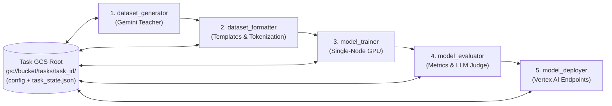

# `distillfw`: Gemini-to-Gemma Distillation Framework Specification

## 1. Overview & Motivation

`distillfw` is a Python library for distilling task-specific capabilities from **Gemini** teacher models into smaller, open-weights **Gemma** student models on Google Cloud Platform (GCP).

### Problem Statement & Core Workflow
Many production applications prototype or launch using large frontier models (e.g., Gemini 3.5 Pro / Flash) for a specialized, well-defined task. Once the task is validated, teams often need to:
1. **Reduce inference costs** at scale.
2. **Guarantee low, predictable latency** (TTFT and TPOT).
3. **Deploy within controlled infrastructure** (self-hosted endpoints, strict data governance, predictable capacity).

To achieve this, the user provides a dataset of representative task prompts. `distillfw` automates the end-to-end workflow:
1. Querying the **Gemini** teacher model with the prompt dataset to record high-quality responses, reasoning traces, and/or top-$k$ token log-probabilities.
2. Formatting and curating the resulting distillation dataset.
3. Training a **Gemma** student model on a single GPU node using SOTA off-policy or on-policy distillation algorithms.
4. Evaluating the distilled Gemma model against both the untrained base Gemma model and the Gemini teacher.
5. Deploying the distilled model to **Vertex AI Endpoints**.

---

## 2. Design Principles & Constraints

- **GCP-Native Integration**: First-class support for Google Cloud Storage (GCS), Vertex AI Gemini API / Batch Prediction, Vertex AI Custom Training, Vertex AI Model Garden, and Vertex AI Endpoints.
- **Isolated Multi-Task Tracking on GCS**: Each distillation task is tracked in its own dedicated GCS root path (`gs://<bucket>/<prefix>/<task_id>/`). Multiple tasks can run concurrently or asynchronously without state collision.
- **Zero-Local-State Resumability**: A task's GCS path is the **single source of truth**. Given *only* the GCS task URI (`gs://.../<task_id>/`), any worker, VM, or Vertex AI job can inspect task status, recover from interruptions, skip completed stages, and resume execution without requiring any local files, local state, or external databases.
- **Single-Node Simplicity**: Because Gemma student models (1B to 27B) fit on a single multi-GPU node (e.g., 1×–8× NVIDIA L4, A100, or H100 GPUs), multi-node distributed training is intentionally excluded. Training uses single-node PyTorch / Accelerate / FSDP / LoRA / QLoRA for maximum reliability and debuggability.
- **Leverage SOTA Open-Source Engines**: Rather than re-implementing low-level training loops from scratch, `distillfw` wraps battle-tested ecosystems (`huggingface/trl`, `transformers`, `peft`, `vllm`, and `google-genai`).
- **Declarative & Modular Pipeline**: Every pipeline stage can be executed independently via Python API or CLI using a unified, validated configuration schema (Pydantic / YAML).

---

## 3. Multi-Task Tracking & Self-Contained GCS State

### 3.1 Isolated Task Workspaces & Preflight Initialization Checks
- Every distillation task is uniquely identified by its GCS task URI: `gs://<bucket>/<tasks_root>/<task_id>/`.
- Users can initialize a new task from a local config file (`distillfw init --config config.yaml --prompts prompts.jsonl [--force-reset]`) or resume an existing task using only its URI (`distillfw resume gs://...`).
- **Existing Workspace Protection (`--force-reset`)**:
  - If the target GCS workspace (`<task_uri>/`) already contains any objects, `distillfw init` warns the user and exits cleanly without modifying anything (`TaskWorkspace.initialize` raises [`TaskWorkspaceExistsError`](file:///usr/local/google/home/raulramos/projects/distillfw/src/distillfw/state.py#L88-L89)).
  - When `--force-reset` is specified on the CLI and the target GCP path has existing contents, `distillfw init` explicitly warns the user that **all existing contents under `<task_uri>/` will be permanently and completely erased before proceeding** and prompts for confirmation (`y/N`). If declined, `distillfw init` cancels cleanly ([`TaskResetAbortedError`](file:///usr/local/google/home/raulramos/projects/distillfw/src/distillfw/state.py#L92-L93)) without modifying anything; if confirmed, it completely erases all objects under `<task_uri>/` via [`StorageBackend.delete_prefix`](file:///usr/local/google/home/raulramos/projects/distillfw/src/distillfw/gcp/storage.py#L175-L190) **before proceeding** with preflight validation and workspace initialization.
- **Preflight Validation (`TaskWorkspace.initialize` / `distillfw init`)**: Before creating or writing any artifacts to the GCS workspace, `init` performs two strict preflight checks and raises [`TaskInitializationError`](file:///usr/local/google/home/raulramos/projects/distillfw/src/distillfw/state.py#L84-L85) on failure:
  1. **Algorithm ↔ Logprobs Compatibility Check**:
     - If `training.algorithm` does **not** require token log-probabilities (`sft_seqkd`, `dpo`, `simpo`, `orpo`, `grpo`), `teacher.response_logprobs` **must** be `false`.
     - If `training.algorithm` **does** require token log-probabilities (`forward_kl`, `reverse_kl`, `jsd`, `skew_kl`, `distillm2`, `gkd`), `teacher.response_logprobs` **must** be `true` **and** `teacher.logprobs_top_k` (`1..20`) **must** be explicitly set.
  2. **Live Teacher Logprobs Probe**:
     - When `teacher.response_logprobs: true`, `init` runs a single-prompt preflight test inference against the configured teacher model (`teacher.model_id` / `teacher.location`) to verify both that the model endpoint supports returning token log-probabilities and that every returned token position delivers at least `teacher.logprobs_top_k` candidate entries.

### 3.2 GCS State Manifest (`task_state.json`)
Each task directory maintains an atomic, versioned `task_state.json` manifest alongside the frozen `config.yaml` and input prompts:
- **Global Metadata**: `task_id`, `created_at`, `updated_at`, `current_stage`, overall `status` (`PENDING`, `RUNNING`, `COMPLETED`, `FAILED`), and `config_sha256`.
- **Per-Stage Status Records**: For each stage (`dataset_generator`, `dataset_formatter`, `model_trainer`, `model_evaluator`, `model_deployer`):
  - `status`: `PENDING` | `RUNNING` | `COMPLETED` | `FAILED`
  - `started_at`, `completed_at`, `attempt_count`, `error_message`
  - `progress_cursor`: Intra-stage progress pointer (e.g., completed shard index or prompt offset for generation; latest step checkpoint URI for training; Vertex AI Batch/Custom Job resource ID for detached jobs).
  - `artifacts`: Explicit GCS URIs of all inputs consumed and outputs produced by the stage.

### 3.3 Stateless Resumption Contract
When `distillfw` is invoked with a task URI (`gs://.../<task_id>/`):
1. It downloads `config.yaml` and `task_state.json` from that GCS path.
2. It verifies all completed stages and their output artifacts directly on GCS.
3. For the first incomplete or failed stage, it automatically resumes from the recorded `progress_cursor` or latest checkpoint (e.g., appending missing Gemini generations, re-attaching to an active Vertex AI Batch/Training job, or loading the latest trainer checkpoint from `03_checkpoints/checkpoint-<step>/`).
4. Ephemeral local disk storage is used strictly as a write-through cache; all checkpoints, shards, metrics, and status updates are synced to GCS.

---

## 4. Configuration & User Choices Matrix

`distillfw` exposes a unified configuration object (`DistillationConfig`) allowing users to mix and match models, data formats, algorithms, and evaluation strategies:

| Dimension | Supported Options | Notes |
| :--- | :--- | :--- |
| **Teacher Models (Gemini)** | `gemini-3.5-pro`, `gemini-3.5-flash`, `gemini-3.5-flash-lite`, `gemini-2.0-flash`, `gemini-2.0-flash-lite` | Accessed via `google-genai` SDK. Supports dedicated `teacher.location` (e.g. `global`) independent of regional `gcp.location` used for training/serving, plus thinking traces and `response_logprobs`. |
| **Student Models (Gemma)** | **Gemma 3**: `1b`, `4b`, `12b`, `27b` (`-pt` & `-it`)<br>**Gemma 2**: `2b`, `9b`, `27b` (`-pt` & `-it`) | Pulled from Vertex AI Model Garden or Hugging Face Hub. Supports full fine-tuning, LoRA, and QLoRA (4-bit/8-bit). |
| **Prompt Formats** | `pretrain` (raw completion)<br>`instruction` (single-turn `<start_of_turn>`)<br>`chat` (multi-turn conversation + system prompt)<br>`reasoning` (explicit `<start_of_turn>thought` traces) | Automatically applies model-specific chat templates and computes loss masks (`-100` on user/system prompt tokens). |
| **Dataset Representations** | `text` (prompt/completion strings)<br>`tokens` (pre-tokenized `input_ids` + `labels`)<br>`sparse_logprobs` (top-$k$ teacher token IDs & logprobs)<br>`preference` (`prompt`, `chosen`, `rejected` pairs) | Stored on GCS as Parquet / JSONL / Hugging Face Dataset artifacts with full provenance metadata. |
| **Distillation Paradigms** | **Off-Policy**: Fixed teacher/preference dataset.<br>**On-Policy / Hybrid**: Student generates rollouts during training (`GKD` $\lambda$-mixing or online teacher scoring). | Off-policy maximizes speed and zero online teacher cost; on-policy mitigates exposure bias and compounding student errors. |
| **Training Algorithms** | **SFT / SeqKD**: Sequence-level cross-entropy.<br>**Logit KD**: Forward KL, Reverse KL, JSD, Skew KL (*DistiLLM*).<br>**Contrastive / Preference**: DPO, SimPO, ORPO, *DistiLLM-2*.<br>**RL / On-Policy**: GKD, GRPO / RLOO (with Gemini judge or verifiable reward). | Accounts for the API boundary: uses sequence-level/preference losses for pure text outputs, or truncated top-$k$ distributions when `response_logprobs=True`. |
| **Evaluation Methods** | **Lexical**: BLEU, ROUGE-1/2/L, Exact Match.<br>**Probabilistic**: Perplexity, Token KL Divergence.<br>**Semantic / Task**: Embedding Cosine Sim, JSON Schema Validity.<br>**LLM-as-a-Judge**: Pairwise Win Rate & Rubric Score vs. Gemini.<br>**System**: Latency (TTFT, TPOT, p50/p95) & Cost/1M tokens. | Automatically generates a comparison report across Teacher (Gemini) vs. Base Student vs. Distilled Student. |

---

## 5. Pipeline Architecture (5 Stages)



### Stage 1: `dataset_generator`
Generates the distillation training dataset by querying the selected Gemini teacher model with user-provided prompts.
- **Inputs (from GCS Task Path)**: `00_inputs/prompts.parquet` (copied to GCS on task init), `config.yaml`, and `task_state.json`.
- **Capabilities**:
  - Uses `teacher.location` (e.g., `global`) when specified, falling back to `gcp.location` (e.g., `us-central1`) if unset.
  - **Resilient Retry & Exponential Backoff (`gcp/retry.py`)**: Every Gemini API request is wrapped in [`call_with_exponential_backoff`](file:///usr/local/google/home/raulramos/projects/distillfw/src/distillfw/gcp/retry.py#L40-L89) with **at least 10 retries** (`teacher.max_retries >= 10`, default `12`) and strictly increasing wait intervals ($t_1 < t_2 < \dots < t_{N}$) to survive `429 RESOURCE_EXHAUSTED` and overloaded prefill queue errors.
  - Supports high-throughput **async online requests** (writing sharded outputs to GCS for fine-grained resumption) and **Vertex AI Batch Prediction** jobs (persisting the batch job ID in `task_state.json` so any process can poll/collect results later).
  - Optional **Best-of-$N$ / Rejection Sampling**: Generates $N$ candidate responses per prompt and filters/ranks them using a verifier or judge before saving.
  - **Thinking Budget & Output Token Reservation**: Explicitly passes `ThinkingConfig(thinking_budget=0)` when `teacher.thinking_budget` is unset/`0` and `formatting.prompt_format != "reasoning"` so internal hidden thinking tokens (`thoughts_token_count`) do not consume `teacher.max_output_tokens`. When reasoning is enabled, sets the API `max_output_tokens = teacher.max_output_tokens + thinking_budget` (with `include_thoughts=True`), and automatically retries with a doubled token budget if `FinishReason.MAX_TOKENS` is encountered.
  - Captures both final answers and intermediate reasoning traces (`thought` blocks) when distilling reasoning capabilities.
- **Outputs**: Sharded raw teacher dataset saved to `<task_uri>/01_raw_dataset/` + updated `task_state.json`.

### Stage 2: `dataset_formatter`
Transforms raw teacher outputs into the target prompt format and training representation required by the chosen algorithm.
- **Inputs (from GCS Task Path)**: `<task_uri>/01_raw_dataset/`, student tokenizer, target prompt format (`pretrain`, `instruction`, `chat`, `reasoning`), and dataset representation (`text`, `tokens`, `sparse_logprobs`, `preference`).
- **Capabilities**:
  - Applies Gemma chat templates and masks prompt tokens (`label = -100`) so loss is computed strictly on assistant/thought turns.
  - When using `sparse_logprobs`, aligns teacher top-$k$ log-probabilities into dense/sparse target tensors with residual probability mass smoothing.
  - For contrastive/preference algorithms (DPO, DistiLLM-2), pairs teacher outputs (`chosen`) with base student outputs or lower-ranked candidates (`rejected`).
  - Performs train/validation/test splitting and sequence length filtering.
- **Outputs**: Formatted training/validation splits saved to `<task_uri>/02_formatted_dataset/` + updated `task_state.json`.

### Stage 3: `model_trainer`
Trains the Gemma student model on a single GPU node using SOTA distillation algorithms.
- **Inputs (from GCS Task Path)**: `<task_uri>/02_formatted_dataset/`, base Gemma model ID (from Vertex AI Model Garden / HF), and prior checkpoints in `<task_uri>/03_checkpoints/` if resuming.
- **Execution Modes**:
  - **Local / Interactive Mode**: Runs directly on the current single-node GPU machine (1–8 GPUs via `accelerate`), syncing checkpoints directly to `<task_uri>/03_checkpoints/`.
  - **Managed Vertex AI Mode**: Packages the training job and submits a single-node multi-GPU **Vertex AI Custom Training Job**, recording the Vertex job ID in `task_state.json` for stateless monitoring/resumption.
- **Supported Algorithm Families**:
  1. **Supervised Fine-Tuning / SeqKD (`trl.SFTTrainer`)**: Standard cross-entropy on teacher completions.
  2. **Generalized Knowledge Distillation (`trl.GKDTrainer`)**: Supports off-policy ($\lambda=0$), on-policy ($\lambda=1$), and mixed ($\lambda \in (0,1)$) student rollout generation with Forward KL, Reverse KL, and Generalized JSD.
  3. **Streamlined & Contrastive Off-Policy KD (`DistiLLM` / `DistiLLM-2`)**: Implements Skew KL divergence and asymmetric contrastive losses for superior off-policy stability.
  4. **Preference & Alignment Distillation (`trl.DPOTrainer` / `ORPOTrainer`)**: Off-policy preference optimization between teacher and student generations.
  5. **Reinforcement Learning Distillation (`trl.GRPOTrainer`)**: On-policy group relative policy optimization using Gemini or deterministic verifiers as reward functions.
- **Outputs**: Checkpoints, training metrics, and merged final model weights saved to `<task_uri>/03_checkpoints/` and `<task_uri>/05_exported_model/` + updated `task_state.json`.

### Stage 4: `model_evaluator`
Evaluates the distilled Gemma model on held-out test prompts and benchmarks it against both the untrained base student and the Gemini teacher.
- **Inputs (from GCS Task Path)**: Held-out test split in `<task_uri>/02_formatted_dataset/test/`, distilled model artifact in `<task_uri>/05_exported_model/`, baseline Gemma model, and teacher reference outputs.
- **Capabilities**:
  - **Managed Vertex AI GPU Custom Job or Local Execution**: When `vertex_machine_type`, `vertex_accelerator_type`, and `vertex_accelerator_count` are configured under `evaluation:` in `config.yaml` (e.g., `g2-standard-12` with `1x NVIDIA_L4`), Stage 4 reuses [`VertexJobManager.submit_evaluation_job`](file:///usr/local/google/home/raulramos/projects/distillfw/src/distillfw/gcp/vertex.py#L149-L173) to run student evaluation (`before_training` and `after_training`) on dedicated ephemeral Vertex AI GPU hardware (`distillfw-eval-<task_id>`). When those three hardware options are omitted, Stage 4 emits a 5-line CLI log and console printout warning (without asking for confirmation) and executes locally.
  - Fast batched inference using `vllm` / `transformers`.
  - Computes configured metrics:
    - **Reference-based**: BLEU, ROUGE-1/2/L, Exact Match, BERTScore.
    - **Intrinsic**: Perplexity and KL divergence against teacher logprobs.
    - **Task-specific**: Custom Python verifiers (e.g., JSON schema validation, regex match, code execution).
    - **LLM-as-a-Judge**: Automated side-by-side win/tie/loss evaluation and 1–5 rubric grading using Vertex AI Gen AI Evaluation / Gemini 3.5 Pro.
    - **System profiling**: Measures throughput (tokens/sec), latency (TTFT, TPOT, p50/p95/p99), and estimated serving cost per 1M tokens.
- **Outputs**: Structured JSON/Markdown evaluation scorecard and quality-vs-cost report saved to `<task_uri>/04_evaluation/` + updated `task_state.json`.

### Stage 5: `model_deployer`
Deploys the validated Gemma student model to a production **Vertex AI Endpoint**.
- **Inputs (from GCS Task Path)**: Distilled model artifact in `<task_uri>/05_exported_model/`, serving configuration in `config.yaml`.
- **Capabilities**:
  - Automatically merges LoRA adapters into base weights (or configures dynamic LoRA serving).
  - Uploads the model to **Vertex AI Model Registry** using optimized Model Garden serving containers (vLLM).
  - Creates or updates a **Vertex AI Endpoint**, deploys the model with traffic splitting, and runs post-deployment smoke/latency checks.
- **Outputs**: Deployment manifest (`endpoint_info.json`) saved to `<task_uri>/06_deployment/` + updated `task_state.json`.

---

## 6. GCP Infrastructure & Self-Contained Task Layout

Each distillation task is completely self-contained under its own GCS prefix:

```text
gs://<project-distillfw-bucket>/
└── tasks/
    ├── <task_id_1>/                        # Self-contained Task 1 workspace
    │   ├── config.yaml                     # Frozen DistillationConfig snapshot
    │   ├── task_state.json                 # Single-source-of-truth stage status & cursors
    │   ├── 00_inputs/                      # Immutable copy of user input prompts
    │   ├── 01_raw_dataset/                 # Sharded Gemini responses, thoughts, logprobs
    │   ├── 02_formatted_dataset/           # Tokenized / templated Parquet train/val/test splits
    │   ├── 03_checkpoints/                 # Resumable training checkpoints & TensorBoard logs
    │   ├── 04_evaluation/                  # Scorecard, generations, judge verdicts
    │   ├── 05_exported_model/              # Final merged HF/vLLM weights ready for serving
    │   ├── 06_deployment/                  # Deployed Vertex AI Model & Endpoint metadata
    │   └── logs/                           # Timestamped run logs synced every 60s & on completion
    └── <task_id_2>/                        # Independent Task 2 workspace
        └── ...
```

### 6.1 Activity Logging & Continuous GCS Log Synchronization
- Every command execution (`distillfw init`, `distillfw resume`, `distillfw run-stage`) and pipeline invocation is managed by [`TaskRunLogger`](file:///usr/local/google/home/raulramos/projects/distillfw/src/distillfw/logging_utils.py#L31-L185).
- Logs are emitted simultaneously to **console (`stdout`/`stderr`)** and to a **local log file** whose filename is prefixed with the start date and time (`<log_dir>/<YYYYMMDD_HHMMSS>_<command>.log`).
- A daemon background thread automatically uploads the active local log file to `<task_uri>/logs/<YYYYMMDD_HHMMSS>_<command>.log` on GCS **every 60 seconds** while the command runs, and performs a **final flush and upload when the command finishes** (whether succeeding or raising an error).

### 6.2 Interactive Web UI (`distillfw ui` / `src/distillfw/ui/`)
- Launched via `distillfw ui [--root-uri gs://...] [--host 127.0.0.1] [--port 8080]` ([`cli.py`](file:///usr/local/google/home/raulramos/projects/distillfw/src/distillfw/cli.py#L269-L298)), served by [`TaskUIController`](file:///usr/local/google/home/raulramos/projects/distillfw/src/distillfw/ui/server.py#L194-L458) and [`create_ui_server`](file:///usr/local/google/home/raulramos/projects/distillfw/src/distillfw/ui/server.py#L461-L577).
- **Top Control Bar**:
  - Text input (`#gcs-root-input`) pointing to the GCS root path where distillation tasks are kept (`gs://<bucket>/<tasks_prefix>` or local tasks root).
  - Dropdown selector (`#task-select`) populated with all discovered tasks (`*/task_state.json`) and their overall status.
  - **About Distillation Button (`#about-distillation-btn`)**: Top-right button that opens a pop-up `<dialog>` reference guide explaining Off-Policy (`off_policy`) vs. On-Policy/Hybrid (`on_policy`/`hybrid`) distillation paradigms, exposure bias vs. online student rollout generation, Teacher logprob (`teacher.response_logprobs`) requirements, and Tokenizer/Vocabulary alignment across all supported algorithm families (`sft_seqkd`, `forward_kl`, `reverse_kl`, `jsd`, `skew_kl`, `distillm2`, `dpo`, `simpo`, `orpo`, `gkd`, `grpo`).
- **Selected Distillation Task Workspace View**:
  - **Current Task & Stage Status**: Displays overall task status, metadata strip, and the 5-stage pipeline status table with live Vertex AI Custom Job status refresh ([`TaskWorkspace.refresh_vertex_training_status`](file:///usr/local/google/home/raulramos/projects/distillfw/src/distillfw/state.py#L646-L708)).
  - **Config File Emerging Panel**: Clicking **View Config (`config.yaml`)** opens `<task_uri>/config.yaml` in an emerging `<dialog>` panel.
  - **GCP Resources & Console Links**: Displays direct resource identifiers, status badges, copy buttons, and Google Cloud Console links for the GCS Task Workspace (`task_uri`), GCS Checkpoints (`03_checkpoints`), GCS Exported Student Model (`05_exported_model`), Vertex AI Custom Training Job (plus Cloud Logging link), Vertex AI Custom Evaluation Job (when configured/submitted), Deployed Model in Vertex AI Model Registry, and Vertex AI Serving Endpoint.
  - **Task Log Files & Emerging Panel Viewer**: Lists all `<YYYYMMDD_HHMMSS>_<command>.log` files under `<task_uri>/logs/` and opens any clicked log file in an emerging panel with line filtering.
  - **Task Datasets & Structured Table Emerging Panel**: Lists all datasets across `00_inputs/`, `01_raw_dataset/`, `02_formatted_dataset/` (`train.parquet`, `val.parquet`, `test.parquet`), and `04_evaluation/predictions.jsonl`, rendering clicked datasets as a structured table with fields/columns, search filter, and pagination inside an emerging panel.
  - **Structured Evaluation Metrics & Side-by-Side Inferences Emerging Panel**: Renders structured evaluation tables (`Metric`, `Before Training (Base)`, `After Training (Distilled)`, `Improvement (Delta)`) for both **Test Split (Held-Out)** and **Train Split**, and provides a **Compare Side-by-Side Inferences** emerging panel displaying each prompt alongside `Student Model Before Training`, `Student Model After Training`, and `Teacher Model` outputs side by side, including the per-case evaluation metrics (`Exact Match`, `ROUGE-1`, `ROUGE-2`, `BLEU-4`, `LLM Judge Score` + rationale, and `Latency`) inside both the `Student Before Training` and `Student After Training` panels (with improvement deltas).

---

## 7. Proposed Package Structure

```text
distillfw/
├── .gitignore                          # Git ignore rules for Python, caches, checkpoints & weights
├── README.md                           # User guide, configuration reference & CLI/API instructions
├── pyproject.toml
├── spec.md
├── examples/                           # Ready-to-run task examples with 150-prompt datasets
│   ├── support_ticket_classification/  # Support ticket triage (config.yaml + 150 prompts)
│   └── query_expansion/                # Search/RAG query expansion (config.yaml + 150 prompts)
└── src/
    ├── notebooks/                      # Sample notebooks illustrating end-to-end & staged workflows
    │   ├── 01_quickstart_end_to_end.ipynb
    │   ├── 02_staged_pipeline_and_resumption.ipynb
    │   ├── 03_off_policy_vs_on_policy_algorithms.ipynb
    │   ├── 04_evaluation_and_vertex_deployment.ipynb
    │   └── 05_inference_side_by_side_teacher_with_deployed_student.ipynb
    └── distillfw/
        ├── __init__.py
        ├── cli.py                      # CLI (`distillfw init / resume / status / list / run-stage / ui`)
        ├── config.py                   # Pydantic schemas for full pipeline configuration
        ├── logging_utils.py            # Console + timestamped local file logging & 60s GCS sync
        ├── state.py                    # TaskState manifest & atomic GCS state synchronization
        ├── pipeline.py                 # Stateless orchestrator driven solely by `gs://.../<task_id>/`
        ├── ui/                         # Web UI (`distillfw ui`) for inspecting GCS tasks & evaluations
        │   ├── __init__.py
        │   ├── server.py               # TaskUIController & HTTP JSON/static server
        │   └── static/                 # Frontend HTML5, CSS, and JS assets (`index.html`, `styles.css`, `app.js`)
        ├── stages/
        │   ├── generator.py            # Stage 1: Resumable sharded/batch Gemini dataset generation
        │   ├── formatter.py            # Stage 2: Chat templating, loss masking, top-k logprob packing
        │   ├── trainer.py              # Stage 3: Single-node TRL / DistiLLM / GKD trainers + GCS checkpoint sync
        │   ├── evaluator.py            # Stage 4: Lexical, perplexity, LLM-judge & latency evaluation
        │   └── deployer.py             # Stage 5: Model Registry upload & Vertex AI Endpoint deployment
        ├── algorithms/                 # Custom loss functions (Skew KLD, Sparse Top-K KLD, DistiLLM-2)
        └── gcp/                        # GCS I/O helpers, Vertex AI Custom Job & Endpoint wrappers
```

---

## 8. Specification & Framework Evolution Log

| Date | Version | Summary of Changes |
| :--- | :--- | :--- |
| 2026-09-20 | `v0.1.0` | Initial specification & implementation of `distillfw`: 5-stage Gemini-to-Gemma distillation pipeline on GCP, isolated multi-task tracking on GCS (`task_state.json`), zero-local-state resumability from GCS URIs alone, single-node multi-GPU training, SOTA distillation losses (Forward KL, Reverse KL, JSD, Skew KL / *DistiLLM*, Contrastive Asymmetric KD / *DistiLLM-2*, Sparse Top-K API Logprob KD), CLI, test suite, and 5 sample notebooks in `src/notebooks/`. |
| 2026-09-20 | `v0.1.1` | Added comprehensive [README.md](file:///usr/local/google/home/raulramos/projects/distillfw/README.md) with user instructions covering environment setup, GCP authentication, local GCS emulation (`DISTILLFW_LOCAL_GCS_ROOT`), prompt preparation, full `config.yaml` reference, CLI & Python API usage, distillation algorithm selection guide, GCS workspace layout, and sample notebook guides. |
| 2026-09-21 | `v0.1.2` | Added [.gitignore](file:///usr/local/google/home/raulramos/projects/distillfw/.gitignore) covering Python bytecode/packaging artifacts, test/lint caches, Jupyter notebook checkpoints, virtual environments, local ML checkpoints/weights, and IDE/OS files. |
| 2026-09-21 | `v0.1.3` | Replaced all Gemini 2.5 references across [config.py](file:///usr/local/google/home/raulramos/projects/distillfw/src/distillfw/config.py), [README.md](file:///usr/local/google/home/raulramos/projects/distillfw/README.md), [01_quickstart_end_to_end.ipynb](file:///usr/local/google/home/raulramos/projects/distillfw/src/notebooks/01_quickstart_end_to_end.ipynb), and [spec.md](file:///usr/local/google/home/raulramos/projects/distillfw/spec.md) with Gemini 3.5 (`gemini-3.5-pro`, `gemini-3.5-flash`, `gemini-3.5-flash-lite`). |
| 2026-09-21 | `v0.1.4` | Added `examples/` directory with two complete end-to-end examples ([`support_ticket_classification`](file:///usr/local/google/home/raulramos/projects/distillfw/examples/support_ticket_classification/) and [`query_expansion`](file:///usr/local/google/home/raulramos/projects/distillfw/examples/query_expansion/)), each containing a validated `config.yaml`, a `README.md`, and a 150-prompt `prompts.jsonl` dataset. |
| 2026-09-21 | `v0.1.5` | Added optional `location` field to [`TeacherConfig`](file:///usr/local/google/home/raulramos/projects/distillfw/src/distillfw/config.py#L116-L128) (and `judge_location` to [`EvaluationConfig`](file:///usr/local/google/home/raulramos/projects/distillfw/src/distillfw/config.py#L240-L254)) so Gemini inference calls in [generator.py](file:///usr/local/google/home/raulramos/projects/distillfw/src/distillfw/stages/generator.py#L77-L80) and [evaluator.py](file:///usr/local/google/home/raulramos/projects/distillfw/src/distillfw/stages/evaluator.py#L106-L119) can target global endpoints (`location: global`) while `gcp.location` targets regional training/serving infrastructure. |
| 2026-09-21 | `v0.1.6` | Enforced strict preflight validation during task initialization ([`TaskWorkspace.initialize`](file:///usr/local/google/home/raulramos/projects/distillfw/src/distillfw/state.py#L204-L234) / [`DistillationConfig.validate_logprobs_compatibility`](file:///usr/local/google/home/raulramos/projects/distillfw/src/distillfw/config.py#L298-L329)): (1) verifies that `teacher.response_logprobs` and `teacher.logprobs_top_k` match whether `training.algorithm` requires logprobs, and (2) when `response_logprobs: true`, runs a live preflight test inference against the teacher model via [`verify_teacher_logprobs_support`](file:///usr/local/google/home/raulramos/projects/distillfw/src/distillfw/state.py#L25-L84) to verify logprobs availability and `top_k` count before creating GCS task artifacts. |
| 2026-09-21 | `v0.1.7` | Updated task initialization (`distillfw init` / [`TaskWorkspace.initialize`](file:///usr/local/google/home/raulramos/projects/distillfw/src/distillfw/state.py#L221-L266)) so that if existing contents are present in the target GCS workspace, it warns and exits cleanly without modifying anything unless `--force-reset` (`force_reset=True`) is specified (in which case existing contents under `<task_uri>/` are deleted via [`StorageBackend.delete_prefix`](file:///usr/local/google/home/raulramos/projects/distillfw/src/distillfw/gcp/storage.py#L175-L190) and re-initialized). |
| 2026-09-21 | `v0.1.8` | Added detailed stage-by-stage activity logging via [`logging_utils.py`](file:///usr/local/google/home/raulramos/projects/distillfw/src/distillfw/logging_utils.py) ([`TaskRunLogger`](file:///usr/local/google/home/raulramos/projects/distillfw/src/distillfw/logging_utils.py#L31-L185)): streams logs to stdout/stderr and to a local log file prefixed with the start date/time (`<YYYYMMDD_HHMMSS>_<command>.log`), uploads the log file to `<task_uri>/logs/` on GCS every 60 seconds in a daemon background thread, and uploads the final log file when the command finishes. |
| 2026-09-21 | `v0.1.9` | Updated `distillfw init --force-reset` ([`cli.py`](file:///usr/local/google/home/raulramos/projects/distillfw/src/distillfw/cli.py#L28-L62), [`state.py`](file:///usr/local/google/home/raulramos/projects/distillfw/src/distillfw/state.py#L229-L290)) so that when the target GCP path has existing contents, it clearly warns the user that all existing contents under `<task_uri>/` will be permanently and completely erased before proceeding, asks for confirmation (`y/N`), and completely erases the GCP path before proceeding with preflight checks and workspace initialization (or exits cleanly via [`TaskResetAbortedError`](file:///usr/local/google/home/raulramos/projects/distillfw/src/distillfw/state.py#L92-L93) if declined). |
| 2026-09-21 | `v0.1.10` | Added [`gcp/retry.py`](file:///usr/local/google/home/raulramos/projects/distillfw/src/distillfw/gcp/retry.py) (`call_with_exponential_backoff` & `compute_increasing_backoff_delays`) and retry configuration fields on [`TeacherConfig`](file:///usr/local/google/home/raulramos/projects/distillfw/src/distillfw/config.py#L165-L185) (`max_retries >= 10`, default `12`) so all Gemini API calls ([`generator.py`](file:///usr/local/google/home/raulramos/projects/distillfw/src/distillfw/stages/generator.py#L54-L115), [`state.py`](file:///usr/local/google/home/raulramos/projects/distillfw/src/distillfw/state.py#L128-L160), [`evaluator.py`](file:///usr/local/google/home/raulramos/projects/distillfw/src/distillfw/stages/evaluator.py#L113-L135)) automatically perform at least 10 retries with strictly increasing wait intervals to handle `429 RESOURCE_EXHAUSTED` / overloaded prefill queue errors. |
| 2026-09-21 | `v0.1.11` | Migrated all `google-genai` inference call sites ([`generator.py`](file:///usr/local/google/home/raulramos/projects/distillfw/src/distillfw/stages/generator.py#L107-L118), [`state.py`](file:///usr/local/google/home/raulramos/projects/distillfw/src/distillfw/state.py#L140-L157), and [`evaluator.py`](file:///usr/local/google/home/raulramos/projects/distillfw/src/distillfw/stages/evaluator.py#L127-L134)) from `client.models.generate_content(...)` to `client.chats.create(model=..., config=...).send_message(message=...)` (`Chat.send_message`), eliminating the `google-genai` automatic function calling (AFC) deprecation warning. |
| 2026-09-21 | `v0.1.12` | Fixed `transformers 5.x` / `trl 1.x` compatibility in [`stages/trainer.py`](file:///usr/local/google/home/raulramos/projects/distillfw/src/distillfw/stages/trainer.py#L107-L215): replaced removed `warmup_ratio` keyword argument on `TrainingArguments` with computed `warmup_steps`, updated `SFTConfig` sequence length argument (`max_length`), and added `trl.experimental.gkd` import fallback for `GKDConfig` / `GKDTrainer`. |
| 2026-09-21 | `v0.1.13` | Updated bundled example configs ([`examples/support_ticket_classification/config.yaml`](file:///usr/local/google/home/raulramos/projects/distillfw/examples/support_ticket_classification/config.yaml#L43-L47), [`examples/query_expansion/config.yaml`](file:///usr/local/google/home/raulramos/projects/distillfw/examples/query_expansion/config.yaml#L43-L47)) from `execution_mode: local` to `execution_mode: vertex_custom_job` so Stage 3 dispatches to Vertex AI GPU nodes rather than running locally on CPU-only workstations, and added an explicit `torch.cuda.is_available()` check in [`stages/trainer.py`](file:///usr/local/google/home/raulramos/projects/distillfw/src/distillfw/stages/trainer.py#L70-L81) before downloading weights or initializing `TrainingArguments`. |
| 2026-09-21 | `v0.1.14` | Removed `DISTILLFW_LOCAL_GCS_ROOT` environment variable support and replaced it with a declarative [`LocalConfig`](file:///usr/local/google/home/raulramos/projects/distillfw/src/distillfw/config.py#L128-L138) (`local.storage_root`) section in `config.yaml`. Enforced strict XOR validation in [`DistillationConfig`](file:///usr/local/google/home/raulramos/projects/distillfw/src/distillfw/config.py#L343-L349) requiring either `gcp` or `local` (never both, never neither), updated [`TrainingConfig.execution_mode`](file:///usr/local/google/home/raulramos/projects/distillfw/src/distillfw/config.py#L251) to default to `"vertex_custom_job"` so all stages run on GCP by default, and updated [`StorageBackend`](file:///usr/local/google/home/raulramos/projects/distillfw/src/distillfw/gcp/storage.py#L22-L190), [README.md](file:///usr/local/google/home/raulramos/projects/distillfw/README.md), notebooks, and tests accordingly. |
| 2026-09-21 | `v0.1.15` | Refined the [`examples/query_expansion/`](file:///usr/local/google/home/raulramos/projects/distillfw/examples/query_expansion/) example ([`config.yaml`](file:///usr/local/google/home/raulramos/projects/distillfw/examples/query_expansion/config.yaml), [`README.md`](file:///usr/local/google/home/raulramos/projects/distillfw/examples/query_expansion/README.md), and [`prompts.jsonl`](file:///usr/local/google/home/raulramos/projects/distillfw/examples/query_expansion/prompts.jsonl)) to focus exclusively on retail e-commerce product search across three explicit levels of product query detail (`specificity_level`: `broad`, `medium`, `high`, e.g. `"running shoes"` vs. `"adidas pair of sporting shoes with red stripes"`), covering 150 unique shopper queries across 10 retail product categories. |
| 2026-09-21 | `v0.1.16` | Added regional GCS bucket preflight validation ([`verify_gcp_bucket_location`](file:///usr/local/google/home/raulramos/projects/distillfw/src/distillfw/state.py#L96-L170) via [`StorageBackend.get_bucket_location`](file:///usr/local/google/home/raulramos/projects/distillfw/src/distillfw/gcp/storage.py#L53-L62)) during `distillfw init` ([`TaskWorkspace.initialize`](file:///usr/local/google/home/raulramos/projects/distillfw/src/distillfw/state.py#L343)). Verifies that `gcp.bucket_name` (and `gcp.staging_bucket` if set) exists and is a single-region bucket matching `gcp.location` (catching multi-region `US` vs regional `us-central1` mismatches before Stage 1 runs), and outputs actionable `gcloud storage buckets create --location=<region> --uniform-bucket-level-access` and `config.yaml` instructions. |
| 2026-09-21 | `v0.1.17` | Updated Option B remediation instructions in [`verify_gcp_bucket_location`](file:///usr/local/google/home/raulramos/projects/distillfw/src/distillfw/state.py#L165-L171) to include the explicit `gcloud storage buckets delete gs://<bucket_name> --project=<project_id>` command (after removing bucket contents) before recreating the regional bucket. |
| 2026-09-21 | `v0.1.18` | Fixed Vertex AI Custom Job synchronous completion waiting & stage ordering enforcement: (1) added [`VertexJobManager.wait_for_job_completion`](file:///usr/local/google/home/raulramos/projects/distillfw/src/distillfw/gcp/vertex.py#L82-L137) so [`ModelTrainer.run`](file:///usr/local/google/home/raulramos/projects/distillfw/src/distillfw/stages/trainer.py#L268-L327) polls submitted/attached Vertex AI Custom Jobs until terminal completion (`JOB_STATE_SUCCEEDED` / `JOB_STATE_FAILED`) before returning; (2) added [`TaskWorkspace.verify_upstream_stages_completed`](file:///usr/local/google/home/raulramos/projects/distillfw/src/distillfw/state.py#L514-L525) and enforced it across [`DistillationPipeline.run_stage`](file:///usr/local/google/home/raulramos/projects/distillfw/src/distillfw/pipeline.py#L84-L114), [`DistillationPipeline.resume`](file:///usr/local/google/home/raulramos/projects/distillfw/src/distillfw/pipeline.py#L116-L134), and every stage runner (`formatter`, `trainer`, `evaluator`, `deployer`) so downstream stages never start while upstream stages are still `PENDING`/`RUNNING`/`FAILED`; and (3) added `sentencepiece`, `tiktoken`, and `protobuf` to [pyproject.toml](file:///usr/local/google/home/raulramos/projects/distillfw/pyproject.toml#L25-L27) and added exported-model presence check + tokenizer fallback in [`stages/evaluator.py`](file:///usr/local/google/home/raulramos/projects/distillfw/src/distillfw/stages/evaluator.py#L70-L90). |
| 2026-09-21 | `v0.1.19` | Added [`TaskWorkspace.refresh_vertex_training_status`](file:///usr/local/google/home/raulramos/projects/distillfw/src/distillfw/state.py#L527-L588) and wired it into [`distillfw status`](file:///usr/local/google/home/raulramos/projects/distillfw/src/distillfw/cli.py#L109-L132) (`cli.py`) and [`DistillationPipeline.get_state`](file:///usr/local/google/home/raulramos/projects/distillfw/src/distillfw/pipeline.py#L80-L82): when `model_trainer` is in status `RUNNING` with a Vertex AI Custom Job, `distillfw status` queries the live Vertex AI Custom Job state, updates the stage status (`RUNNING` / `COMPLETED` / `FAILED`) and `progress_cursor["vertex_job_state"]`, persists the updated `task_state.json` to GCS, and displays the refreshed state to the user. |
| 2026-09-21 | `v0.1.20` | Fixed two Vertex AI Custom Training Job execution and state-detection bugs: (1) updated [`VertexJobManager.submit_training_job`](file:///usr/local/google/home/raulramos/projects/distillfw/src/distillfw/gcp/vertex.py#L72-L162) to package the local `distillfw` source tree into `<task_uri>/00_inputs/distillfw_package.tar.gz`, forward `HF_TOKEN` into the worker container environment, and launch via a `bash -c` bootstrap script that downloads and installs `distillfw` inside Google's prebuilt PyTorch GPU container before running `python3 -m distillfw.cli run-stage ... --stage model_trainer --local-exec` (fixing `StartError: exec: "distillfw": executable file not found in $PATH`); and (2) added [`normalize_vertex_job_state`](file:///usr/local/google/home/raulramos/projects/distillfw/src/distillfw/gcp/vertex.py#L28-L55) to map Python 3.11+ `JobState` `IntEnum` values (`5` / `"5"` -> `"JOB_STATE_FAILED"`, `4` / `"4"` -> `"JOB_STATE_SUCCEEDED"`, etc.) so `distillfw status`, `wait_for_job_completion`, and `distillfw resume` immediately recognize terminal job states and automatically submit a fresh job when resuming after a failed job. |
| 2026-09-21 | `v0.1.21` | Added mandatory `HF_TOKEN` environment variable validation via [`verify_hf_token_present`](file:///usr/local/google/home/raulramos/projects/distillfw/src/distillfw/state.py#L96-L116) during both `distillfw init` ([`TaskWorkspace.initialize`](file:///usr/local/google/home/raulramos/projects/distillfw/src/distillfw/state.py#L364)) and Stage 3 startup ([`ModelTrainer.run`](file:///usr/local/google/home/raulramos/projects/distillfw/stages/trainer.py#L265)): if `HF_TOKEN` is unset or empty, the CLI exits immediately with code `1` and step-by-step instructions explaining how to create and export `HF_TOKEN` before launching any training job. |
| 2026-09-21 | `v0.1.22` | Added `distillfw reset-training <task_uri>` and `distillfw reset-eval <task_uri>` CLI subcommands ([`cli.py`](file:///usr/local/google/home/raulramos/projects/distillfw/src/distillfw/cli.py#L168-L189)) backed by [`TaskWorkspace.reset_stage`](file:///usr/local/google/home/raulramos/projects/distillfw/src/distillfw/state.py#L530-L558) to reset `model_trainer` or `model_evaluator` back to `PENDING` (clearing progress cursors, attempt counts, and error messages in `task_state.json`). |
| 2026-09-21 | `v0.1.23` | Fixed `ImportError: AutoModelForCausalLM requires the PyTorch library` on Vertex AI prebuilt PyTorch containers: `transformers 5.x` (`is_torch_available()`) explicitly disables PyTorch whenever `torch < 2.5.0`, whereas `us-docker.pkg.dev/vertex-ai/training/pytorch-gpu.2-2.py310:latest` preinstalls PyTorch `2.2.x` and `pyproject.toml` allowed `torch>=2.2.0`. Updated [pyproject.toml](file:///usr/local/google/home/raulramos/projects/distillfw/pyproject.toml#L23) to require `torch>=2.5.0` and updated [`VertexJobManager.submit_training_job`](file:///usr/local/google/home/raulramos/projects/distillfw/src/distillfw/gcp/vertex.py#L109-L122) to uninstall stale preinstalled `torchvision`/`torchaudio`, install `torch>=2.5.0` via `python3 -m pip`, and verify `transformers.utils.is_torch_available()` before running training. |
| 2026-09-21 | `v0.1.24` | Fixed `ImportError: numpy.core.multiarray failed to import` in `scipy.linalg` on Vertex AI prebuilt PyTorch containers: preinstalled C/Fortran extensions (`scipy`, `scikit-learn`) inside `us-docker.pkg.dev/vertex-ai/training/pytorch-gpu.2-2.py310:latest` are compiled against the NumPy 1.x C-API (`numpy.core.multiarray`), which breaks when `pip install --upgrade` upgrades `numpy` to `2.x`. Pinned `numpy>=1.26.0,<2.0.0` in [pyproject.toml](file:///usr/local/google/home/raulramos/projects/distillfw/pyproject.toml#L20) and in [`VertexJobManager.submit_training_job`](file:///usr/local/google/home/raulramos/projects/distillfw/src/distillfw/gcp/vertex.py#L116-L119) (along with a pre-run `import numpy, scipy, torch, transformers` check). |
| 2026-09-21 | `v0.1.25` | Removed the `Attempts` column from the `distillfw status` output table ([`cli.py`](file:///usr/local/google/home/raulramos/projects/distillfw/src/distillfw/cli.py#L126-L138)) so the table displays only `Stage`, `Status`, and `Progress Cursor`. |
| 2026-09-21 | `v0.1.26` | Fixed `ImportError: /opt/conda/lib/python3.10/site-packages/_XLAC.cpython-310-x86_64-linux-gnu.so: undefined symbol: _ZNK5torch8autograd4Node4nameEv` on Vertex AI GPU containers: Google's prebuilt PyTorch 2.2 container includes `torch_xla` (along with `torchvision`, `torchaudio`, `torchdata`, `torchtext`, `torch-tensorrt`) compiled against the PyTorch 2.2 C++ ABI, which crashes when `accelerate`/`transformers` probes TPU support (`import torch_xla` -> `import _XLAC`) after upgrading `torch>=2.5.0`. Updated [`VertexJobManager.submit_training_job`](file:///usr/local/google/home/raulramos/projects/distillfw/src/distillfw/gcp/vertex.py#L115-L119) to uninstall `torch_xla`, `torchdata`, `torchtext`, and `torch-tensorrt` alongside `torchvision` and `torchaudio` and verify `import numpy, scipy, torch, transformers, accelerate, peft, trl` upfront. |
| 2026-09-21 | `v0.1.27` | Fixed `AttributeError: 'functools.partial' object has no attribute '__func__'` in `trl.trainer.sft_trainer._patch_chunked_ce_lm_head` ([`stages/trainer.py`](file:///usr/local/google/home/raulramos/projects/distillfw/src/distillfw/stages/trainer.py#L153-L194)): when `AutoModelForCausalLM.from_pretrained(..., device_map="auto")` dispatches across multiple GPUs, `accelerate` wraps `model.forward` in a `functools.partial` hook without `__func__`, causing `trl >= 1.0`'s `_patch_chunked_ce_lm_head` (`loss_type="chunked_nll"`) to fail on `inspect.signature(original_forward.__func__)`. Set `loss_type="nll"` on `SFTConfig` (when supported) and attached `__func__` on `functools.partial` forward hooks so `SFTTrainer` initializes cleanly on multi-GPU `device_map="auto"` models. |
| 2026-09-21 | `v0.1.28` | Added `judge_model_location` to [`EvaluationConfig`](file:///usr/local/google/home/raulramos/projects/distillfw/src/distillfw/config.py#L297-L315) and added judge model access preflight validation via [`verify_judge_model_access`](file:///usr/local/google/home/raulramos/projects/distillfw/src/distillfw/state.py#L294-L371) in both `distillfw init` ([`TaskWorkspace.initialize`](file:///usr/local/google/home/raulramos/projects/distillfw/src/distillfw/state.py#L492)) and Stage 4 startup ([`ModelEvaluator.run`](file:///usr/local/google/home/raulramos/projects/distillfw/stages/evaluator.py#L168-L173)), plus fast-fail handling on `404 NOT_FOUND` / `403 PERMISSION_DENIED` in [`gcp/retry.py`](file:///usr/local/google/home/raulramos/projects/distillfw/src/distillfw/gcp/retry.py#L75-L83) and `--config` support on `distillfw reset-eval` / `distillfw reset-training` ([`cli.py`](file:///usr/local/google/home/raulramos/projects/distillfw/src/distillfw/cli.py#L166-L202)). |
| 2026-09-21 | `v0.1.29` | Updated [`ModelEvaluator.run`](file:///usr/local/google/home/raulramos/projects/distillfw/src/distillfw/stages/evaluator.py#L160-L312) so `verify_judge_model_access` and the entire evaluation lifecycle run inside `try ... except BaseException`, ensuring `self.workspace.mark_stage_failed(StageName.MODEL_EVALUATOR, ...)` is always persisted to `<task_uri>/task_state.json` on GCS whenever evaluation fails or is interrupted instead of leaving the stage status as `RUNNING`. |
| 2026-09-21 | `v0.1.30` | Fixed `AttributeError: 'TeacherConfig' object has no attribute 'retry_initial_delay_seconds'` in [`verify_judge_model_access`](file:///usr/local/google/home/raulramos/projects/distillfw/src/distillfw/state.py#L363-L367) by passing `config.teacher.initial_retry_delay_seconds`, `config.teacher.max_retry_delay_seconds`, and `config.teacher.backoff_multiplier` to `call_with_exponential_backoff`. |
| 2026-09-21 | `v0.1.31` | Updated [`FormatConfig`](file:///usr/local/google/home/raulramos/projects/distillfw/src/distillfw/config.py#L226-L243) (`test_split_ratio > 0.0`) and [`DatasetFormatter.run`](file:///usr/local/google/home/raulramos/projects/distillfw/src/distillfw/stages/formatter.py#L163-L195) to guarantee non-empty disjoint `train.parquet` and `test.parquet` splits, and updated [`ModelEvaluator.run`](file:///usr/local/google/home/raulramos/projects/distillfw/src/distillfw/stages/evaluator.py#L325-L505) and [`cli.py`](file:///usr/local/google/home/raulramos/projects/distillfw/src/distillfw/cli.py#L77-L131) so Stage 4 evaluates both the base student model (`before_training`) and the distilled student model (`after_training`) across both the `train` and `test` splits, producing `before_training`, `after_training`, and `improvement` (`after - before`) metric sets in `scorecard.json`, `report.md`, `predictions.jsonl`, and Rich CLI summary tables. |
| 2026-09-23 | `v0.1.32` | Added the interactive Web UI (`distillfw ui` in [`cli.py`](file:///usr/local/google/home/raulramos/projects/distillfw/src/distillfw/cli.py#L269-L298), [`ui/server.py`](file:///usr/local/google/home/raulramos/projects/distillfw/src/distillfw/ui/server.py), and [`ui/static/`](file:///usr/local/google/home/raulramos/projects/distillfw/src/distillfw/ui/static/)) featuring: (1) a top GCS root path input (`#gcs-root-input`) and task selector dropdown (`#task-select`); (2) live task & stage status view; (3) GCP resource references & Google Cloud Console links (GCS workspace, checkpoints, exported model weights, Vertex AI Custom Training Job + Cloud Logs, Vertex AI Model Registry resource, and Vertex AI Endpoint); (4) emerging `<dialog>` panel viewers for `config.yaml`, task log files (`logs/*.log`), and structured dataset tables (`00_inputs/`, `01_raw_dataset/`, `02_formatted_dataset/`, `04_evaluation/`); (5) structured evaluation metric tables (`Before Training` vs. `After Training` vs. `Improvement`); and (6) an emerging panel comparing evaluation inferences side by side across `Student Model Before Training`, `Student Model After Training`, and `Teacher Model`. |
| 2026-09-23 | `v0.1.33` | Fixed Gemini teacher output truncation (`FinishReason.MAX_TOKENS`) caused by default internal thinking token consumption (`thoughts_token_count` starving `max_output_tokens`): (1) updated [`DatasetGenerator._call_gemini_single`](file:///usr/local/google/home/raulramos/projects/distillfw/src/distillfw/stages/generator.py#L92-L148) to explicitly pass `ThinkingConfig(thinking_budget=0)` when `thinking_budget` is unset/`0` (and `prompt_format != "reasoning"`), reserve `max_output_tokens + thinking_budget` when reasoning is enabled, and automatically retry with a doubled token budget if `FinishReason.MAX_TOKENS` occurs; (2) configured `ThinkingConfig(thinking_budget=0)` on the Stage 4 LLM Judge ([`evaluator.py`](file:///usr/local/google/home/raulramos/projects/distillfw/src/distillfw/stages/evaluator.py#L225-L246)) and preflight probes ([`state.py`](file:///usr/local/google/home/raulramos/projects/distillfw/src/distillfw/state.py#L248-L255)); (3) passed `max_new_tokens=config.teacher.max_output_tokens` to student evaluation inference in [`evaluator.py`](file:///usr/local/google/home/raulramos/projects/distillfw/src/distillfw/stages/evaluator.py#L471-L488); and (4) increased `teacher.max_output_tokens` and `student.max_seq_length` to `2048` in both [`examples/support_ticket_classification/config.yaml`](file:///usr/local/google/home/raulramos/projects/distillfw/examples/support_ticket_classification/config.yaml) and [`examples/query_expansion/config.yaml`](file:///usr/local/google/home/raulramos/projects/distillfw/examples/query_expansion/config.yaml). |
| 2026-09-23 | `v0.1.34` | Added Vertex AI Custom Job support for Stage 4 (`model_evaluator`) reusing [`VertexJobManager`](file:///usr/local/google/home/raulramos/projects/distillfw/src/distillfw/gcp/vertex.py#L82-L191): (1) added `vertex_machine_type`, `vertex_accelerator_type`, and `vertex_accelerator_count` options to [`EvaluationConfig`](file:///usr/local/google/home/raulramos/projects/distillfw/src/distillfw/config.py#L316-L360); (2) updated [`ModelEvaluator.run`](file:///usr/local/google/home/raulramos/projects/distillfw/src/distillfw/stages/evaluator.py#L415-L525) to submit and wait on a managed single-node GPU Vertex AI Custom Job (`distillfw-eval-<task_id>`) when those three options are present, or emit a 5-line warning via CLI logger and console `print` (without asking for confirmation) when omitted and running locally; (3) updated [`TaskWorkspace.refresh_vertex_training_status`](file:///usr/local/google/home/raulramos/projects/distillfw/src/distillfw/state.py#L672-L735) and [`_build_gcp_resources`](file:///usr/local/google/home/raulramos/projects/distillfw/src/distillfw/ui/server.py#L168-L210) to track and display Vertex AI Custom Evaluation Jobs; and (4) configured `vertex_machine_type: g2-standard-12`, `vertex_accelerator_type: NVIDIA_L4`, `vertex_accelerator_count: 1` under `evaluation:` in both [`examples/support_ticket_classification/config.yaml`](file:///usr/local/google/home/raulramos/projects/distillfw/examples/support_ticket_classification/config.yaml) and [`examples/query_expansion/config.yaml`](file:///usr/local/google/home/raulramos/projects/distillfw/examples/query_expansion/config.yaml). |
| 2026-09-23 | `v0.1.35` | Added per-sample evaluation metrics inside both the `Student Before Training (Base)` and `Student After Training (Distilled)` columns in the Side-by-Side Evaluation Comparison emerging panel: (1) added [`compute_sample_lexical_metrics`](file:///usr/local/google/home/raulramos/projects/distillfw/src/distillfw/stages/evaluator.py#L31-L51) and updated [`ModelEvaluator.run`](file:///usr/local/google/home/raulramos/projects/distillfw/src/distillfw/stages/evaluator.py#L655-L715) to persist `base_metrics` and `distilled_metrics` (`exact_match`, `rouge1`, `rouge2`, `bleu`, `latency_ms`, `llm_judge_score`, `llm_judge_reason`) into each row of `<task_uri>/04_evaluation/predictions.jsonl`; (2) updated [`TaskUIController.get_evaluation_inferences`](file:///usr/local/google/home/raulramos/projects/distillfw/src/distillfw/ui/server.py#L571-L658) to return `base_metrics`, `distilled_metrics`, and `metrics_delta` for every sample (automatically computing lexical and latency metrics on the fly when inspecting older `predictions.jsonl` files); and (3) updated [`app.js`](file:///usr/local/google/home/raulramos/projects/distillfw/src/distillfw/ui/static/app.js#L685-L775) and [`styles.css`](file:///usr/local/google/home/raulramos/projects/distillfw/src/distillfw/ui/static/styles.css#L830-L905) to render the `Case Evaluation Metrics` grid (`Exact Match`, `ROUGE-1`, `ROUGE-2`, `BLEU-4`, `LLM Judge`, `Latency`, plus delta badges and judge rationale) inside both student columns. |
| 2026-09-23 | `v0.1.36` | Fixed Stage 4 LLM-Judge score parsing and added automatic repair for existing evaluation runs: (1) configured `response_mime_type="application/json"` on `judge_gen_cfg` in [`ModelEvaluator._run_llm_judge`](file:///usr/local/google/home/raulramos/projects/distillfw/src/distillfw/stages/evaluator.py#L504-L545) and implemented [`parse_llm_judge_verdict`](file:///usr/local/google/home/raulramos/projects/distillfw/src/distillfw/stages/evaluator.py#L121-L250) using a 4-stage extraction pipeline (direct JSON parse, Markdown fenced block extraction anywhere in text, balanced `{...}` `JSONDecoder.raw_decode` scanning inside larger reasoning texts, and regex fallback for malformed JSON/plain-text verdicts); and (2) added [`repair_evaluation_judge_artifacts`](file:///usr/local/google/home/raulramos/projects/distillfw/src/distillfw/stages/evaluator.py#L253-L390) and wired it into [`TaskUIController.get_task_details`](file:///usr/local/google/home/raulramos/projects/distillfw/src/distillfw/ui/server.py#L384-L395) and [`TaskUIController.get_evaluation_inferences`](file:///usr/local/google/home/raulramos/projects/distillfw/src/distillfw/ui/server.py#L598-L636) to automatically parse previously fallback-wrapped `llm_judge_reason` blocks, update `predictions.jsonl`, and recompute `mean_rubric_score`, `win_or_tie_rate_vs_teacher`, and `improvement` deltas in `scorecard.json` and `task_state.json`. |
| 2026-09-23 | `v0.1.37` | Added **Output Length (Tokens)** (`mean_output_tokens` / per-sample `output_tokens`) and **Time per Output Token (`ms/tok`)** (`time_per_output_token_ms` / per-sample `ms_per_output_token`) alongside end-to-end latency in `scorecard.json`, `predictions.jsonl`, `report.md`, CLI summary tables ([`cli.py`](file:///usr/local/google/home/raulramos/projects/distillfw/src/distillfw/cli.py#L131-L150)), and the Web UI ([`evaluator.py`](file:///usr/local/google/home/raulramos/projects/distillfw/src/distillfw/stages/evaluator.py#L67-L115), [`server.py`](file:///usr/local/google/home/raulramos/projects/distillfw/src/distillfw/ui/server.py#L635-L665), [`app.js`](file:///usr/local/google/home/raulramos/projects/distillfw/src/distillfw/ui/static/app.js#L406-L438)), including automatic retroactive backfill in [`repair_evaluation_judge_artifacts`](file:///usr/local/google/home/raulramos/projects/distillfw/src/distillfw/stages/evaluator.py#L280-L435) using `<task_uri>/05_exported_model/tokenizer.json`. |
| 2026-09-23 | `v0.1.38` | Replaced repeated static instructions in `prompts.jsonl` with structured `"data"` dictionary records and added [`PromptConstructionConfig`](file:///usr/local/google/home/raulramos/projects/distillfw/src/distillfw/config.py#L140-L166) (`prompt_construction` section in `config.yaml`): (1) moved `system_instructions` out of `teacher` into `prompt_construction.system_instructions` so identical system instructions are applied across both the Teacher (`DatasetGenerator._call_gemini_single`) and Student (`DatasetFormatter._format_single_record`) models; (2) added `prompt_construction.prompt_template` (`{field}` placeholders populated from each record's `"data"` dictionary via `render_prompt`, validated during `TaskWorkspace.initialize` preflight); and (3) converted both [`examples/support_ticket_classification/`](file:///usr/local/google/home/raulramos/projects/distillfw/examples/support_ticket_classification/) (`ticket_id`, `customer_tier`, `ticket_body`) and [`examples/query_expansion/`](file:///usr/local/google/home/raulramos/projects/distillfw/examples/query_expansion/) (`retail_category`, `query_detail_level`, `shopper_query`) to the new structured `"data"` + `prompt_construction` format. |
| 2026-09-24 | `v0.1.39` | Added the **About Distillation** top-right header button (`#about-distillation-btn`) and interactive pop-up reference guide (`openAboutDistillationPanel`) in [`index.html`](file:///usr/local/google/home/raulramos/projects/distillfw/src/distillfw/ui/static/index.html#L56-L60), [`app.js`](file:///usr/local/google/home/raulramos/projects/distillfw/src/distillfw/ui/static/app.js#L831-L1006), and [`styles.css`](file:///usr/local/google/home/raulramos/projects/distillfw/src/distillfw/ui/static/styles.css#L916-L1035), explaining **Off-Policy vs. On-Policy (& Hybrid)** distillation paradigms, exposure bias vs. student rollout generation, **Teacher Logprob (`response_logprobs`)** requirements, and **Tokenizer / Vocabulary Alignment** across all supported algorithm families (`sft_seqkd`, `forward_kl`, `reverse_kl`, `jsd`, `skew_kl`, `distillm2`, `dpo`, `simpo`, `orpo`, `gkd`, `grpo`). |


