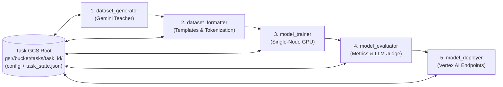

# `distillfw`: Gemini-to-Gemma Distillation Framework Specification

## 1. Overview & Motivation

`distillfw` is a Python library for distilling task-specific capabilities from **Gemini** teacher models into smaller, open-weights **Gemma** student models on Google Cloud Platform (GCP).

### Problem Statement & Core Workflow
Many production applications prototype or launch using large frontier models (e.g., Gemini 2.5 Pro / Flash) for a specialized, well-defined task. Once the task is validated, teams often need to:
1. **Reduce inference costs** at scale.
2. **Guarantee low, predictable latency** (TTFT and TPOT).
3. **Deploy within controlled infrastructure** (self-hosted endpoints, strict data governance, predictable capacity).

To achieve this, the user provides a dataset of representative task prompts. `distillfw` automates the end-to-end workflow:
1. Querying the **Gemini** teacher model with the prompt dataset to record high-quality responses, reasoning traces, and/or top-$k$ token log-probabilities.
2. Formatting and curating the resulting distillation dataset.
3. Training a **Gemma** student model on a single GPU node using SOTA off-policy or on-policy distillation algorithms.
4. Evaluating the distilled Gemma model against both the untrained base Gemma model and the Gemini teacher.
5. Deploying the distilled model to **Vertex AI Endpoints**.

---

## 2. Design Principles & Constraints

- **GCP-Native Integration**: First-class support for Google Cloud Storage (GCS), Vertex AI Gemini API / Batch Prediction, Vertex AI Custom Training, Vertex AI Model Garden, and Vertex AI Endpoints.
- **Isolated Multi-Task Tracking on GCS**: Each distillation task is tracked in its own dedicated GCS root path (`gs://<bucket>/<prefix>/<task_id>/`). Multiple tasks can run concurrently or asynchronously without state collision.
- **Zero-Local-State Resumability**: A task's GCS path is the **single source of truth**. Given *only* the GCS task URI (`gs://.../<task_id>/`), any worker, VM, or Vertex AI job can inspect task status, recover from interruptions, skip completed stages, and resume execution without requiring any local files, local state, or external databases.
- **Single-Node Simplicity**: Because Gemma student models (1B to 27B) fit on a single multi-GPU node (e.g., 1×–8× NVIDIA L4, A100, or H100 GPUs), multi-node distributed training is intentionally excluded. Training uses single-node PyTorch / Accelerate / FSDP / LoRA / QLoRA for maximum reliability and debuggability.
- **Leverage SOTA Open-Source Engines**: Rather than re-implementing low-level training loops from scratch, `distillfw` wraps battle-tested ecosystems (`huggingface/trl`, `transformers`, `peft`, `vllm`, and `google-genai`).
- **Declarative & Modular Pipeline**: Every pipeline stage can be executed independently via Python API or CLI using a unified, validated configuration schema (Pydantic / YAML).

---

## 3. Multi-Task Tracking & Self-Contained GCS State

### 3.1 Isolated Task Workspaces
- Every distillation task is uniquely identified by its GCS task URI: `gs://<bucket>/<tasks_root>/<task_id>/`.
- Users can initialize a new task from a local config file (`distillfw init --config config.yaml --task-uri gs://...`) or resume an existing task using only its URI (`distillfw resume gs://...`).

### 3.2 GCS State Manifest (`task_state.json`)
Each task directory maintains an atomic, versioned `task_state.json` manifest alongside the frozen `config.yaml` and input prompts:
- **Global Metadata**: `task_id`, `created_at`, `updated_at`, `current_stage`, overall `status` (`PENDING`, `RUNNING`, `COMPLETED`, `FAILED`), and `config_sha256`.
- **Per-Stage Status Records**: For each stage (`dataset_generator`, `dataset_formatter`, `model_trainer`, `model_evaluator`, `model_deployer`):
  - `status`: `PENDING` | `RUNNING` | `COMPLETED` | `FAILED`
  - `started_at`, `completed_at`, `attempt_count`, `error_message`
  - `progress_cursor`: Intra-stage progress pointer (e.g., completed shard index or prompt offset for generation; latest step checkpoint URI for training; Vertex AI Batch/Custom Job resource ID for detached jobs).
  - `artifacts`: Explicit GCS URIs of all inputs consumed and outputs produced by the stage.

### 3.3 Stateless Resumption Contract
When `distillfw` is invoked with a task URI (`gs://.../<task_id>/`):
1. It downloads `config.yaml` and `task_state.json` from that GCS path.
2. It verifies all completed stages and their output artifacts directly on GCS.
3. For the first incomplete or failed stage, it automatically resumes from the recorded `progress_cursor` or latest checkpoint (e.g., appending missing Gemini generations, re-attaching to an active Vertex AI Batch/Training job, or loading the latest trainer checkpoint from `03_checkpoints/checkpoint-<step>/`).
4. Ephemeral local disk storage is used strictly as a write-through cache; all checkpoints, shards, metrics, and status updates are synced to GCS.

---

## 4. Configuration & User Choices Matrix

`distillfw` exposes a unified configuration object (`DistillationConfig`) allowing users to mix and match models, data formats, algorithms, and evaluation strategies:

| Dimension | Supported Options | Notes |
| :--- | :--- | :--- |
| **Teacher Models (Gemini)** | `gemini-2.5-pro`, `gemini-2.5-flash`, `gemini-2.5-flash-lite`, `gemini-2.0-flash`, `gemini-2.0-flash-lite` | Accessed via `google-genai` SDK (online async or Vertex AI Batch Prediction). Supports thinking/reasoning traces and `response_logprobs`. |
| **Student Models (Gemma)** | **Gemma 3**: `1b`, `4b`, `12b`, `27b` (`-pt` & `-it`)<br>**Gemma 2**: `2b`, `9b`, `27b` (`-pt` & `-it`) | Pulled from Vertex AI Model Garden or Hugging Face Hub. Supports full fine-tuning, LoRA, and QLoRA (4-bit/8-bit). |
| **Prompt Formats** | `pretrain` (raw completion)<br>`instruction` (single-turn `<start_of_turn>`)<br>`chat` (multi-turn conversation + system prompt)<br>`reasoning` (explicit `<start_of_turn>thought` traces) | Automatically applies model-specific chat templates and computes loss masks (`-100` on user/system prompt tokens). |
| **Dataset Representations** | `text` (prompt/completion strings)<br>`tokens` (pre-tokenized `input_ids` + `labels`)<br>`sparse_logprobs` (top-$k$ teacher token IDs & logprobs)<br>`preference` (`prompt`, `chosen`, `rejected` pairs) | Stored on GCS as Parquet / JSONL / Hugging Face Dataset artifacts with full provenance metadata. |
| **Distillation Paradigms** | **Off-Policy**: Fixed teacher/preference dataset.<br>**On-Policy / Hybrid**: Student generates rollouts during training (`GKD` $\lambda$-mixing or online teacher scoring). | Off-policy maximizes speed and zero online teacher cost; on-policy mitigates exposure bias and compounding student errors. |
| **Training Algorithms** | **SFT / SeqKD**: Sequence-level cross-entropy.<br>**Logit KD**: Forward KL, Reverse KL, JSD, Skew KL (*DistiLLM*).<br>**Contrastive / Preference**: DPO, SimPO, ORPO, *DistiLLM-2*.<br>**RL / On-Policy**: GKD, GRPO / RLOO (with Gemini judge or verifiable reward). | Accounts for the API boundary: uses sequence-level/preference losses for pure text outputs, or truncated top-$k$ distributions when `response_logprobs=True`. |
| **Evaluation Methods** | **Lexical**: BLEU, ROUGE-1/2/L, Exact Match.<br>**Probabilistic**: Perplexity, Token KL Divergence.<br>**Semantic / Task**: Embedding Cosine Sim, JSON Schema Validity.<br>**LLM-as-a-Judge**: Pairwise Win Rate & Rubric Score vs. Gemini.<br>**System**: Latency (TTFT, TPOT, p50/p95) & Cost/1M tokens. | Automatically generates a comparison report across Teacher (Gemini) vs. Base Student vs. Distilled Student. |

---

## 5. Pipeline Architecture (5 Stages)



### Stage 1: `dataset_generator`
Generates the distillation training dataset by querying the selected Gemini teacher model with user-provided prompts.
- **Inputs (from GCS Task Path)**: `00_inputs/prompts.parquet` (copied to GCS on task init), `config.yaml`, and `task_state.json`.
- **Capabilities**:
  - Supports high-throughput **async online requests** (writing sharded outputs to GCS for fine-grained resumption) and **Vertex AI Batch Prediction** jobs (persisting the batch job ID in `task_state.json` so any process can poll/collect results later).
  - Optional **Best-of-$N$ / Rejection Sampling**: Generates $N$ candidate responses per prompt and filters/ranks them using a verifier or judge before saving.
  - Captures both final answers and intermediate reasoning traces (`thought` blocks) when distilling reasoning capabilities.
- **Outputs**: Sharded raw teacher dataset saved to `<task_uri>/01_raw_dataset/` + updated `task_state.json`.

### Stage 2: `dataset_formatter`
Transforms raw teacher outputs into the target prompt format and training representation required by the chosen algorithm.
- **Inputs (from GCS Task Path)**: `<task_uri>/01_raw_dataset/`, student tokenizer, target prompt format (`pretrain`, `instruction`, `chat`, `reasoning`), and dataset representation (`text`, `tokens`, `sparse_logprobs`, `preference`).
- **Capabilities**:
  - Applies Gemma chat templates and masks prompt tokens (`label = -100`) so loss is computed strictly on assistant/thought turns.
  - When using `sparse_logprobs`, aligns teacher top-$k$ log-probabilities into dense/sparse target tensors with residual probability mass smoothing.
  - For contrastive/preference algorithms (DPO, DistiLLM-2), pairs teacher outputs (`chosen`) with base student outputs or lower-ranked candidates (`rejected`).
  - Performs train/validation/test splitting and sequence length filtering.
- **Outputs**: Formatted training/validation splits saved to `<task_uri>/02_formatted_dataset/` + updated `task_state.json`.

### Stage 3: `model_trainer`
Trains the Gemma student model on a single GPU node using SOTA distillation algorithms.
- **Inputs (from GCS Task Path)**: `<task_uri>/02_formatted_dataset/`, base Gemma model ID (from Vertex AI Model Garden / HF), and prior checkpoints in `<task_uri>/03_checkpoints/` if resuming.
- **Execution Modes**:
  - **Local / Interactive Mode**: Runs directly on the current single-node GPU machine (1–8 GPUs via `accelerate`), syncing checkpoints directly to `<task_uri>/03_checkpoints/`.
  - **Managed Vertex AI Mode**: Packages the training job and submits a single-node multi-GPU **Vertex AI Custom Training Job**, recording the Vertex job ID in `task_state.json` for stateless monitoring/resumption.
- **Supported Algorithm Families**:
  1. **Supervised Fine-Tuning / SeqKD (`trl.SFTTrainer`)**: Standard cross-entropy on teacher completions.
  2. **Generalized Knowledge Distillation (`trl.GKDTrainer`)**: Supports off-policy ($\lambda=0$), on-policy ($\lambda=1$), and mixed ($\lambda \in (0,1)$) student rollout generation with Forward KL, Reverse KL, and Generalized JSD.
  3. **Streamlined & Contrastive Off-Policy KD (`DistiLLM` / `DistiLLM-2`)**: Implements Skew KL divergence and asymmetric contrastive losses for superior off-policy stability.
  4. **Preference & Alignment Distillation (`trl.DPOTrainer` / `ORPOTrainer`)**: Off-policy preference optimization between teacher and student generations.
  5. **Reinforcement Learning Distillation (`trl.GRPOTrainer`)**: On-policy group relative policy optimization using Gemini or deterministic verifiers as reward functions.
- **Outputs**: Checkpoints, training metrics, and merged final model weights saved to `<task_uri>/03_checkpoints/` and `<task_uri>/05_exported_model/` + updated `task_state.json`.

### Stage 4: `model_evaluator`
Evaluates the distilled Gemma model on held-out test prompts and benchmarks it against both the untrained base student and the Gemini teacher.
- **Inputs (from GCS Task Path)**: Held-out test split in `<task_uri>/02_formatted_dataset/test/`, distilled model artifact in `<task_uri>/05_exported_model/`, baseline Gemma model, and teacher reference outputs.
- **Capabilities**:
  - Fast batched inference using `vllm`.
  - Computes configured metrics:
    - **Reference-based**: BLEU, ROUGE-1/2/L, Exact Match, BERTScore.
    - **Intrinsic**: Perplexity and KL divergence against teacher logprobs.
    - **Task-specific**: Custom Python verifiers (e.g., JSON schema validation, regex match, code execution).
    - **LLM-as-a-Judge**: Automated side-by-side win/tie/loss evaluation and 1–5 rubric grading using Vertex AI Gen AI Evaluation / Gemini 2.5 Pro.
    - **System profiling**: Measures throughput (tokens/sec), latency (TTFT, TPOT, p50/p95/p99), and estimated serving cost per 1M tokens.
- **Outputs**: Structured JSON/Markdown evaluation scorecard and quality-vs-cost report saved to `<task_uri>/04_evaluation/` + updated `task_state.json`.

### Stage 5: `model_deployer`
Deploys the validated Gemma student model to a production **Vertex AI Endpoint**.
- **Inputs (from GCS Task Path)**: Distilled model artifact in `<task_uri>/05_exported_model/`, serving configuration in `config.yaml`.
- **Capabilities**:
  - Automatically merges LoRA adapters into base weights (or configures dynamic LoRA serving).
  - Uploads the model to **Vertex AI Model Registry** using optimized Model Garden serving containers (vLLM).
  - Creates or updates a **Vertex AI Endpoint**, deploys the model with traffic splitting, and runs post-deployment smoke/latency checks.
- **Outputs**: Deployment manifest (`endpoint_info.json`) saved to `<task_uri>/06_deployment/` + updated `task_state.json`.

---

## 6. GCP Infrastructure & Self-Contained Task Layout

Each distillation task is completely self-contained under its own GCS prefix:

```text
gs://<project-distillfw-bucket>/
└── tasks/
    ├── <task_id_1>/                        # Self-contained Task 1 workspace
    │   ├── config.yaml                     # Frozen DistillationConfig snapshot
    │   ├── task_state.json                 # Single-source-of-truth stage status & cursors
    │   ├── 00_inputs/                      # Immutable copy of user input prompts
    │   ├── 01_raw_dataset/                 # Sharded Gemini responses, thoughts, logprobs
    │   ├── 02_formatted_dataset/           # Tokenized / templated Parquet train/val/test splits
    │   ├── 03_checkpoints/                 # Resumable training checkpoints & TensorBoard logs
    │   ├── 04_evaluation/                  # Scorecard, generations, judge verdicts
    │   ├── 05_exported_model/              # Final merged HF/vLLM weights ready for serving
    │   └── 06_deployment/                  # Deployed Vertex AI Model & Endpoint metadata
    └── <task_id_2>/                        # Independent Task 2 workspace
        └── ...
```

---

## 7. Proposed Package Structure

```text
distillfw/
├── README.md                           # User guide, configuration reference & CLI/API instructions
├── pyproject.toml
├── spec.md
└── src/
    ├── notebooks/                      # Sample notebooks illustrating end-to-end & staged workflows
    │   ├── 01_quickstart_end_to_end.ipynb
    │   ├── 02_staged_pipeline_and_resumption.ipynb
    │   ├── 03_off_policy_vs_on_policy_algorithms.ipynb
    │   ├── 04_evaluation_and_vertex_deployment.ipynb
    │   └── 05_inference_side_by_side_teacher_with_deployed_student.ipynb
    └── distillfw/
        ├── __init__.py
        ├── cli.py                      # CLI (`distillfw init / resume / status / list / run-stage`)
        ├── config.py                   # Pydantic schemas for full pipeline configuration
        ├── state.py                    # TaskState manifest & atomic GCS state synchronization
        ├── pipeline.py                 # Stateless orchestrator driven solely by `gs://.../<task_id>/`
        ├── stages/
        │   ├── generator.py            # Stage 1: Resumable sharded/batch Gemini dataset generation
        │   ├── formatter.py            # Stage 2: Chat templating, loss masking, top-k logprob packing
        │   ├── trainer.py              # Stage 3: Single-node TRL / DistiLLM / GKD trainers + GCS checkpoint sync
        │   ├── evaluator.py            # Stage 4: Lexical, perplexity, LLM-judge & latency evaluation
        │   └── deployer.py             # Stage 5: Model Registry upload & Vertex AI Endpoint deployment
        ├── algorithms/                 # Custom loss functions (Skew KLD, Sparse Top-K KLD, DistiLLM-2)
        └── gcp/                        # GCS I/O helpers, Vertex AI Custom Job & Endpoint wrappers
```

---

## 8. Specification & Framework Evolution Log

| Date | Version | Summary of Changes |
| :--- | :--- | :--- |
| 2026-09-20 | `v0.1.0` | Initial specification & implementation of `distillfw`: 5-stage Gemini-to-Gemma distillation pipeline on GCP, isolated multi-task tracking on GCS (`task_state.json`), zero-local-state resumability from GCS URIs alone, single-node multi-GPU training, SOTA distillation losses (Forward KL, Reverse KL, JSD, Skew KL / *DistiLLM*, Contrastive Asymmetric KD / *DistiLLM-2*, Sparse Top-K API Logprob KD), CLI, test suite, and 5 sample notebooks in `src/notebooks/`. |
| 2026-09-20 | `v0.1.1` | Added comprehensive [README.md](file:///usr/local/google/home/raulramos/projects/distillfw/README.md) with user instructions covering environment setup, GCP authentication, local GCS emulation (`DISTILLFW_LOCAL_GCS_ROOT`), prompt preparation, full `config.yaml` reference, CLI & Python API usage, distillation algorithm selection guide, GCS workspace layout, and sample notebook guides. |


