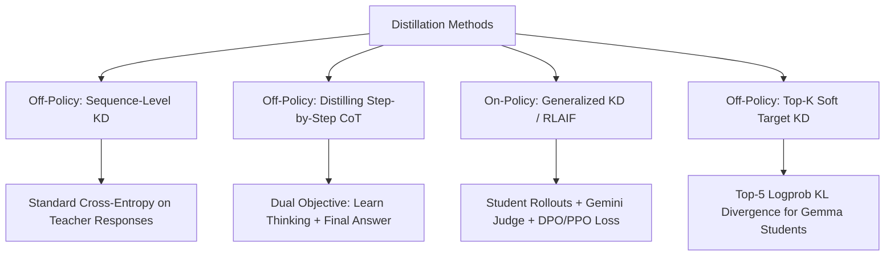
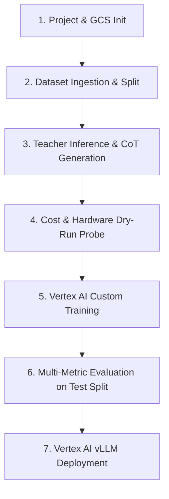
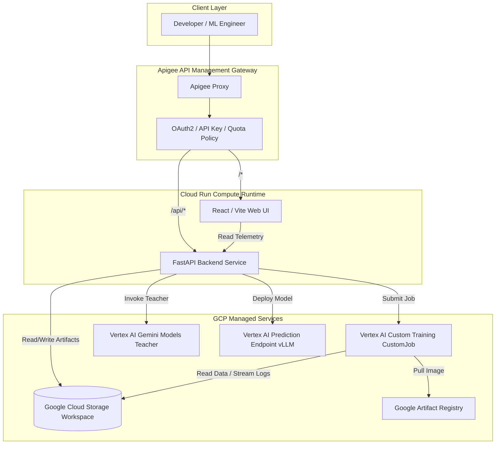

# Managed Distillation Framework on Google Cloud Platform (GCP)

## 1. Executive Summary & Goal

The goal of this framework is to provide an end-to-end, production-grade platform on Google Cloud Platform (GCP)—consisting of an **API**, a **Web UI**, and an **orchestration backend**—to manage the complete lifecycle of distilling knowledge from a proprietary **Teacher Model** into a compact, efficient open-source **Student Model** tailored to a specific task.

### Key Terminology
- **Teacher Model**: A large, powerful Gemini model (e.g., `gemini-2.5-pro`, `gemini-2.5-flash`, `gemini-1.5-pro`) accessed via Vertex AI.
- **Student Model**: A compact, parameter-efficient open-source model (e.g., Gemma 2 2B/9B/27B, Llama 3/3.1/3.2 1B/3B/8B, Mistral 7B) available in GCP Model Garden or Hugging Face.
- **Input Dataset**: A dataset of user prompts representing the domain-specific task for distillation.
- **Model Distillation**: The algorithmic process by which the Student Model learns to replicate the Teacher Model's reasoning, accuracy, and formatting.
- **Project Workspace**: An isolated Google Cloud Storage (GCS) path (`gs://<bucket>/<project-id>/`) maintaining all configurations, datasets, checkpoints, telemetry, and evaluation reports for a given distillation experiment.

---

## 2. Distillation Methods & Technical Formulation

The framework exclusively supports **Parameter-Efficient Fine-Tuning (PEFT)** using LoRA and QLoRA (4-bit/8-bit quantization) to ensure training efficiency, low VRAM footprint, and rapid iteration.

### 2.1. Addressing the Closed-API & Cross-Tokenizer Reality
Standard logit-matching distillation (e.g., Hinton KD) requires:
1. Full vocabulary logits from the Teacher over student-generated sequences.
2. Identical subword tokenizers between Teacher and Student.

Because the Teacher Model is a closed Gemini API (which returns tokens and at most top-5 logprobs on its own generations, with a distinct 256k SentencePiece vocabulary), direct token-for-token logit matching across different student tokenizers (e.g., Llama 128k BPE, Mistral 32k SPM) is mathematically incompatible and network-prohibitive.

To solve this rigorously, the framework provides three mature, proven distillation methods:



### 2.2. Supported Distillation Methods

#### Method 1: Sequence-Level Knowledge Distillation (SeqKD) — *Off-Policy (Default)*
- **Description**: The Student Model is trained via standard Supervised Fine-Tuning (SFT) on the completions generated by the Teacher Model on the training split.
- **Loss Function**: Standard Token Cross-Entropy on teacher completion tokens:
  $$\mathcal{L}_{\text{SeqKD}} = -\frac{1}{|Y|}\sum_{t=1}^{|Y|} \log P_{\text{student}}(y_t \mid X, y_{<t})$$
- **Tokenizer Compatibility**: Universal. Works seamlessly across any open-source student model regardless of vocabulary differences.
- **Maturity**: Industry standard for LLM distillation, highly stable, zero network latency during GPU training.

#### Method 2: Distilling Step-by-Step (CoT Reasoning Distillation) — *Off-Policy*
- **Description**: Based on Google Research (*Hsieh et al., 2023*). Captures both `teacher_thinking` (chain-of-thought rationale) and `teacher_response` (final answer). The Student is trained to generate the rationale before producing the answer, enabling small models to match models $10\times$ their size with significantly less data.
- **Loss Function**: Weighted Multi-Task / Multi-Stage Loss:
  $$\mathcal{L}_{\text{CoT}} = \lambda_{\text{think}} \mathcal{L}_{\text{think}} + \lambda_{\text{resp}} \mathcal{L}_{\text{resp}}$$
- **Configurable Options**:
  - Format: Unified Prefix (`[Prompt] -> <thought>[Thinking]</thought> [Response]`) or Dual-Task (`task_type: predict_rationale` vs. `task_type: predict_answer`).
  - Loss weights: $\lambda_{\text{think}}$ and $\lambda_{\text{resp}}$ (default: 0.5 / 1.0).

#### Method 3: Generalized Knowledge Distillation (GKD) & On-Policy Teacher-as-a-Judge — *On-Policy*
- **Description**: Based on DeepMind's Generalized Knowledge Distillation (*Agarwal et al., 2024*) and On-Policy RLAIF. The Student Model generates rollouts on training prompts during training; the Teacher (Gemini) evaluates, ranks, or critiques these completions; the Student updates its policy on its own generated tokens.
- **Loss Function**: Direct Preference Optimization (DPO) or Policy Gradient loss on student rollouts using Teacher feedback as reward signal.
- **Benefit**: Pinpoints and corrects student distribution shift without requiring full teacher logit matrices.

#### Method 4: Top-$k$ Soft Target KD — *Off-Policy (Token-Level)*
- **Description**: Supported when the Student Model shares vocabulary alignment with Gemini (e.g., Gemma 2). Gemini returns top-5 tokens and logprobs (`responseLogprobs: true`). The training objective combines ground-truth Cross-Entropy with KL Divergence over the top-$k$ soft distribution:
  $$\mathcal{L} = (1 - \alpha)\mathcal{L}_{\text{CE}} + \alpha \mathcal{L}_{\text{KL}}^{\text{top-}k}$$
- **Configurable Options**: Temperature $T$, loss weight $\alpha$ (default: 0.3).

---

## 3. End-to-End Supported Workflow

The platform orchestrates the complete lifecycle through 7 discrete, auditable stages:



### Stage 1: Project Initialization & Configuration
- Designate or create a GCS project directory: `gs://<bucket>/<project-id>/`.
- Generate and manage `config.yaml` specifying model choices, distillation method, hyperparameters, and hardware.
- The user can configure all options directly in `config.yaml` or interactively via the Web UI.

### Stage 2: Dataset Ingestion, Validation & Splitting
- **Format**: JSON Lines (`.jsonl`). Each row contains:
  ```json
  {"prompt": "User query or instruction", "split": "train"}
  ```
  Permitted values for `split`: exactly one of `"train"`, `"val"`, `"test"`.
- **Auto-Split Fallback**: If `split` keys are omitted by the user, the platform provides an automated random/stratified splitting utility (default: 80% `train`, 10% `val`, 10% `test`) with a configurable random seed.
- **Prompt Instructions**: `config.yaml` supports a `prompt_instructions` and `prompt_template` property applied uniformly to prompts during Teacher inference and Student training.
- **Dataset Safeguards**:
  - `val` split is strictly reserved for validation monitoring during training.
  - `test` split is strictly quarantined and used exclusively during Stage 6 (Final Evaluation).

### Stage 3: Teacher Model Inference & Knowledge Extraction
- Executes asynchronous or batch inference on the Input Dataset using the designated Gemini Teacher Model via Vertex AI.
- Generates `data/teacher_inferences.jsonl` containing:
  ```json
  {
    "prompt": "User prompt",
    "split": "train",
    "teacher_response": "The reference answer produced by Gemini...",
    "teacher_thinking": "Reasoning steps / chain-of-thought trace...",
    "teacher_tokens": {"prompt_tokens": 15, "completion_tokens": 120},
    "teacher_logprobs": [...] 
  }
  ```
- Transparent backward-compatibility: If legacy files use the typo `'teacher respose'`, the framework automatically recognizes and maps it to `'teacher_response'`.

### Stage 4: Cost Estimation & Hardware Calibration Probe
Before committing to full training, the system produces a two-part cost estimation:
1. **Teacher Inference Cost**: Calculated from input/output token counts and Vertex AI Gemini pricing:
   $$\text{Cost}_{\text{teacher}} = (\text{Tokens}_{\text{in}} \times \text{Price}_{\text{in}}) + (\text{Tokens}_{\text{out}} \times \text{Price}_{\text{out}})$$
2. **Training Hardware Cost Probe**:
   - Launches an automated 20-step micro-job on Vertex AI Custom Training with the selected GPU and batch size.
   - Measures exact initialization/container pull duration $T_{\text{init}}$, average step time $T_{\text{step}}$, and peak VRAM usage (verifying no OOM).
   - Projects total training duration and compute cost:
     $$\text{Cost}_{\text{train}} = \frac{T_{\text{init}} + (T_{\text{step}} \times \text{Total Steps})}{3600} \times \text{Hourly Rate}_{\text{hardware}}$$
   - Displays a transparent budget scorecard in the UI for user sign-off.

### Stage 5: Vertex AI Custom Training & Live Telemetry
- Launches a `CustomJob` on Vertex AI Training running a specialized Docker container.
- **Hugging Face Implementation**: Standard PyTorch training loop subclassing `transformers.Trainer` (**without** using Hugging Face's deprecated or restrictive `DistillationTrainer`).
- **Telemetry Streaming Callback**:
  - Implements a custom `GCSProgressCallback(TrainerCallback)`.
  - Flushes training metrics (`step`, `epoch`, `train_loss`, `val_loss`, `learning_rate`, `gpu_utilization_pct`, `memory_allocated_gb`, `tokens_per_sec`) to `training/metrics.jsonl` in GCS every $N$ steps.
  - Updates `training/heartbeat.json` every minute to guarantee reliable crash and OOM detection.
  - The Web UI polls/streams this file to render real-time loss and hardware utilization curves.

### Stage 6: Rigorous 3-Tier Evaluation
Executed strictly on the untouched `test` split:
1. **Lexical & Task Metrics**: ROUGE-1, ROUGE-2, ROUGE-L, BLEU, Exact Match, and JSON format syntax compliance rate (if structured outputs are required).
2. **LLM-as-a-Judge (Gemini Teacher)**: Gemini evaluates Student outputs against Teacher outputs on a 1–5 rubric across:
   - *Factual Correctness*
   - *Instruction & Constraint Adherence*
   - *Reasoning Completeness*
   - *Semantic Similarity & Alignment*
   - *Hallucination / Safety Assessment*
3. **Operational Benchmarking**:
   - Latency percentiles ($p_{50}$, $p_{95}$, $p_{99}$ in milliseconds).
   - Throughput (tokens/second).
   - Cost-efficiency multiple (e.g., "$14\times$ lower serving cost than Teacher").

### Stage 7: Production Deployment
- Deploys the distilled model to a **Vertex AI Endpoint** for real-time online prediction.
- **Serving Engine**: High-performance **vLLM** container on Vertex AI (PagedAttention, continuous batching, dynamic tensor parallelism).
- **Packaging Options**:
  - *Option A (Default)*: Base open-source model + dynamic PEFT LoRA adapter.
  - *Option B*: Merged standalone model weights pushed to Vertex AI Model Registry.

---

## 4. System Architecture & Technical Specifications



### 4.1. Apigee + Cloud Run Decoupling
- **Apigee**: Acts as the single public entry point / API Gateway:
  - Enforces API authentication (API keys / OAuth2 tokens).
  - Enforces rate limiting, spike arrests, and quotas.
  - Routes `/api/*` traffic to the FastAPI Backend.
  - Routes `/*` traffic to the Web UI frontend.
  - Logs API metrics and audit traces.
- **Cloud Run Backend**:
  - Stateless Python FastAPI application.
  - Manages asynchronous orchestration, Vertex AI SDK interactions, and GCS manipulation.
- **Cloud Run UI**:
  - Modern Single Page Application (SPA) built with React, Vite, and Tailwind CSS.
  - Features real-time training progress charts, dataset inspect/split tools, config editors, and evaluation dashboards.

### 4.2. Custom Training Docker Image
Stored in Google Artifact Registry:
- **Base**: `nvidia/cuda:12.4.1-runtime-ubuntu22.04` with Python 3.11 and PyTorch 2.4+.
- **Core Libraries**: `transformers`, `peft`, `accelerate`, `bitsandbytes`, `datasets`, `google-cloud-storage`.
- **Optimization**: FlashAttention-2 support for accelerated Gemma/Llama training.

---

## 5. GCS Workspace Layout & Status Inference

Every distillation project is entirely self-contained under `gs://<bucket>/<project-id>/`:

```
gs://<bucket>/<project-id>/
├── config.yaml                     # Master project configuration
├── status.json                     # Cached status, active job URIs, timestamps
├── data/
│   ├── input_dataset.jsonl         # Original user dataset
│   ├── split_dataset.jsonl         # Validated dataset with train/val/test splits
│   └── teacher_inferences.jsonl    # Enriched dataset with teacher response & thinking
├── cost/
│   └── cost_estimate.json          # Hardware probe stats and token cost calculation
├── training/
│   ├── metrics.jsonl               # Live telemetry flushed during training
│   ├── heartbeat.json              # Worker liveness indicator
│   ├── checkpoints/                # Intermediate PEFT checkpoints
│   └── final_adapter/              # adapter_config.json, adapter_model.safetensors
├── evaluation/
│   ├── test_predictions.jsonl      # Model predictions on test split
│   └── eval_results.json           # Lexical scores, Gemini judge rubric, latency stats
├── examples/
│   ├── sample_config.jsonl         # An example config file
|   └── sample_dataset.jsonl         # An example dataset
└── deployment/
    └── endpoint_metadata.json      # Vertex AI Endpoint URI, deployed model ID
```

### Deterministic Status Inference Logic
The system automatically derives the current project state from GCS artifact presence:
1. **`UNINITIALIZED`**: Missing `config.yaml`.
2. **`CONFIGURED`**: `config.yaml` exists, but no dataset present.
3. **`DATASET_READY`**: `data/split_dataset.jsonl` exists and is validated.
4. **`TEACHER_INFERENCE_RUNNING`**: Vertex Batch Prediction or inference worker active.
5. **`TEACHER_INFERENCE_DONE`**: `data/teacher_inferences.jsonl` exists.
6. **`COST_ESTIMATED`**: `cost/cost_estimate.json` exists.
7. **`TRAINING_RUNNING`**: Vertex CustomJob active, `training/metrics.jsonl` updating.
8. **`TRAINING_COMPLETED`**: `training/final_adapter/adapter_model.safetensors` exists.
9. **`EVALUATING`**: Evaluation job active on `test` split.
10. **`EVALUATED`**: `evaluation/eval_results.json` exists.
11. **`DEPLOYED`**: `deployment/endpoint_metadata.json` exists with an active Vertex AI Endpoint.

### History
a file in GCS history.json must keep track of all actions performed with detailed parameters, start 
time, end time, etc.

---

## 6. Master Configuration (`config.yaml`) Specification

Users can configure all workflow stages via the Web UI or by editing `config.yaml` directly:

```yaml
project:
  id: "distill-gemma-math-v1"
  description: "Distill Gemini 2.5 Pro reasoning into Gemma 2 9B for mathematical problem solving"
  gcs_workspace: "gs://my-distill-bucket/distill-gemma-math-v1"

models:
  teacher:
    model_name: "gemini-2.5-pro"
    temperature: 0.2
    max_output_tokens: 4096
    include_thinking: true
    response_logprobs: false
  student:
    model_name_or_path: "google/gemma-2-9b"
    quantization: "4bit"  # "none", "8bit", "4bit" (QLoRA)
    trust_remote_code: false

prompt:
  instructions: "You are an expert mathematician. Solve this problem stating the final answer."
  template: "{instructions}\n\nProblem:\n{prompt}\n\nSolution:"

dataset:
  input_path: "data/input_dataset.jsonl"
  auto_split: true
  split_ratios:
    train: 0.8
    val: 0.1
    test: 0.1
  random_seed: 42

distillation:
  method: "cot_distillation"  # "seq_kd", "cot_distillation", "on_policy_gkd", "topk_kd"
  loss_type: "cot_weighted"   # "ce", "cot_weighted", "kl_divergence", "dpo"
  cot_weights:
    thinking_weight: 0.5
    response_weight: 1.0
  peft:
    r: 16
    lora_alpha: 32
    lora_dropout: 0.05
    target_modules: ["q_proj", "k_proj", "v_proj", "o_proj", "gate_proj", "up_proj", "down_proj"]

training:
  hardware:
    accelerator_type: "NVIDIA_L4"  # "NVIDIA_L4", "NVIDIA_A100_80GB", "NVIDIA_H100_80GB"
    accelerator_count: 1
    machine_type: "g2-standard-8"
  hyperparameters:
    learning_rate: 2.0e-4
    batch_size: 4
    gradient_accumulation_steps: 4
    num_train_epochs: 3
    warmup_ratio: 0.05
    optimizer: "paged_adamw_8bit"
    lr_scheduler_type: "cosine"
    max_seq_length: 2048
    logging_steps: 5
    eval_steps: 50
    save_steps: 100

evaluation:
  batch_size: 8
  metrics: ["rouge", "bleu", "exact_match", "gemini_judge", "latency"]
  gemini_judge:
    model_name: "gemini-2.5-flash"
    rubric: ["correctness", "instruction_following", "coherence", "similarity"]

deployment:
  serving_framework: "vllm"
  machine_type: "g2-standard-4"
  accelerator_type: "NVIDIA_L4"
  accelerator_count: 1
  min_replicas: 0
  max_replicas: 2
  merge_lora_weights: true
```

---

## 7. Infrastructure as Code & Automated Deployment (`deploy.sh`)

The platform is deployed to GCP via Terraform modules under `terraform/` orchestrated by `deploy.sh`.

### 7.1. Pre-flight Checks (`deploy.sh`)
- Confirms local dependencies: `gcloud`, `terraform`, `docker`, `python3`, `node`, `npm`.
- Verifies current GCP authenticated identity and active billing account.
- Verifies user permissions:
  - `roles/aiplatform.admin`
  - `roles/storage.admin`
  - `roles/run.admin`
  - `roles/apigee.admin`
  - `roles/artifactregistry.admin`
  - `roles/iam.serviceAccountUser`
- **IAM Permission Verification & Remediation Flow**:
  - Automatically inspects the project IAM policy for the authenticated user (`user:${AUTH_ACCOUNT}` or `roles/owner`).
  - If any required roles are missing, checks whether the user has permission to grant themselves the required roles (`roles/resourcemanager.projectIamAdmin` or `roles/owner`).
  - If the user has permission to grant roles, prompts for confirmation (with `-y`/`--yes` auto-confirm option) and automatically adds the missing role bindings.
  - If the user cannot grant roles, prompts the user to contact their GCP Project Administrator and drafts a suggested message with detailed role justifications and copy-pasteable `gcloud` commands.
- Enables required Google Cloud APIs:
  ```bash
  gcloud services enable \
    aiplatform.googleapis.com \
    run.googleapis.com \
    apigee.googleapis.com \
    storage.googleapis.com \
    artifactregistry.googleapis.com \
    cloudbuild.googleapis.com \
    iam.googleapis.com
  ```

### 7.2. Terraform Provisioning
- **`modules/storage`**: Creates GCS bucket with uniform bucket-level access and CORS policies for direct UI log streaming.
- **`modules/artifact_registry`**: Sets up private Docker registry for training and API images.
- **`modules/cloud_run`**: Deploys FastAPI backend service and Web UI frontend.
- **`modules/apigee`**: Configures Apigee environment, API proxies, route targets, and authentication policies.
- **`modules/iam`**: Configures fine-grained service accounts for Cloud Run, Vertex AI Custom Training, and Apigee.

### 7.3 Additional Options
- it must contain an option --reset that removes all resources created in GCP.

## 8. Initialization and Example data

- **`sample_config.yaml`** must contain the example configuration above
- **`sample_dataset.jsonl`** must contain 100 math problems whose answer is a just numeric response.
- `deploy.sh` must (1) create a bucket `distillfw-workspaces` and, (2)create a sample project and populate it with this sample data and sample configuration, and leave it in the `DATASET_READY` state.

## 9. UI Features

- on the top there must be a combobox where the user can always select what is the main bucket with the distillation project. this must default to distillfw-workspaces
- the user can always select from the list of folders within the main bucket as its workspace
- there must be a collapsible panel on the bottom where we can always see the log of current operations being performed (making inference, training, etc.)
- the section to manage the current configuration (`config.yaml`) must be a form with controls for all the configuration parameters, and not a plain text area where the user can edit the yaml file. if the user modifies any value, it must update the file. if the file is not present, it must create it. there must be a button to save the configuration to a file.

## 10. Documentation

The platform includes detailed documentation under `docs/`:
- **`docs/install.md`**: Detailed installation instructions in GCP, covering prerequisites, required IAM roles and APIs, automated deployment via `deploy.sh` (including `--dry-run` and `--reset`), manual Terraform provisioning, Docker image builds, and local verification.
- **`docs/userguide.md`**: Complete end-to-end example workflow showing how to use the application across all 7 stages from both the interactive Web UI and the programmatic REST API.

