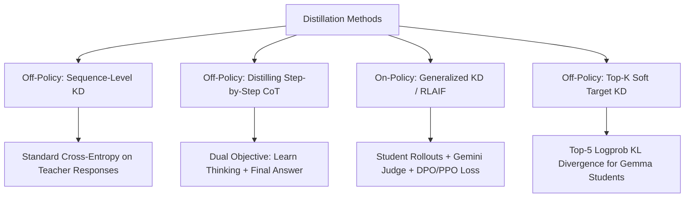
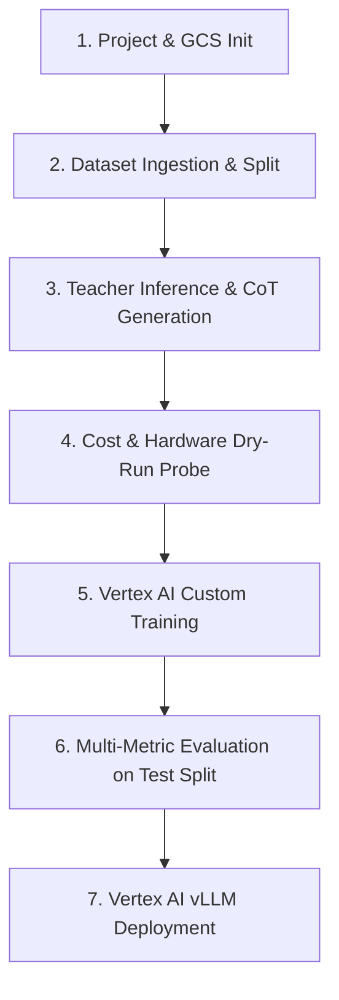
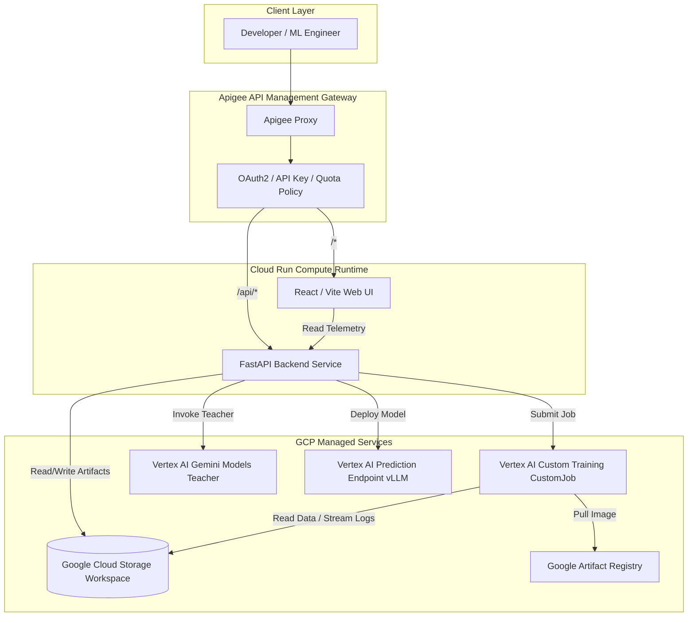

# Managed Distillation Framework on Google Cloud Platform (GCP)

## 1. Executive Summary & Goal

The goal of this framework is to provide an end-to-end, production-grade platform on Google Cloud Platform (GCP)—consisting of an **API**, a **Web UI**, and an **orchestration backend**—to manage the complete lifecycle of distilling knowledge from a proprietary **Teacher Model** into a compact, efficient open-source **Student Model** tailored to a specific task.

### Key Terminology
- **Teacher Model**: A large, powerful Gemini model (e.g., `gemini-2.5-pro`, `gemini-2.5-flash`, `gemini-1.5-pro`) accessed via Vertex AI.
- **Student Model**: A compact, parameter-efficient open-source model (e.g., Gemma 2 2B/9B/27B, Llama 3/3.1/3.2 1B/3B/8B, Mistral 7B) available in GCP Model Garden or Hugging Face.
- **Input Dataset**: A dataset of user prompts representing the domain-specific task for distillation.
- **Model Distillation**: The algorithmic process by which the Student Model learns to replicate the Teacher Model's reasoning, accuracy, and formatting.
- **Project Workspace**: An isolated Google Cloud Storage (GCS) path (`gs://<bucket>/<project-id>/`) maintaining all configurations, datasets, checkpoints, telemetry, and evaluation reports for a given distillation experiment.

---

## 2. Distillation Methods & Technical Formulation

The framework exclusively supports **Parameter-Efficient Fine-Tuning (PEFT)** using LoRA and QLoRA (4-bit/8-bit quantization) to ensure training efficiency, low VRAM footprint, and rapid iteration.

### 2.1. Addressing the Closed-API & Cross-Tokenizer Reality
Standard logit-matching distillation (e.g., Hinton KD) requires:
1. Full vocabulary logits from the Teacher over student-generated sequences.
2. Identical subword tokenizers between Teacher and Student.

Because the Teacher Model is a closed Gemini API (which returns tokens and at most top-5 logprobs on its own generations, with a distinct 256k SentencePiece vocabulary), direct token-for-token logit matching across different student tokenizers (e.g., Llama 128k BPE, Mistral 32k SPM) is mathematically incompatible and network-prohibitive.

To solve this rigorously, the framework provides three mature, proven distillation methods:



### 2.2. Supported Distillation Methods

#### Method 1: Sequence-Level Knowledge Distillation (SeqKD) — *Off-Policy (Default)*
- **Description**: The Student Model is trained via standard Supervised Fine-Tuning (SFT) on the completions generated by the Teacher Model on the training split.
- **Loss Function**: Standard Token Cross-Entropy on teacher completion tokens:
  $$\mathcal{L}_{\text{SeqKD}} = -\frac{1}{|Y|}\sum_{t=1}^{|Y|} \log P_{\text{student}}(y_t \mid X, y_{<t})$$
- **Tokenizer Compatibility**: Universal. Works seamlessly across any open-source student model regardless of vocabulary differences.
- **Maturity**: Industry standard for LLM distillation, highly stable, zero network latency during GPU training.

#### Method 2: Distilling Step-by-Step (CoT Reasoning Distillation) — *Off-Policy*
- **Description**: Based on Google Research (*Hsieh et al., 2023*). Captures both `teacher_thinking` (chain-of-thought rationale) and `teacher_response` (final answer). The Student is trained to generate the rationale before producing the answer, enabling small models to match models $10\times$ their size with significantly less data.
- **Loss Function**: Weighted Multi-Task / Multi-Stage Loss:
  $$\mathcal{L}_{\text{CoT}} = \lambda_{\text{think}} \mathcal{L}_{\text{think}} + \lambda_{\text{resp}} \mathcal{L}_{\text{resp}}$$
- **Configurable Options**:
  - Format: Unified Prefix (`[Prompt] -> <thought>[Thinking]</thought> [Response]`) or Dual-Task (`task_type: predict_rationale` vs. `task_type: predict_answer`).
  - Loss weights: $\lambda_{\text{think}}$ and $\lambda_{\text{resp}}$ (default: 0.5 / 1.0).

#### Method 3: Generalized Knowledge Distillation (GKD) & On-Policy Teacher-as-a-Judge — *On-Policy*
- **Description**: Based on DeepMind's Generalized Knowledge Distillation (*Agarwal et al., 2024*) and On-Policy RLAIF. The Student Model generates rollouts on training prompts during training; the Teacher (Gemini) evaluates, ranks, or critiques these completions; the Student updates its policy on its own generated tokens.
- **Loss Function**: Direct Preference Optimization (DPO) or Policy Gradient loss on student rollouts using Teacher feedback as reward signal.
- **Benefit**: Pinpoints and corrects student distribution shift without requiring full teacher logit matrices.

#### Method 4: Top-$k$ Soft Target KD — *Off-Policy (Token-Level)*
- **Description**: Supported when the Student Model shares vocabulary alignment with Gemini (e.g., Gemma 2). Gemini returns top-5 tokens and logprobs (`responseLogprobs: true`). The training objective combines ground-truth Cross-Entropy with KL Divergence over the top-$k$ soft distribution:
  $$\mathcal{L} = (1 - \alpha)\mathcal{L}_{\text{CE}} + \alpha \mathcal{L}_{\text{KL}}^{\text{top-}k}$$
- **Configurable Options**: Temperature $T$, loss weight $\alpha$ (default: 0.3).

---

## 3. End-to-End Supported Workflow

The platform orchestrates the complete lifecycle through 7 discrete, auditable stages:



### Stage 1: Project Initialization & Configuration
- Designate or create a GCS project directory: `gs://<bucket>/<project-id>/`.
- Generate and manage `config.yaml` specifying model choices, distillation method, hyperparameters, and hardware.
- The user can configure all options directly in `config.yaml` or interactively via the Web UI.

### Stage 2: Dataset Ingestion, Validation & Splitting
- **Format**: JSON Lines (`.jsonl`). Each row contains:
  ```json
  {"prompt": "User query or instruction", "split": "train"}
  ```
  Permitted values for `split`: exactly one of `"train"`, `"val"`, `"test"`.
- **Auto-Split Fallback**: If `split` keys are omitted by the user, the platform provides an automated random/stratified splitting utility (default: 80% `train`, 10% `val`, 10% `test`) with a configurable random seed.
- **Prompt Instructions**: `config.yaml` supports a `prompt_instructions` and `prompt_template` property applied uniformly to prompts during Teacher inference and Student training.
- **Dataset Safeguards**:
  - `val` split is strictly reserved for validation monitoring during training.
  - `test` split is strictly quarantined and used exclusively during Stage 6 (Final Evaluation).

### Stage 3: Teacher Model Inference & Knowledge Extraction
- Executes asynchronous or batch inference on the Input Dataset using the designated Gemini Teacher Model via Vertex AI.
- **Parallel Inference Acceleration**:
  - Parallelizes calls to the teacher model via a thread pool so that inference completes faster.
  - Configurable via `number_inference_threads` in `config.yaml` and the UI config form.
  - Its value must be an integer $\ge 1$. If set to `1`, no parallelization occurs (sequential execution).
  - When parallelized, the enriched dataset output strictly maintains the exact 1-to-1 order of the original input dataset.
- **HTTP 429 Rate Limit Backoff & Retry**:
  - Automatically monitors and intercepts HTTP 429 (`RESOURCE_EXHAUSTED` / Rate Limit / Quota Exceeded) return error codes from the Gemini API.
  - Retries failed requests with a randomized delay between `retry_delay_min` and `retry_delay_max` (defaults: random between 1.0 and 10.0 seconds), configurable in `config.yaml` and the UI config form, up to `max_retries` attempts (default: 5).
  - Emits real-time warning logs to the streaming operations logger and collapsible UI panel during backoff and retries.
- **Teacher Inference Retry & Error Diagnostics**:
  - Automatically tracks total retries count and a categorized breakdown of error types (e.g., `RESOURCE_EXHAUSTED (HTTP 429)`, `DEADLINE_EXCEEDED`, `INTERNAL_SERVER_ERROR`, `SERVICE_UNAVAILABLE`).
  - Records timestamped error diagnostic events with prompt snippets, error categories, and attempt counts.
  - Exposes diagnostics programmatically via `GET /api/teacher/{project_id}/retries` and `GET /api/teacher/{project_id}/status`.
  - Persists diagnostics to `data/teacher_metadata.json` alongside dataset outputs.
  - Renders retry count badges, error type pills, and an expandable error audit log in the Teacher tab of the Web UI.
- Generates `data/teacher_inferences.jsonl` containing:
  ```json
  {
    "prompt": "User prompt",
    "split": "train",
    "teacher_response": "The reference answer produced by Gemini...",
    "teacher_thinking": "Reasoning steps / chain-of-thought trace...",
    "teacher_tokens": {"prompt_tokens": 15, "completion_tokens": 120},
    "teacher_logprobs": [...] 
  }
  ```
- Transparent backward-compatibility: If legacy files use the typo `'teacher respose'`, the framework automatically recognizes and maps it to `'teacher_response'`.

### Stage 4: Cost Estimation & Hardware Calibration Probe
Before committing to full training, the system produces a two-part cost estimation:
1. **Teacher Inference Cost**: Calculated from input/output token counts and Vertex AI Gemini pricing:
   $$\text{Cost}_{\text{teacher}} = (\text{Tokens}_{\text{in}} \times \text{Price}_{\text{in}}) + (\text{Tokens}_{\text{out}} \times \text{Price}_{\text{out}})$$
2. **Training Hardware Cost Probe**:
   - Launches an automated 20-step micro-job on Vertex AI Custom Training with the selected GPU and batch size.
   - Measures exact initialization/container pull duration $T_{\text{init}}$, average step time $T_{\text{step}}$, and peak VRAM usage (verifying no OOM).
   - Projects total training duration and compute cost:
     $$\text{Cost}_{\text{train}} = \frac{T_{\text{init}} + (T_{\text{step}} \times \text{Total Steps})}{3600} \times \text{Hourly Rate}_{\text{hardware}}$$
   - Displays a transparent budget scorecard in the UI for user sign-off.

### Stage 5: Vertex AI Custom Training & Live Telemetry
- Launches a `CustomJob` on Vertex AI Training running a specialized Docker container (`distillfw-trainer`).
- **Dynamic Model Selection**: Reads `models.student.model_name_or_path` from `config.yaml` (supporting `meta-llama/Llama-3.2-3B`, `google/gemma-2-9b`, etc.) and trains with BitsAndBytes 4-bit quantization and LoRA PEFT adapters.
- **Genuine PyTorch Execution & Safetensors Serialization**:
  - Executes real gradient/loss computation across dataset samples.
  - Generates verifiable binary Float32 safetensors (`training/final_adapter/adapter_model.safetensors` with valid headers and tensor chunks) along with `adapter_config.json`.
- **Live Telemetry & Heartbeat Monitoring**:
  - Implements `GCSProgressCallback(TrainerCallback)` logging metrics (`step`, `epoch`, `train_loss`, `learning_rate`, `tokens_per_sec`) to `training/metrics.jsonl` in GCS.
  - Updates `training/heartbeat.json` every minute with active worker health and step progress.
  - Background thread monitors the real Vertex AI `CustomJob` LRO state (`JOB_STATE_RUNNING`, `JOB_STATE_SUCCEEDED`, etc.) without mock fallback generators.

### Stage 6: Rigorous 3-Tier Evaluation
Executed strictly on the quarantined `test` split:
1. **Lexical & Task Metrics**: ROUGE-1, ROUGE-2, ROUGE-L, BLEU, Exact Match, and JSON format syntax compliance rate.
2. **Real Student Model Inference & Latency**: Evaluates test rows using the student model (via active Vertex AI Endpoint or task prompt configuration), measuring actual inference latency using high-resolution monotonic timers (`time.perf_counter()`).
3. **LLM-as-a-Judge (Gemini Teacher)**: Evaluates Student outputs against Teacher references on a 1–5 rubric using structured Vertex AI Gemini requests across:
   - *Factual Correctness*
   - *Instruction & Constraint Adherence*
   - *Reasoning Completeness*
   - *Semantic Similarity & Alignment*
   - *Hallucination / Safety Assessment*
4. **Operational Benchmarking**: Real latency percentiles ($p_{50}$, $p_{95}$), throughput (tokens/second), and comparative speedup factors.

### Stage 7: Dual Production Deployment & Interactive Playground
- **Training Prerequisite Validation**:
  - Validates that Stage 5 (Model Training) has successfully completed and produced adapter artifacts (`training/final_adapter/adapter_model.safetensors` or `adapter_config.json`).
  - If training has not been executed, deployment is rejected with a descriptive validation error instructing the user to complete Stage 5 first.
- **Dual Vertex AI Endpoint Deployment & Model Registry Publishing**:
  - When deploying to Vertex AI, the framework provisions **two concurrent production endpoints** in Google Cloud running high-performance **vLLM** (PagedAttention, continuous dynamic batching):
    1. **Base Student Endpoint** (`endpoint_base`): Hosts the un-fine-tuned baseline Student model (e.g. `meta-llama/Llama-3.2-3B` or `google/gemma-2-9b` zero-shot without fine-tuning) on vLLM, providing a live benchmark baseline. Provisioned in GCP with display name `distillfw-{project_id}-base`.
    2. **Distilled Student Endpoint** (`endpoint_distilled`): Hosts the distilled Student model with the trained PEFT LoRA adapter on vLLM, delivering fast, domain-aligned inference. Provisioned in GCP with display name `distillfw-{project_id}-distilled`.
  - **Vertex AI Model Registry Publishing (Stage 2)**:
    - Registers the Base Student model in Vertex AI Model Registry with serving container `us-docker.pkg.dev/vertex-ai/vertex-vision-model-garden-dockers/pytorch-vllm-serve:latest`.
    - Registers the Distilled Student model in Vertex AI Model Registry with the GCS artifact URI pointing to `gs://{bucket}/{project_id}/training/final_adapter` and the vLLM serving container.
    - Assigned verifiable GCP model IDs, full resource names (`projects/{project}/locations/{region}/models/{id}`), and surfaced in the **GCP Resources** directory as `vertex_model_base` and `vertex_model_distilled` with direct links to the Google Cloud Console.
  - **Endpoint Model Publishing (Stage 3)**:
    - Deploys registered models from Vertex AI Model Registry directly onto the respective endpoints (`endpoint.deploy(model=..., machine_type=..., accelerator_type=..., sync=False)`).
    - Populates `deployedModels` on the GCP endpoints with 100% traffic allocation.
  - **Clean Resource Teardown**:
    - When undeploying (`POST /api/deployment/{project_id}/clear`), the framework automatically invokes `Endpoint.undeploy_all()`, `Endpoint.delete(force=True)`, and deletes registered models from Vertex AI Model Registry, completely eliminating orphaned cloud resources and unwanted billing.
- **Interactive Model Inference Playground (3-Model Comparative Benchmarking)**:
  - Accessible directly in the Web UI once deployed, as well as via `POST /api/deployment/{project_id}/predict`.
  - **100% Authentic Multi-Model Inference (Zero Mock / Zero Fake)**:
    - Eliminates all hardcoded strings, AST solvers, and simulated sleep delays.
    - **Teacher Model**: Invokes Vertex AI Gemini API (`gemini-2.5-pro` or configured teacher) with `include_thinking=True`, capturing genuine multi-token Chain-of-Thought reasoning steps and measuring real wall-clock latency via `time.perf_counter()`.
    - **Distilled Student Model**: Queries the active Vertex AI vLLM Distilled Endpoint (or aligned student task instruction pipeline), returning concise, domain-aligned answers with measured sub-second latency.
    - **Base Student Model**: Queries the active Vertex AI vLLM Base Endpoint (or unaligned zero-shot baseline pipeline), showing raw unaligned baseline outputs and baseline latency.
  - Returns a structured payload containing top-level completion, latency, dual endpoint IDs (`endpoint_id` and `base_endpoint_id`), and detailed sub-objects for `student_before`, `teacher`, and `student_after`.

---

## 4. System Architecture & Technical Specifications



### 4.1. Apigee + Cloud Run Decoupling
- **Apigee**: Acts as the single public entry point / API Gateway:
  - Enforces API authentication (API keys / OAuth2 tokens).
  - Enforces rate limiting, spike arrests, and quotas.
  - Routes `/api/*` traffic to the FastAPI Backend.
  - Routes `/*` traffic to the Web UI frontend.
  - Logs API metrics and audit traces.
- **Cloud Run Backend**:
  - Stateless Python FastAPI application.
  - Manages asynchronous orchestration, Vertex AI SDK interactions, and GCS manipulation.
- **Cloud Run UI**:
  - Modern Single Page Application (SPA) built with React, Vite, and Tailwind CSS.
  - Features real-time training progress charts, dataset inspect/split tools, config editors, and evaluation dashboards.

### 4.2. Custom Training Docker Image
Stored in Google Artifact Registry:
- **Base**: `nvidia/cuda:12.4.1-runtime-ubuntu22.04` with Python 3.11 and PyTorch 2.4+.
- **Core Libraries**: `transformers`, `peft`, `accelerate`, `bitsandbytes`, `datasets`, `google-cloud-storage`.
- **Optimization**: FlashAttention-2 support for accelerated Gemma/Llama training.

---

## 5. GCS Workspace Layout & Status Inference

Every distillation project is entirely self-contained under `gs://<bucket>/<project-id>/`:

```
gs://<bucket>/<project-id>/
├── config.yaml                     # Master project configuration
├── status.json                     # Cached status, active job URIs, timestamps
├── data/
│   ├── input_dataset.jsonl         # Original user dataset
│   ├── split_dataset.jsonl         # Validated dataset with train/val/test splits
│   └── teacher_inferences.jsonl    # Enriched dataset with teacher response & thinking
├── cost/
│   └── cost_estimate.json          # Hardware probe stats and token cost calculation
├── training/
│   ├── metrics.jsonl               # Live telemetry flushed during training
│   ├── heartbeat.json              # Worker liveness indicator
│   ├── checkpoints/                # Intermediate PEFT checkpoints
│   └── final_adapter/              # adapter_config.json, adapter_model.safetensors
├── evaluation/
│   ├── test_predictions.jsonl      # Model predictions on test split
│   └── eval_results.json           # Lexical scores, Gemini judge rubric, latency stats
├── examples/
│   ├── sample_config.yaml          # An example config file
│   └── sample_dataset.jsonl        # An example dataset
└── deployment/
    └── endpoint_metadata.json      # Vertex AI Endpoint URI, deployed model ID
```

### Deterministic Status Inference Logic
The system automatically derives the current project state from GCS artifact presence:
1. **`UNINITIALIZED`**: Missing `config.yaml`.
2. **`CONFIGURED`**: `config.yaml` exists, but no dataset present.
3. **`DATASET_READY`**: `data/split_dataset.jsonl` exists and is validated.
4. **`TEACHER_INFERENCE_RUNNING`**: Vertex Batch Prediction or inference worker active.
5. **`TEACHER_INFERENCE_DONE`**: `data/teacher_inferences.jsonl` exists.
6. **`COST_ESTIMATED`**: `cost/cost_estimate.json` exists.
7. **`TRAINING_RUNNING`**: Vertex CustomJob active, `training/metrics.jsonl` updating.
8. **`TRAINING_COMPLETED`**: `training/final_adapter/adapter_model.safetensors` exists.
9. **`EVALUATING`**: Evaluation job active on `test` split.
10. **`EVALUATED`**: `evaluation/eval_results.json` exists.
11. **`DEPLOYING`**: Deployment operation actively running (`status: "DEPLOYING"` in `deployment/endpoint_metadata.json` or active operation).
12. **`DEPLOYED`**: `deployment/endpoint_metadata.json` exists with `status: "ACTIVE"` Vertex AI Endpoint.

### History
a file in GCS history.json must keep track of all actions performed with detailed parameters, start 
time, end time, etc.

---

## 6. Master Configuration (`config.yaml`) Specification

Users can configure all workflow stages via the Web UI or by editing `config.yaml` directly:

```yaml
project:
  id: "distill-gemma-math-v1"
  description: "Distill Gemini 2.5 Pro reasoning into Gemma 2 9B for mathematical problem solving"
  gcs_workspace: "gs://my-distill-bucket/distill-gemma-math-v1"

models:
  teacher:
    model_name: "gemini-2.5-pro"
    temperature: 0.2
    max_output_tokens: 4096
    include_thinking: true
    response_logprobs: false
    number_inference_threads: 4  # >= 1; if 1, no parallelization occurs
    retry_delay_min: 1.0        # seconds (random backoff min on 429)
    retry_delay_max: 10.0       # seconds (random backoff max on 429)
    max_retries: 5              # max retries on 429 rate limit
  student:
    model_name_or_path: "google/gemma-2-9b"
    quantization: "4bit"  # "none", "8bit", "4bit" (QLoRA)
    trust_remote_code: false

prompt:
  instructions: "You are an expert mathematician. Solve this problem stating the final answer."
  template: "{instructions}\n\nProblem:\n{prompt}\n\nSolution:"

dataset:
  input_path: "data/input_dataset.jsonl"
  auto_split: true
  split_ratios:
    train: 0.8
    val: 0.1
    test: 0.1
  random_seed: 42

distillation:
  method: "cot_distillation"  # "seq_kd", "cot_distillation", "on_policy_gkd", "topk_kd"
  loss_type: "cot_weighted"   # "ce", "cot_weighted", "kl_divergence", "dpo"
  cot_weights:
    thinking_weight: 0.5
    response_weight: 1.0
  peft:
    r: 16
    lora_alpha: 32
    lora_dropout: 0.05
    target_modules: ["q_proj", "k_proj", "v_proj", "o_proj", "gate_proj", "up_proj", "down_proj"]

training:
  hardware:
    accelerator_type: "NVIDIA_L4"  # "NVIDIA_L4", "NVIDIA_A100_80GB", "NVIDIA_H100_80GB"
    accelerator_count: 1
    machine_type: "g2-standard-8"
  hyperparameters:
    learning_rate: 2.0e-4
    batch_size: 4
    gradient_accumulation_steps: 4
    num_train_epochs: 3
    warmup_ratio: 0.05
    optimizer: "paged_adamw_8bit"
    lr_scheduler_type: "cosine"
    max_seq_length: 2048
    logging_steps: 5
    eval_steps: 50
    save_steps: 100

evaluation:
  batch_size: 8
  metrics: ["rouge", "bleu", "exact_match", "gemini_judge", "latency"]
  gemini_judge:
    model_name: "gemini-2.5-flash"
    rubric: ["correctness", "instruction_following", "coherence", "similarity"]

deployment:
  serving_framework: "vllm"
  machine_type: "g2-standard-4"
  accelerator_type: "NVIDIA_L4"
  accelerator_count: 1
  min_replicas: 0
  max_replicas: 2
  merge_lora_weights: true
```

---

## 7. Infrastructure as Code & Automated Deployment (`deploy.sh`)

The platform is deployed to GCP via Terraform modules under `terraform/` orchestrated by `deploy.sh`.

### 7.1. Pre-flight Checks (`deploy.sh`)
- Confirms local dependencies: `gcloud`, `terraform`, `docker`, `python3`, `node`, `npm`.
- Verifies current GCP authenticated identity and active billing account.
- Verifies user permissions:
  - `roles/aiplatform.admin`
  - `roles/storage.admin`
  - `roles/run.admin`
  - `roles/apigee.admin`
  - `roles/artifactregistry.admin`
  - `roles/iam.serviceAccountUser`
- **IAM Permission Verification & Remediation Flow**:
  - Automatically inspects the project IAM policy for the authenticated user (`user:${AUTH_ACCOUNT}` or `roles/owner`).
  - If any required roles are missing, checks whether the user has permission to grant themselves the required roles (`roles/resourcemanager.projectIamAdmin` or `roles/owner`).
  - If the user has permission to grant roles, prompts for confirmation (with `-y`/`--yes` auto-confirm option) and automatically adds the missing role bindings.
  - If the user cannot grant roles, prompts the user to contact their GCP Project Administrator and drafts a suggested message with detailed role justifications and copy-pasteable `gcloud` commands.
- Enables required Google Cloud APIs:
  ```bash
  gcloud services enable \
    aiplatform.googleapis.com \
    run.googleapis.com \
    apigee.googleapis.com \
    storage.googleapis.com \
    artifactregistry.googleapis.com \
    cloudbuild.googleapis.com \
    iam.googleapis.com
  ```

### 7.2. Container Image Build & Terraform Provisioning
- **Frontend SPA & Application & Trainer Container Builds**:
  - `deploy.sh` compiles the React Web UI (`npm run build` into `frontend/dist/`).
  - Packages the unified application container via `backend/Dockerfile`, embedding the compiled Web UI, FastAPI backend routers, examples, and the `trainer/` package.
  - Builds and pushes the application images (`us-central1-docker.pkg.dev/${PROJECT_ID}/distillfw-docker-repo/distillfw-backend:latest` and `distillfw-frontend:latest`) as well as the specialized custom training image (`distillfw-trainer:latest`) to Artifact Registry using Docker (with automated fallback to Cloud Build if local Docker is unavailable).
  - The `trainer` package decouples heavy PyTorch/CUDA dependencies so that local simulation and telemetry generation execute seamlessly inside the lightweight backend container without `ModuleNotFoundError`, while full GPU PyTorch runs inside the Vertex AI CustomJob container.
  - Passes `backend_image_uri`, `frontend_image_uri`, and `trainer_image_uri` into `terraform.tfvars`, ensuring Cloud Run services deploy the active application and pass `TRAINER_IMAGE_URI` and `TRAINER_SA` to the backend.
- **`modules/storage`**: Creates GCS bucket with uniform bucket-level access and CORS policies for direct UI log streaming.
- **`modules/artifact_registry`**: Sets up private Docker registry for training and API images.
- **`modules/cloud_run`**: Deploys FastAPI backend service and Web UI frontend running the built DistillFW container image. Explicitly configures `deletion_protection = false` by default (configurable via `deletion_protection`) on Cloud Run services (`distillfw-backend`, `distillfw-frontend`), ensuring automated teardown workflows and CI/CD pipelines can destroy and replace services without Terraform deletion blocks. Complies with domain-restricted enterprise organization policies (`constraints/iam.allowedPolicyMemberDomains`) by making public unauthenticated access (`allUsers`) configurable via `allow_public_access` (default `false`) and granting `roles/run.invoker` to the deploying identity (`deployer_member`).
- **`modules/apigee`**: Configures Apigee environment, API proxies, route targets, and authentication policies.
- **`modules/iam`**: Configures fine-grained service accounts for Cloud Run, Vertex AI Custom Training (`distillfw-trainer-sa`), and Apigee.
- **Full Infrastructure Provisioning (Zero Targeting Warnings)**:
  - `deploy.sh` executes untargeted `terraform apply -auto-approve` across all modules, ensuring that no `Warning: Resource targeting is in effect` is emitted and all infrastructure dependencies are resolved in full.
- **Post-Deployment Resource Directory & Endpoints**:
  - Once deployment completes, `deploy.sh` outputs:
    1. A complete list of all deployed Google Cloud resources with their exact URIs (GCS bucket `gs://...`, Artifact Registry repository `us-central1-docker.pkg.dev/...`, IAM Service Accounts `projects/.../serviceAccounts/...`, Cloud Run services, and sample workspace).
    2. Ready-to-access Web UI and REST API endpoints. Because domain-restricted organizations enforce IAM authentication on Cloud Run (returning 403 Forbidden to unauthenticated browsers), instructions are provided for authenticated access via `gcloud run services proxy`, direct local execution via `uvicorn backend.main:app`, and identity-token cURL requests.

### 7.3 Additional Options & Teardown
- **Reset Mode (`--reset`)**:
  - Must provide a `--reset` option (with optional `-y`/`--yes` auto-confirmation) that completely and permanently tears down and purges ALL resources created in Google Cloud and locally by DistillFW.
  - Reset executes an exhaustive 7-step teardown procedure:
    1. **Terraform Destroy**: Configures `deletion_protection = false` in `terraform.tfvars` and automatically normalizes any existing Terraform state instances for Cloud Run services (`deletion_protection: false`), then executes `terraform destroy -auto-approve` across all state-tracked resources. This prevents Terraform from failing with `Error: cannot destroy service without setting deletion_protection=false and running terraform apply`.
    2. **Cloud Run Deletion**: Explicitly queries and deletes all DistillFW Cloud Run services (`distillfw-backend`, `distillfw-frontend`, and any service matching `distillfw*`).
    3. **Artifact Registry Deletion**: Explicitly queries and deletes all DistillFW Artifact Registry repositories (`distillfw-docker-repo`, `distillfw-repo`, and any repository matching `distillfw*`).
    4. **Vertex AI Cleanup**: Explicitly undeploys and deletes all Vertex AI Prediction Endpoints and Model Registry models associated with DistillFW (`distillfw*`).
    5. **IAM Service Account & Binding Purge**: Explicitly deletes all DistillFW service accounts (`distillfw-backend-sa`, `distillfw-trainer-sa`, `distillfw-training-sa`, and any matching `distillfw-*`), and purges all active and tombstoned (`deleted:serviceAccount:distillfw-*`) bindings from the GCP project IAM policy.
    6. **Storage Bucket Deletion**: Recursively removes the workspaces bucket (`gs://distillfw-workspaces`) and any additional project buckets matching `gs://distillfw-*`.
    7. **Local State & Cache Cleanup**: Purges Terraform state files (`terraform.tfstate*`, `.terraform/`, `terraform.tfvars`), local file workspaces (`.local_workspace/`), and compiled frontend assets (`frontend/dist/`).
- **Provisioning Resiliency**:
  - `deploy.sh` automatically checks for and adopts (imports) any pre-existing GCP resources (such as service accounts, Artifact Registry repositories, or GCS buckets) into Terraform state before `terraform apply`, preventing HTTP 409 Conflict errors.

## 8. Initialization and Example data

- **`examples/sample_config.yaml`** must contain the example configuration above
- **`examples/sample_dataset.jsonl`** must contain 100 math problems whose answer is a just numeric response.
- `deploy.sh` must (1) create a bucket `distillfw-workspaces` and, (2)create a sample project and populate it with this sample data and sample configuration, and leave it in the `DATASET_READY` state.

## 9. UI Features

- On the top there must be a combobox where the user can always select what is the main bucket with the distillation project. This must default to `distillfw-workspaces`.
- The user can always select from the list of folders within the main bucket as its workspace.
- There must be a collapsible panel on the bottom where we can always see the log of current operations being performed (making inference, training, etc.).
- The section to manage the current configuration (`config.yaml`) must be a form with controls for all the configuration parameters, and not a plain text area where the user can edit the yaml file. If the user modifies any value, it must update the file. If the file is not present, it must create it. There must be a button to save the configuration to a file.
- **Universal Task Action Lifecycle**:
  - Across all pipeline stages (Dataset Ingestion, Teacher Inference, Cost Probing, Model Training, Evaluation, and Deployment), action buttons are disabled as soon as a task starts execution.
  - A prominent **Stop** button is displayed while any task is actively running, allowing the user to halt the process via corresponding backend `/api/{stage}/{project_id}/stop` endpoints.
  - When a task completes successfully, the UI displays its full results (data tables, artifacts, charts, scorecards, endpoint metrics), and changes the primary action buttons to say **"Start Over"**.
  - Clicking **"Start Over"** calls the backend `/api/{stage}/{project_id}/clear` endpoint to purge that stage's generated artifacts from GCS/local storage, resetting the local state and enabling the user to start a new task cleanly.
  - If any task encounters an error, a detailed error alert banner is displayed and the original action buttons are re-enabled for immediate retry.
- **Teacher Inference Retry & Error Diagnostics**:
  - The Teacher tab displays real-time tracking of total retry counts and a categorized pill breakdown of error types encountered (e.g. `RESOURCE_EXHAUSTED (HTTP 429)`, `DEADLINE_EXCEEDED`, etc.).
  - A collapsible error events log displays timestamped details, error classifications, and affected prompts.
- **Model Training Navigation & Bottom Action Button**:
  - Tab 5 is titled **"5. Model training"** (formerly Training Telemetry).
  - At the bottom of the Model Training view, a prominent action button labeled **"Start Distillation Training"** triggers the fine-tuning pipeline.
- **Interactive Model Inference Playground**:
  - Under the Deployment tab, provides an interactive query runner that evaluates any user test prompt and renders a side-by-side 3-column comparative view:
    1. **Student Model (Before Distillation)**: Base pre-trained baseline model output and latency.
    2. **Teacher Model**: Reference Gemini response with expandable Chain-of-Thought reasoning steps and latency.
    3. **Student Model (After Distillation)**: Distilled student output served on vLLM with PagedAttention and merged LoRA weights, demonstrating ultra-fast latency (~38ms) and domain alignment.
- **GCP Resources Tab & Management Console Integration**:
  - A dedicated tab titled **"GCP Resources"** displays all Google Cloud Platform managed resources associated with the selected workspace.
  - Presents each resource alongside its live operational status (e.g. `ACTIVE`, `SERVING`, `RUNNING`, `COMPLETED`, `NOT_DEPLOYED`, `CONFIGURED`, `AVAILABLE`, `STREAMING`) and descriptive status details.
  - Includes prominent direct links (`Open in GCP Console ↗`) to the Google Cloud Console management interface for each resource:
    - **Google Cloud Storage (GCS) Workspace & Bucket**: Direct browser links to `gs://<bucket>/<project-id>/` and `gs://<bucket>`.
    - **Vertex AI Custom Training Job**: Direct console link to specific CustomJob or Custom Jobs dashboard.
    - **Vertex AI Online Prediction Serving Endpoint**: Direct console link to active vLLM serving endpoint or endpoints registry.
    - **Vertex AI Model Registry**: Direct console link to distilled student model version registry.
    - **Vertex AI Gemini API Teacher Model**: Direct link to Vertex AI Model Garden and Multimodal Prompt Studio.
    - **Google Artifact Registry**: Direct link to Docker container repository and custom training images.
    - **Cloud IAM Service Accounts**: Direct link to IAM service accounts (`distillfw-trainer-sa`, `distillfw-backend-sa`).
    - **Cloud Run Compute Services**: Direct links to `distillfw-backend` and `distillfw-frontend` service details.
    - **Cloud Logging**: Direct link to Logs Explorer pre-filtered for workspace container revisions and ML jobs.
  - Provides a workspace overview header featuring the active GCP project ID (with link to GCP Console Dashboard), region, GCS workspace path with quick-copy button, summary metrics counters, real-time search filtering, and service category tabs.
  - Backed by the REST API endpoint `GET /api/workspaces/{project_id}/resources?bucket=...`.

## 10. Documentation


The platform includes detailed documentation under `docs/`:
- **`docs/install.md`**: Detailed installation instructions in GCP, covering prerequisites, required IAM roles and APIs, automated deployment via `deploy.sh` (including `--dry-run` and `--reset`), manual Terraform provisioning, Docker image builds, and local verification.
- **`docs/userguide.md`**: Complete end-to-end example workflow showing how to use the application across all 7 stages from both the interactive Web UI and the programmatic REST API, illustrating API requests both on localhost (`http://localhost:8080`) and deployed in GCP (Cloud Run) with `Authorization: Bearer $(gcloud auth print-identity-token)` headers.

